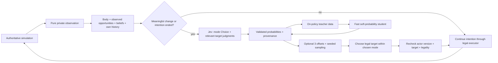

# MGOGO Jev decision design

**Recommendation:** give Jev a private, quantitative account of the chimp's food opportunities, recent activity and social history; sample its judgments at meaningful changes; let code maintain a chosen intention and execute legal actions. Test an enriched direct Choice before adopting a hierarchy. Use Jev's soft judgments on the resulting policy's own states to train fast students for long runs.

**Status:** diagnosis and proposed design, awaiting approval. No simulation, server, training or decision implementation changed. No paid inference, GPU rental or new simulated population run was performed. Spend in this task: **$0**. Labels, persona instructions, sampling rules, thresholds and proposed acceptance tolerances are **design assumptions**, not observed chimpanzee decisions.

Done for this task means this document contains six checked hypotheses, reproducible aggregate evidence, a packet and architecture, staged costs and gates, and unapplied code proposals. Approval of this document does not authorize every later stage's spend.

## 1. Evidence and its limits

Read: `CLAUDE.md`, `AGENTS.md`, all of [decide-finetune.md](decide-finetune.md), Tracks F/P in [IMPLEMENTATION_PLAN.md](../IMPLEMENTATION_PLAN.md), the requested decision/training/running files, the expert rubric and evidence digest, the target registry, research/design/simulation documentation and the stored runs. Biological claims below refer to [research.md](research.md) or target IDs; the expert rubric supplies design assumptions, not field observations.

Current source and old runs are different evidence. The long runs use snapshot-v3, code fingerprint `1c20a219db3e`, with 180 days of rules burn-in, then 1,825 observed days, seeds **8001, 8002, 8003**, no scheduled field experiments, and distilled stand-ins for the four model policies. Real field-model runs use seeds **7001, 7002**, three observed days. Compressed society results use round 2, code fingerprint `18b95a6d5d09`, seeds **4001–4008**, three days and community rotations. These historical seeds are **already seen**, not future test seeds.

The new read-only probe is [offline_probe.py](../artifacts/decide-jev-design/offline_probe.py); its exact aggregate results and SHA-256 input identities are [offline-results.json](../artifacts/decide-jev-design/offline-results.json). Run from the repository root:

```sh
python3 artifacts/decide-jev-design/offline_probe.py
```

It reads stored probabilities/features, contexts, labels and scorecards. It neither imports a model nor calls Jev. It exports no names, individual records, positions or raw coordinates. Local evidence under `artifacts/` is gitignored; the principal findings and all matrix seed values are retained in this document.

During review another session rebuilt the dashboard and updated scenario status in the implementation plan. The matrix and short-run values remained identical; the unrelated plan edits were preserved. This design does not depend on the new scenario results.

### 1.1 Six hypotheses

| Hypothesis | Check and result | Confidence |
| --- | --- | --- |
| 1. Single labels plus argmax amplify the mode | Confirmed single picks and confidence-weighted softmax cross-entropy in `train.py`; confirmed argmax in `ft-society.ts:answerWaiting`. Analytically summed 16,609 logged distributions. Sampling raises travel choice share for all policies, but does not consistently lower forage. This supports a contribution, not a complete explanation. | **high** for the mechanism and offline changes; **moderate** for population consequences |
| 2. Drive wording hides ecological alternatives | Current forage purpose echoes hunger; travel purpose is “moves to another area.” Crop belief, depletion and trip cost used by code are absent from the native packet. Hungry adapters choose forage much more often than rules on the same visited states. However, fallback appears in only 450/1,200 bounded round-3 training menus, so “almost every menu” is refuted for that sample. | **high** for the missing information; **moderate** for wording causing the bias |
| 3. Repair wording/menu and small denominators inflate reconciliation | Repair is conditionally offered, not universally offered. The tension prompt names repair, avoidance and renewed threats. Baseline/collaborative long runs have few conflicts and only 2–4 individuals eligible for CCT per seed. Untuned CCT is also high with thousands of detected conflicts, so small denominators alone cannot explain it. No prompt ablation exists to establish causation. | **high** for metric/sparsity; **low** for the prompt's isolated effect |
| 4. Too little aggression and ranging weaken hierarchy/encounter estimates | Baseline/collaborative society charges are effectively zero; round-3 base labels choose only 4 charges and 2 displays in 1,200 contexts. Collaborative long-run CCT and dominance data are sparse; travel and encounters are low. Yet baseline steepness is inside the band and aggressive steepness is high. The proposed causal links need interventions. | **high** for counts; **moderate** for under-ranging lowering exposure; **low** for a unique hierarchy explanation |
| 5. Rules-state training causes covariate shift | Sampler resolves captured decisions with rules. Actual split is **900 train / 100 dev / 200 test**, not about 800 train; all three round-3 manifests record 900 examples. Round 3 added field contexts, but remained rules-driven and menu-stratified. High-hunger contexts are 83/1,200 in that set versus 710/4,011 to 3,727/4,849 in policy logs. | **high** for distribution mismatch; **moderate** for its causal size |
| 6. Some failures belong to the simulation | Rules and every stand-in miss home range; rules steepness and encounters are high on this snapshot; every population grows. Rules also miss resting and narrowly miss CCT before rounding. A model should not compensate for these by receiving a quota, suppressing encounters or altering mortality. | **high** for common failures; **unknown** for their precise sim-side cause |

### 1.2 Sampling: the measured change is a decision distribution

For each logged state, use the same offered options. Argmax contributes one to the selected action; sampling contributes the sum of that action's option probabilities. No Monte Carlo noise is needed. Rates below are **decision shares**, not daylight activity shares.

| Policy | Decisions | Forage, argmax → sampling | Travel, argmax → sampling | Rest, argmax → sampling | Groom, argmax → sampling |
| --- | ---: | ---: | ---: | ---: | ---: |
| Untuned | 4,849 | 0.1204 → 0.1347 | 0.0056 → 0.0276 | 0.1128 → 0.1284 | 0.2733 → 0.2174 |
| Baseline | 3,688 | 0.1893 → 0.1822 | 0.0561 → 0.0660 | 0.0347 → 0.0431 | 0.1762 → 0.1701 |
| Aggressive | 4,011 | 0.1730 → 0.1669 | 0.0803 → 0.0984 | 0.0661 → 0.0673 | 0.1119 → 0.0990 |
| Collaborative | 4,061 | 0.1967 → 0.1838 | 0.0288 → 0.0360 | 0.0217 → 0.0292 | 0.2389 → 0.2291 |

The requested true activity recomputation is **unavailable from these logs**: they contain `feats` and `probs`, not executed bout lengths, sampled activity or counterfactual next states. `startAction`, `forageTick` and travel commitment make time per choice state-dependent. Decision-count reweighting cannot be presented as a corrected activity budget. A sampled replay is an experiment, not an arithmetic restatement of these runs.

This matters most for baseline: the probabilities are already concentrated (mean maximum probability 0.880 and 0.870 by seed). Sampling adds only 0.0099 to travel choices. It could improve behavior, but the evidence does not support promising that it fixes 0.71 feeding share.

### 1.3 Food choices by hunger

**Logging defect:** all **86,821 option rows** in the eight files have `v:NONE`. `boundedCandidates` copies candidates with `{ ...match }`; metadata lives in a WeakMap keyed by the original object. `optionFeatures` therefore loses the variant. `capture.describe` separately recomputes candidates to recover variants for context records, but the decision log does not retain that description. Exact **P(forage | remembered-tree travel)** and fallback-vs-fruit picks cannot be reconstructed from the saved feature logs.

The following is the available **any-travel-option proxy**. Rules are evaluated on the same policy's visited states, not on a separate rules population. Hunger boundaries follow the current packet's 0.4 active-drive and 0.7 urgent-drive thresholds; those thresholds are design assumptions.

| Policy | Hunger | States with any travel offered | P(forage), argmax | P(forage), sampling | Rules forage on those states |
| --- | --- | ---: | ---: | ---: | ---: |
| Untuned | < 0.4 | 86 | 0.0581 | 0.1141 | 0.1047 |
| Untuned | 0.4–<0.7 | 817 | 0.1028 | 0.1282 | 0.0906 |
| Untuned | ≥ 0.7 | 2,527 | 0.1836 | 0.1964 | 0.0317 |
| Baseline | < 0.4 | 489 | 0.0859 | 0.0877 | 0.0450 |
| Baseline | 0.4–<0.7 | 1,581 | 0.1790 | 0.1641 | 0.0936 |
| Baseline | ≥ 0.7 | 434 | 0.8456 | 0.8374 | 0.0369 |
| Aggressive | < 0.4 | 1,149 | 0.0801 | 0.0860 | 0.0287 |
| Aggressive | 0.4–<0.7 | 1,345 | 0.2097 | 0.2280 | 0.0907 |
| Aggressive | ≥ 0.7 | 351 | 0.9117 | 0.7471 | 0.0570 |
| Collaborative | < 0.4 | 295 | 0.0712 | 0.0823 | 0.0542 |
| Collaborative | 0.4–<0.7 | 1,940 | 0.1170 | 0.1125 | 0.0608 |
| Collaborative | ≥ 0.7 | 585 | 0.8940 | 0.8126 | 0.0325 |

`computeCandidates` explicitly values believed crop, distance, travel/feeding time, revisits, party departure and territory costs. `reasonFor` exposes a crop percentage for visible fruit but not a remembered crop or its age; `buildJevQuestion` converts needs into adjectives and nearby fruit into a coarse word. `urgentPurpose` adds “needed now” to forage, not to a trip whose eventual purpose is food. Rest usually answers fatigue even when digestion, thermoregulation or recent feeding would make it useful.

Fallback walking remains action `forage` and is counted as feeding by the observer. In the current field execution it moves at **0.3 × walkMps** while taking lower-yield food. Thus a chimp can accumulate some distance without much observer-classified travel. Do not relabel that walking merely to pass T-ACT-2; validate the observer against its existing protocol.

There are two other information problems. Nearby routine feeding/travel is omitted by `NOTABLE`, obscuring where companions are going. `buildJevQuestion.instructions.evidence` omits `history` although state contains it. Neither defect establishes a population effect, but both weaken the intended memory-based judgment.

### 1.4 Reconciliation and dominance

**T-SOC-9 is corrected conciliatory tendency (CCT):** for each observed PC–MC pair, attracted means affiliation occurs earlier in the ten-minute post-conflict window; dispersed means earlier in the matched control; equal/absent in both is neutral. CCT = `(attracted − dispersed) / pairs`. Code averages eligible individuals with at least three pairs. Controls occur at the same time on the next possible day when the opponents are observable; five failed scheduling attempts abandon a control. Affiliation includes grooming, play, sharing, consolation and reconcile, not only the named repair action. See `field/protocols.ts:pcmcStep`, `field/stats.ts:conciliatoryTendency`, `field/metrics.ts` T-SOC-9 and the target registry.

The raw world ratio `reconciliations / conflicts` is an explicitly **uncorrected truth diagnostic**. Collaborative counters even exceed one bout per conflict, so this is not a probability. Never use it as the wild comparison or cap it to disguise the difference.

| Policy | World conflicts, seeds 8001 / 8002 / 8003 | Reconcile bouts, same order | Eligible CCT individuals, same order | CCT, same order |
| --- | --- | --- | --- | --- |
| Rules | 14,226 / 14,116 / 11,088 | 533 / 690 / 879 | 35 / 38 / 33 | 0.0768 / 0.0775 / 0.1227 |
| Untuned stand-in | 46,286 / 32,701 / 37,030 | 33,737 / 21,294 / 24,965 | 43 / 43 / 44 | 0.8619 / 0.8814 / 0.8490 |
| Baseline stand-in | 237 / 389 / 330 | 103 / 198 / 187 | 2 / 4 / 4 | 0.5000 / 0.5083 / 0.6784 |
| Aggressive stand-in | 13,446 / 14,871 / 17,954 | 3,656 / 3,896 / 6,869 | 35 / 34 / 33 | 0.3375 / 0.2692 / 0.2917 |
| Collaborative stand-in | 92 / 88 / 135 | 132 / 127 / 196 | 4 / 2 / 2 | 1.0000 / 1.0000 / 1.0000 |

These are **world aggregates**, not per-community conflict counts; the long-run exports do not preserve the necessary community breakdown or individual PC–MC pair counts. The probe also retains every available community's three-day round-2 charge/fight/reconcile counts (`society_community_counts`), which are interaction counts and not interchangeable with decided conflicts. For example, the three communities in rotation 0, seed 4001 have charges **1 / 400 / 1**, fights **0 / 15 / 0**, and reconcile bouts **0 / 35 / 3** for baseline/aggressive/collaborative respectively. Repair can occur without a contact fight.

On the three-day real field-model logs, baseline has only **two** repair-option opportunities and no selected repair; collaborative has **zero**. Untuned has 79 opportunities and selects repair 42 times; aggressive has 155 and selects it 17 times. The long-run collaborative CCT of 1.0 therefore cannot be attributed directly to frequent collaborative real-model repair picks in these short logs. Student error and rare opportunities remain live alternatives.

`affiliationRepair` already restricts repair to a recent opponent, unrepaired conflict, same community, seen/nearby partner and no ongoing partner charge/attack. Preserve that eligibility. Present an opportunity to affiliate with a former opponent as one social context, with avoidance and ordinary activity still available. Do not add an always-present “repair” activity or a per-fight reconciliation quota.

T-SOC-5 uses detected decided adult-male agonistic outcomes, averaged over communities with at least three males; its separate pant-grunt part is not the principal result. The present metric has no robust minimum of observed dyadic contests. A small slope can mean weak differentiation, sparse evidence or both. New reports must expose counts, dyad coverage, missing controls and uncertainty; do not count sparse zero/flat estimates as realism matches.

### 1.5 Covariate shift and simulation ownership

Round-3 menus are 132/900 maintenance-only in training; 768/900 contain affiliative or aggressive-class options. This is purposeful stratification, not a natural frequency sample. The 900 training examples are augmented by menu permutations during training, not 1,800 independent ecological contexts. Base labels choose charge/display only 6/1,200 times. Labels and personas are design assumptions; high accuracy on them proves imitation, not wild behavior.

High-hunger state frequency changes from **83/1,200 (0.0692)** in the combined round-3 context set to **3,727/4,849 (0.7686)** untuned, **973/3,688 (0.2638)** baseline, **710/4,011 (0.1770)** aggressive and **1,345/4,061 (0.3312)** collaborative in on-policy logs. Menu selection and the mixed field/compressed training set complicate attribution. This is evidence to collect on-policy teaching data, not a measured estimate of how much retraining will fix.

Rules population counts start/end at **49→57, 51→61, 50→62**, after burn-in: increases **16.3265%, 19.6078%, 24%**. Across trained stand-ins growth spans **6%–25.4902%**, wider than the narrative “every population grows 18–24%.” There is no wild population-growth band in the eleven-row matrix. Report growth without declaring a pass or fitting a mortality correction to it.

Keep range/food landscape, travel dynamics, dominance updates, observation coverage, reproduction and mortality with their simulation owners. Freeze code and observer fingerprints before comparing new policies. This snapshot's rules encounters are not the science program's accepted C6 baseline; different code and observation conditions prevent treating 79 as a permanent rules property.

## 2. Proposed decision architecture

### 2.1 Ownership and sequence



Jev owns **what the individual wants to do next**: stay with low-yield food, seek a remembered patch, rest, affiliate, contest access/status, coordinate with others, reproduce, care for young, or avoid/protect. Code owns measurement, admissible candidates, physical travel costs, availability, deterministic randomness, state freshness and execution. Jev may select a locally less profitable option because of risk, companions or relationship history. Supplying raw economics does not prescribe the choice.

Start with enriched direct action Choice as the control. The preferred hierarchical arm asks for a **mode** and, when needed, a target intention. Keep only modes backed by legal actions now, with a safe continue/rest alternative. Up to nine named modes is a **new experimental packet contract**, not an extra option secretly inserted into the current eight-option action contract. Do not split near-identical trees into extra top-level food options that dilute mode probability.

Within a mode, code routes to a legal target using explicit physical quantities: believed gain, travel time, expected feeding time, known risk and permitted distance. It must not reuse the entire rules behavior score as the target policy. Where a partner's identity or trade-off matters, Jev selects among a small relevant target set. Food target choice can also be a speculative Choice over two or three belief-backed alternatives. Legal coverage, including stimulus responses, must survive the hierarchy; infants and emergencies must not disappear through grouping.

Every mode can map to more than one action. `seek_food` leads to travel then feeding; `affiliate` can lead to groom/play/share and context-dependent repair; `coordinate` can lead to follow/contact call/patrol/hunt; care and protection are retained explicitly. No mode directly mutates World. Code supplies transitions and completion events rather than asking Jev to choose every animation or movement tick.

### 2.2 TypeSafe judgments and composition

TypeSafe accepts named structured state and separate questions; questions in one request share the same state and are evaluated independently. Use that structure to keep observed facts apart from beliefs. [State](https://docs.typesafe.ai/concepts/state), [fan-out](https://docs.typesafe.ai/patterns/fan-out).

| Judgment | Primitive | Consumption |
| --- | --- | --- |
| Which supported activity mode should this chimp pursue now? | **Choice** | Sample the normalized mode distribution; the reported `choice` is only its argmax. |
| If pursuing food, which of these known opportunities should it seek? If affiliating, which partner? | Speculative **Choice** questions | Only consume the branch chosen by the mode; all target alternatives are supplied upfront. |
| Does this history show an unresolved threat to this individual? | Optional **Noul** | A probability of a yes/no proposition, not fear intensity. Diagnostic initially; immediate physical danger remains a code boundary. |
| How valuable is joining this companion now? How costly socially is leaving? | Optional **Score**, concrete ordered levels | Normalize comparable levels and combine only if the ablation justifies it. Retain distributions and confidence. |

Choice compares options; Score returns the probability-weighted position on described levels; Noul has no separate confidence. Choice/Score confidence describes concentration of a judgment, not the correctness of the entire simulation or a frequency of wild behavior. [Choice](https://docs.typesafe.ai/primitives/choice), [Score](https://docs.typesafe.ai/primitives/score), [Noul](https://docs.typesafe.ai/primitives/noul), [confidence](https://docs.typesafe.ai/confidence).

**Composite alternative:** independently score each supported opportunity's resource benefit and social consequence, then combine normalized scores in code, e.g. `U = physical_net_gain + social_weight × social_score − known_risk`. This offers reusable dimensions and persona weights, but adds judgments and an unidentifiable weighting model. Keep it as an offline ablation, with **zero fitted weights initially**; do not start with a dozen tuned social coefficients. Questions cannot see each other's outputs. If a target list depends on a newly answered mode, either provide speculative lists beforehand or accept a second request and its extra cost. [Composite scoring](https://docs.typesafe.ai/patterns/composite-scoring).

### 2.3 Packet schema

Proposed schema, not currently implemented. Values are types, not exported animal records. Units must remain explicit. Missing evidence is `null` with a reason, not fabricated certainty.

```ts
type Evidence<T> = {
  value: T | null;
  source: 'observed' | 'own_body' | 'own_history' | 'remembered' | 'inferred';
  age_minutes: number | null;
  uncertainty: 'low' | 'moderate' | 'high' | 'unknown';
};
type JevStateV3 = {
  self: { stage: string; sex: string; perceived_rank: string; care_status: string };
  body: { hunger: number; thirst: number; energy: number; stress: number; injury: number };
  activity: {
    today: { daylight_elapsed_h: number; feeding_h: number; travel_km: number; rest_h: number; grooming_h: number };
    last_two_hours: { feeding_min: number; travel_min: number; rest_min: number; grooming_min: number };
  };
  intention: { mode: string; elapsed_min: number; ending_reason: string | null };
  observed: {
    phase: string; weather: string; party_size: number; party_adult_males: number;
    food_here: Evidence<{ food_kind: string; intake_units_per_min: number; recent_change_fraction: number }>;
    companions: { alias: string; relation: string; visible_activity: string; departure_direction: string | null }[];
    threats: string[];
  };
  beliefs: {
    food_alternatives: { alias: string; crop: Evidence<number>; distance_m: Evidence<number>;
      walk_min: Evidence<number>; expected_food_units: Evidence<number>; feeding_min: Evidence<number> }[];
    territory_position: Evidence<string>;
    last_intergroup_contact: Evidence<{ minutes_ago: number; direction: string; outcome: string }>;
    party_heading: Evidence<string>;
  };
  memory: {
    recent_dominance: { partner_alias: string; minutes_ago: number; outcome: string; witnessed: boolean }[];
    relationships: { partner_alias: string; bond: number; unresolved_tension: number;
      recent_groom_given_min: number; recent_groom_received_min: number; support_history: string }[];
  };
};
```

Today's activity is proprioceptive history, not a comparison with field target bands. Jev receives **no desired feeding percentage, day-range quota or target score**. Current perceived environment, inner state and memory remain its decision evidence. A rolling two-hour summary is a compact recent-history feature; **two hours is a design assumption**, tested against an hour and omission offline.

Write these summaries inside simulation-owned updates; `observe()` only projects them. Do not substitute the omniscient field observer for an animal's memory. A declining intake estimate uses actual recent intake, not the true unseen stock of the whole fallback grid. Remembered crop ages and uncertainty persist until the animal observes the site again.

Current `nearTerritoryEdge` uses community center/radius and rank uses engine hierarchy. Those are existing stylizations. Replace or label them as inferred familiarity/rank; do not present a whole-community utilization map as directly perceived. The community-wide `knownTrees` shortcut includes true phenology/capacity for unseen trees, documented as omniscience in [research.md](research.md#food-landscape-and-tree-knowledge-stage-c7a-accepted-after-the-c7a-review-29-september-2026). It cannot become Jev's “memory” without explicit provenance and an ablation against private knowledge.

### 2.4 State additions and costs

At the current documented **$0.042 per million input tokens**, each extra 100 tokens costs **$0.042 per 10,000 judgments**. Output tokens are free. The current native packet's recorded median is 1,457 input tokens; use 1,450 as the historical costing reference. The additions below are estimates, **moderate confidence** in relative sizes and **low confidence** in exact provider token counts before measurement.

| Addition | Estimated incremental tokens | Cost per 10,000 decisions | Retention rule |
| --- | ---: | ---: | --- |
| Today's time/distance summary | 70 | $0.0294 | Always, with elapsed daylight |
| Recent two-hour activity | 90 | $0.0378 | Fixed numeric summary |
| Current feeding rate and decline | 90 | $0.0378 | Only when food/feeding is relevant |
| Best known food alternative, crop age, distance and trip economics | 120 | $0.0504 | Two or three alternatives; no world search |
| Party departure/heading | 60 | $0.0252 | Visible behavior vs inferred heading separately |
| Familiarity/edge and latest intergroup contact | 80 | $0.0336 | Current hazard or spatial decision |
| Recent dominance outcomes | 90 | $0.0378 | At most three relevant witnessed/experienced events |
| Relationship memory | 90 | $0.0378 | At most four relevant partners; include history in instructions |
| Current intention/termination | 35 | $0.0147 | Always |
| **Total additions** | **725** | **$0.3045** | Bounded summaries |

Use **2,250 tokens per call** for initial enriched direct/mode budgeting, with a planned 3,000-token p95 ceiling. Conditional questions can add about 600 tokens; a richer batch may reach 2,850. These are planning budgets, not tokenizer measurements. Record actual per-packet usage by arm; stop or resize the next approved batch if the estimate is exceeded. Never drop a crop's provenance or a relevant danger fact to fit text.

At 1,200 calls/community-day: old packet **$0.07308/day**; enriched packet **$0.1134/day**. At a measured goal of 300 enriched calls/day: **$0.02835/day**. At 120: **$0.01134/day**. Bigger packets only become cheaper per day if call frequency actually falls.

TypeSafe now documents `jev-1.13.0`, 64k tokens/request and 32k for state plus the longest question. The older local statement “Jev documents no token limit” is stale. Pin the version in experiments instead of `jev-latest`, record the responding model and recheck price before approved spending. Local GLiNER's **1,280-token hard limit** is a separate student constraint. [Models and pricing](https://docs.typesafe.ai/models), [HTTP contract](https://docs.typesafe.ai/api).

### 2.5 Option semantics

| Current meaning | Proposed meaning |
| --- | --- |
| Leaves/pith: “food, eases hunger” | “Low-yield fallback food here; observed intake X, recent decline Y; no walk required.” |
| Remembered fruit travel: “moves to another area” | “Seek remembered ripe fruit; last observed crop X, age Y; Z minutes walking before feeding; belief may be wrong.” |
| Rest: “eases fatigue” | “Rest/digest/avoid heat here; current energy and recent feeding are in state.” |
| Reconcile: “repairs the bond after a fight” | “Approach a former opponent; may restore this relationship, but can renew tension; other social and ordinary activities remain available.” |

Use comparisons such as “more food than the leaves here” only when the individual's evidence supports them. Do not state that a remembered tree is currently ripe as fact. Numerical rates are simulation units unless validated into biological units. Lower average leaf/pith yield and the value of remembered fruit have support in [research.md](research.md#fallback-foods-joint-travel-and-travel-energetics-stage-c7c-29-september-2026); the modeled numerical intake rates and this wording remain design assumptions.

Repair stays a conditional **social opportunity**. The top-level mode should not receive an extra share of probability simply because both groom and reconcile can express affiliation. Preserve distinct partner context where needed, with mode probability applied once.

### 2.6 Probabilities, commitment and calibration

Initial baseline: sample `p(mode | state, persona)` at intention boundaries; no temperature fit, no forced exploratory aggression, no activity quotas. TypeSafe's probabilities express its judgment of the question. Treating them as behavioral frequencies is a **design assumption requiring field-level validation**. Soft labels are useful even if not perfectly calibrated; one most-plausible label is not a full population policy.

For an optional calibrated arm, fit exactly **three shared offsets**: `b_feed_here`, `b_seek_food`, `b_rest`. Every other offset is zero, temperature is fixed at one, and the same offsets apply to all personas:

```text
q_i = p_i × exp(b_mode(i)) / sum_legal_j[p_j × exp(b_mode(j))]
```

Zero probabilities stay zero. Fit only to **T-ACT-1, T-ACT-2, T-ACT-4**, on the fitting seeds and student rollouts. Minimize normalized distance outside their bands plus a shrinkage penalty toward zero; predeclare offset bounds ±0.5 and the penalty before fitting. Bounds/penalty are design assumptions, not additional fitted parameters. Use paired validation to reject offsets that collapse persona contrasts or ecological response. Do not fit to T-SOC-5, test-seed activity, CCT, encounters, home range or mortality. T-ACT-3, T-PTY-1 and T-RNG-4 remain report-only for this decision calibration even though the registry calls them fitted.

**Rules-product comparator:** `q_i ∝ p_i × exp(lambda × E_i)`, with legal masking. `E_i` must be a declared ecological quantity in compatible normalized units, not an arbitrary score converted into a probability. Keep lambda at zero for the preferred policy; compare a preregistered fixed lambda of 0.25 offline, with **zero fitted parameters**. Multiplying by the full `Candidate.score` duplicates body/social drives, imports already tuned rules and can hide model failure. It is not the recommended architecture. A rules-choice-only control and removal of `score`/`rulesPick` from student inputs establish whether Jev contributes more than a rules imitation.

Persist the chosen intention through a committed trip and productive feeding bout. Rejudge on arrival, depletion/intake decline, care need, meaningful observed threat/contact, social partner departure, phase change or intention completion. Repeated soft sampling every tick would cause flicker and trip abandonment; uncertainty alone is not a reason to requery continually.

Candidate starting gate: 20-minute maximum refresh while awake, 25% intake decline sustained for five minutes, phase/target-legality change immediately. These **three gate settings are fixed design assumptions**, not calibrated behavioral constants; log blocked/woken events before selecting them. Test cached vs uncached choices around changes. A 20-minute timer does not by itself guarantee 300 calls per community-day; measure frequency and stale-intention errors.

Sampling must be reproducible. The simulation owns the `world.rng` draw, after freshness and legality checks, in stable chimp order. `observe()`, packet construction, logging and rules scoring consume no RNG. Live asynchronous inference also needs recorded request/result/application events: versioned model probabilities can vary, so reproducibility means replaying recorded outputs, not calling Jev again and expecting identical answers. Rules' existing golden hashes remain unchanged when the experimental policy is off.

### 2.7 Temperaments

Keep baseline, aggressive and collaborative as **persona instructions/design assumptions**, distinct from the animal's existing personality values. Jev has no per-customer LoRA tuning in the documented service; adapters belong to local students. [Model customization](https://docs.typesafe.ai/models#customizing-jev).

Baseline balances feeding, movement, rest, relationships and triggered competition. Aggressive puts more value on food/mating access and favorable contests, while still valuing safety and body needs. Collaborative puts more value on relationships and joint action, while still competing, caring for young and defending itself. Do not reproduce the present rubric's effective prohibition of routine competition for baseline/collaborative or its universal treatment of any urgent hunger as “feed here.” A food-seeking trip can also answer hunger when feasible.

All three receive identical factual packets and legal constraints. Preserve raw Jev probability distributions for all personas on the same contexts; use either three conditional Choice questions in one shared-state request or separately versioned requests. Cross-temperament questions are independent. Do not fit persona-specific activity offsets to make societies look different.

Preregister society contrasts: aggressive vs baseline **charges per adult-day**, collaborative vs baseline **grooming bouts per adult-day**, aggressive vs collaborative both markers. Require non-overlapping **95% intervals for each designated pair**, appropriate direction, and no collapse after shared calibration/distillation. Every persona need not differ on every metric. Bootstrap by seed/world, retaining paired communities; three communities in one world are not three independent seeds. These separation criteria are design objectives, not wild phenotype bands.

## 3. The eleven-target matrix

Bands and roles come from [data/targets.json](../data/targets.json). Values below reproduce the dashboard's **median of three seed values**. A rounded number must not change a verdict: rules CCT is **0.07749056101612702**, below 0.08, despite displaying as 0.08 at two decimals. The count remains **5/11**. This is a descriptive band count, not the canonical field scorecard's uncertainty-aware pass total.

| Target | Wild band | Registry role | Rules | Untuned stand-in | Baseline stand-in | Aggressive stand-in | Collaborative stand-in |
| --- | --- | --- | ---: | ---: | ---: | ---: | ---: |
| T-RNG-4 day range, km | 1.5–3.5 | fitted | 3.7671 | 0.4155 | 1.9478 | 1.1681 | 1.0830 |
| T-ACT-2 travel | 0.12–0.25 | fitted | 0.2233 | 0.0218 | 0.0879 | 0.0615 | 0.0462 |
| T-RNG-1 home range, km² | 5–16 | fitted | 1.9000 | 1.1400 | 1.6800 | 1.8000 | 2.0600 |
| T-ACT-1 feeding | 0.33–0.50 | fitted | 0.4717 | 0.7340 | 0.7105 | 0.7741 | 0.8240 |
| T-ACT-4 rest including groom | 0.30–0.47 | fitted | 0.2796 | 0.2013 | 0.2089 | 0.1514 | 0.1286 |
| T-ACT-3 grooming | 0.08–0.18 | fitted | 0.0916 | 0.1804 | 0.1036 | 0.0565 | 0.1115 |
| T-PTY-1 party size | 3–9 | fitted | 3.5250 | 5.0472 | 3.5280 | 2.6548 | 4.8929 |
| T-SOC-9 corrected CCT | 0.08–0.22 | fitted | 0.0775 | 0.8619 | 0.5083 | 0.2917 | 1.0000 |
| T-SOC-5 male steepness | 0.2–0.7 | **held-out** | 0.9069 | 0.8015 | 0.4072 | 0.7313 | 0.0840 |
| T-IGE-1 encounters/community-year | 5–12 | fitted | 78.5966 | 14.2976 | 1.5730 | 3.9948 | 0.7510 |
| T-DEM-1 first-year mortality | 0.11–0.19 | fitted | 0.1775 | 0.1450 | 0.1436 | 0.1046 | 0.2614 |
| **Inside band, unrounded median** | **11 rows** | | **5** | **2** | **5** | **0** | **2** |

Three-day actual-model feeding shares are **0.4111 / 0.7067 / 0.5862 / 0.6180** for untuned/baseline/aggressive/collaborative; their paired stand-ins give **0.6327 / 0.6040 / 0.6923 / 0.6552**. That is a material surrogate gap. Five-year adapter-level claims remain unverified.

### 3.1 All historical seed values

Each cell is **8001 / 8002 / 8003**. Display precision is four decimals; all comparisons use the full numbers in the aggregate receipt. These are pooled observer values over all communities, not individual animal locations.

| Target | Rules | Untuned stand-in | Baseline stand-in | Aggressive stand-in | Collaborative stand-in |
| --- | --- | --- | --- | --- | --- |
| T-RNG-4 | 3.8187 / 3.3461 / 3.7671 | 0.3570 / 0.4234 / 0.4155 | 2.0600 / 1.8291 / 1.9478 | 1.1681 / 1.1068 / 1.2262 | 1.0830 / 0.9979 / 1.3994 |
| T-ACT-2 | 0.2284 / 0.2108 / 0.2233 | 0.0237 / 0.0189 / 0.0218 | 0.0879 / 0.0855 / 0.0930 | 0.0615 / 0.0612 / 0.0631 | 0.0462 / 0.0394 / 0.0648 |
| T-RNG-1 | 2.8000 / 1.8300 / 1.9000 | 1.4000 / 0.6900 / 1.1400 | 2.7100 / 1.6800 / 1.6200 | 2.7800 / 1.5800 / 1.8000 | 2.0600 / 1.4100 / 2.1500 |
| T-ACT-1 | 0.4689 / 0.4838 / 0.4717 | 0.7510 / 0.7328 / 0.7340 | 0.7212 / 0.7105 / 0.7024 | 0.7901 / 0.7741 / 0.7671 | 0.8246 / 0.8240 / 0.7682 |
| T-ACT-4 | 0.2796 / 0.2846 / 0.2794 | 0.1753 / 0.2093 / 0.2013 | 0.1876 / 0.2140 / 0.2089 | 0.1454 / 0.1514 / 0.1634 | 0.1155 / 0.1286 / 0.1536 |
| T-ACT-3 | 0.0909 / 0.0916 / 0.0926 | 0.1629 / 0.1902 / 0.1804 | 0.0973 / 0.1055 / 0.1036 | 0.0455 / 0.0565 / 0.0568 | 0.1057 / 0.1115 / 0.1358 |
| T-PTY-1 | 3.2062 / 3.5530 / 3.5250 | 6.0845 / 4.8511 / 5.0472 | 3.5455 / 3.3067 / 3.5280 | 2.5322 / 2.6548 / 2.7725 | 4.9626 / 4.8929 / 3.8659 |
| T-SOC-9 | 0.0768 / 0.0775 / 0.1227 | 0.8619 / 0.8814 / 0.8490 | 0.5000 / 0.5083 / 0.6784 | 0.3375 / 0.2692 / 0.2917 | 1.0000 / 1.0000 / 1.0000 |
| T-SOC-5 | 0.9069 / 0.9132 / 0.9045 | 0.7550 / 0.8142 / 0.8015 | 0.4571 / 0.4072 / 0.4000 | 0.6531 / 0.7313 / 0.7388 | 0.0840 / 0.0102 / 0.0850 |
| T-IGE-1 | 78.5966 / 12.9736 / 81.1978 | 2.2935 / 64.9142 / 14.2976 | 1.4261 / 31.5953 / 1.5730 | 2.0883 / 14.2142 / 3.9948 | 0.8976 / 0.3260 / 0.7510 |
| T-DEM-1 | 0.1775 / 0.2075 / 0.1497 | 0.1209 / 0.1549 / 0.1450 | 0.1436 / 0.2328 / 0.0000 | 0.1111 / 0.1046 / 0.0000 | 0.2614 / 0.0000 / 0.2765 |

## 4. Staged experiments and approval gates

The next approval is for the candidate implementation and Stage 1's **$2 Jev cap**, not for a $47 program in one step. Do not instantiate JevClient for offline-only work: it reads the credential in its constructor. No key should appear in output or be sent to a pod. GHN stays read-only, accessed through local `read_key` only. No server on 5173 is restarted.

### 4.1 Seeds and target roles

| Use | Seeds | Permitted decisions |
| --- | --- | --- |
| Historical diagnosis | 7001–7002, 8001–8003, original train/dev/test and society seeds | Already seen; retrospective evidence only |
| Fitting and on-policy acquisition | **91001, 91002, 91003** | Packet selection, three offsets, student fitting and DAgger iterations |
| Development validation | **91011, 91012, 91013** | Early stopping/model selection on declared fitted-role targets; not reported as independent test success |
| Final reporting | **91021, 91022, 91023, 91024, 91025** | Frozen configuration, all seeds shown, no tuning after inspection |

These proposed seeds are outside reserved C8/patrol/C9 ranges and absent from inspected filenames and script/doc declarations; **moderate confidence** that they are unused. The integrator must check the active run registry before reservation. Do not execute 1111–2525, 606–1010 or 5101–5505 for development. Reuse fitting seeds across acquisition iterations, never final reporting seeds. A failed final test is a miss; any revised policy requires a newly reserved reporting set.

T-SOC-5 remains held-out throughout. Do not use it to pick prompts, persona wording, offsets or epochs. It has already been viewed historically, so new-seed results are independent replication of a declared target, not a claim that the target was never seen. Keep other science-program sealed targets sealed; this plan does not unlock them. Only three activity targets calibrate offsets. No per-seed offset or activity quota is permitted.

### 4.2 Stages, cheapest first

Costs use $0.042/M input tokens; actual usage wins. Local CPU/MPS work has **$0 provider charge**, with electricity and occupied hardware excluded. No new RunPod charge is assumed. Existing project spend is $3.35/$5, leaving **$1.65**, which is not authorization to rent anything here.

| Stage | Work and sample | Estimate / proposed cap | Stop/go |
| --- | --- | --- | --- |
| **0 — completed offline diagnosis** | 16,609 decisions; all 15 five-year runs; round-2/3 labels/contexts; reported seed matrix | **$0 / $0** | Done. Exact activity resampling and remembered-tree condition remain unidentifiable from logs; do not infer them. |
| **1 — packet and policy probes** | After approval, freeze candidate source/protocol; collect 2,000 fitting-seed contexts without provider calls, including on-policy student states. Four packet arms: current control, neutral/value-bearing purposes, quantitative state, mode/target hierarchy. Three persona Choices share state where compatible. | 8,000 requests × estimated 2,600 tokens = **$0.8736 / $2** | Go only if metadata/provenance/legality pass, urgent/danger/care fixtures hold, crop/distance/depletion changes affect food choices in the intended direction, and menu permutation is stable. Do not choose an arm using held-out field targets. |
| **2 — three-day real Jev field pilot** | Fitting seeds × three personas, all three communities on one persona per world, 180-day rules burn-in. Three arms: enriched direct argmax, enriched direct sampling, hierarchical sampling. Paired rules controls, same frozen snapshot. **27 model worlds, 81 world-days, 243 community-days.** | Direct arms: 162 community-days × $0.1134 = $18.3708; hierarchical: 81 × $0.02835 = $2.29635. **$20.66715 / $25** | Continue only with valid comparable exposure, no safety regression, and short-window baseline ≥5/6 activity/ranging/party rows in band or a declared insufficient window awaiting extension. Hierarchy must achieve ≤300 calls/community-day and no >0.03 activity-share regression versus direct sampling. Require declared temperament contrasts to separate; otherwise extend duration on fitting seeds, not final seeds. |
| **3 — on-policy teaching and students** | Up to three iterations of **20,000 contexts** each from fitting worlds under the evolving policy, natural-frequency sample plus separately weighted rare events. Label all three personas softly in one batch; retain prior data with sampling weights. Fit students and optional three shared offsets on fitting seeds; early-stop on development seeds. | 60,000 × estimated 2,600 tokens = **$6.552 / $8**, local training $0 provider | Go only if teacher/student parity gates below pass. Stop after three iterations, spend cap or lack of development improvement; do not manufacture more labels to claim success. |
| **4 — seven-day frozen teacher/student confirmation** | Five final seeds × three personas, all communities on the same persona per world; paired rules, actual hierarchical Jev and sampled students. **15 teacher worlds, 105 world-days, 315 community-days**; student/control CPU runs separate. | 315 × $0.02835 = **$8.93025 / $12** | Baseline ≥5/6 evaluable short-window rows, no calibrated-target regression, student parity and all designated persona intervals non-overlapping. Report all eleven rows: five long-window rows remain unverified/insufficient, not passes. No retuning on these seeds. If frequency is above 300, resize before launch or seek a new cap. |
| **5 — long runs** | Rules plus three frozen students × five final seeds × five years, field profile, matched warm-up and observation; **20 worlds, 36,500 world-days**. Optional one-year screen before full five years. | **$0 new Jev / $0 new RunPod** for local runs; hardware time below | Baseline must match **at least max(5, concurrent rules band count)/11** with adequate evidence, and improve feeding/travel/rest; all seeds and miss directions retained. Preserve persona contrasts and short teacher parity. Failure is reported plainly; a stand-in result stays a stand-in result. |

Four packet arms test representations while argmax/sampling are recomputed offline on each distribution; no extra inference is needed to compare selection rules on identical states. Optional composite-score and fixed rules-product arms must fit inside Stage 1's remaining cap or receive a separate approval. They are not silently added to the pilot.

Stage 2's 300-call hierarchical rate is an **unverified target**, not a measured saving. At 1,200 calls/day in every arm, the same pilot costs **$27.5562**, exceeding its $25 cap. Gate the schedule after the first measured fitting-seed day and stop before overspend. Serial 0.25-second latency implies roughly **15.1875 hours** of provider waiting at the planned call counts, before simulation overhead/retries; it is not an end-to-end runtime estimate. Concurrent batching may change waiting time but not authorize more calls.

No-cost Stage 0 does not warrant a new eleven-target claim. Three/seven-day stages can judge **T-ACT-1/2/3/4, T-RNG-4, T-PTY-1** when follow coverage is adequate. Home range, corrected CCT, hierarchy, annual encounters and first-year mortality need their registered exposure/denominators. Show them as insufficient until supported; never divide the six measurable rows by eleven to imply a full success. Report infant mortality only for complete one-year cohorts.

The full Stage 1–4 estimate is **$37.0230**, with **$47 total proposed caps**, approved separately. It excludes optional extensions and extra composite questions. It does not consume the remaining RunPod allowance.

### 4.3 Calibration, parity and long-run success

Use paired seed/world comparisons and show medians **and every seed**, with uncertainty and exposure. For short windows, the six-row gate is a screening criterion, not proof of annual behavior. If the baseline stays at five historical matches by trading away party/grooming while feeding improves, that is insufficient: require feed and travel inside their bands and rest to improve toward its band; list all losses. Keep the canonical observer scorecard beside the descriptive median band count.

Teacher/student gate (proposed design thresholds): mean total-variation distance ≤0.10 on development states; top-1 agreement ≥0.85 as a secondary diagnostic; no systematically missed rare legal response; seven-day paired absolute differences ≤0.03 for feeding/travel/rest/grooming, ≤0.5 party members and ≤0.3 km day range. Report intervals; exceeding a tolerance or inadequate exposure blocks the long-run claim. Agreement alone is insufficient—the existing 0.73–0.77 students changed population levels substantially.

Current students include `score` and `rulesPick`, although text models do not see those privileged summaries. The new preferred student omits them and uses only the teacher packet's permitted evidence. Record an explicit inclusion/removal ablation, with separate feature-layout version and weights. Preserve meaningful variants; do not fit on 437 columns whose variant columns are silently constant.

Use a soft-target loss `−sum_i p_teacher(i) log p_student(i)` over legal choices, optionally alongside human/LLM rubric labels clearly marked as design assumptions. Do not harden teacher labels with argmax before training. Preserve modes, target judgments and application gates in both teacher and student. For GLiNER, measure its actual tokenizer: a Jev 2,250-token JSON packet cannot simply be sent to a 1,280-token local worker. A compact semantic projection must preserve essential economics and provenance; otherwise choose a numerical student that accepts the same information. Training/dev/final seeds stay separate.

Five-year evidence can still miss rare events. CCT reports include eligible individuals, pair counts/missing controls and seed uncertainty; hierarchy reports include decided male contests and dyad coverage. A sparse result is flagged even if the current metric returns a number. Do not alter the canonical definitions or acceptance bands in this track. Mortality, home range and encounter failures remain visible and routed to simulation owners.

Actual Jev for five years at the historical **$0.07/community-day** costs **$127.75 per community**, **$383.25 for all three communities per seed**, and **$1,916.25 for five full-population seeds**. At enriched 1,200 calls/day it would be **$620.865 per full-population seed**; at the still-unproven 300-call rate **$155.21625**. This is why multi-year validation should use qualified students, with short teacher checks. “About $400 per seed” applies to three communities at the historical rate, not one Jev-driven community.

Historical rules five-year files record **1,526.7 / 1,526.6 / 1,201.4 seconds** on the CPU pod. Twenty comparable runs would be about **6.67–8.48 serial hours** at that rate before student overhead; local hardware/shared-load performance is **unknown**. Benchmark one fitting-seed local world before promising a completion time. The five-year final reporting stage is not authorized to start now.

### 4.4 Spending guard required before any paid stage

Passing `max_dollars` is necessary but the existing client is not sufficient for the proposed hard guarantee. `JevClient.choose` reserves 4,096 tokens per request, releases that reservation before charging returned usage, resets accounting on construction and retries up to six times. There is no enforced request bound proving 4,096 is sufficient. Concurrent settlement can temporarily expose released capacity, ambiguous retry outcomes can be charged without usage, and separate clients/processes can each consume their cap.

Require one local run-wide ledger, a bounded verified request reservation, atomic reserve-to-settle, persistent spent totals, and conservative retention of uncertain charges. Disable automatic retry of requests with unknown billing outcomes until reconciled. A multi-question interface must preserve all answer distributions/usage rather than calling the current action-only client repeatedly. Abort on malformed output, exhausted cap or ledger ambiguity; mark a partial run incomplete, not valid mixed-policy evidence. Do not silently spend or fill the rest of an experimental run with rules and label it Jev-driven.

Every paid invocation must explicitly pass the approved stage cap, e.g. `JevClient(max_dollars=2.00, ...)` after the guard is repaired. No default $1 constructor, key printing or credential transfer to pods. Price/version changes invalidate the estimate until reapproved if they exceed the cap.

## 5. Exact change points — proposals only

These are schematic diffs against the inspected functions, **not patches applied to the repository**. New helper/type names are proposed APIs; implementation requires the relevant owners. No simulator constants, schemas, observer code, server code, registries or lockfiles are changed by this document.

### 5.1 Keep metadata and declare an experimental packet

`src/decision.ts:boundedCandidates`, `buildRequest`; `scripts/ft-contexts.ts:capture`; `scripts/ft-features.ts:optionFeatures`.

```diff
 // boundedCandidates.add: preserve metadata on the bounded copy
- if (match && ...) chosen.push({ ...match });
+ if (match && ...) {
+   const copy = { ...match };
+   const meta = candidateMeta.get(match);
+   if (meta) candidateMeta.set(copy, meta);
+   chosen.push(copy);
+ }

 // buildRequest: old action contract remains available as an experiment control
+ // Proposed separate buildIntentRequest(world, chimp) groups legal actions,
+ // preserves response coverage, and projects only private Evidence fields.

 // capture / optionFeatures
+ // Log option action, true variant, fallback-vs-fruit kind and packet version.
+ // Keep ids/times locally for replay; export aggregate diagnostics only.
+ // Feature layout v2 excludes Candidate.score and rulesPick in the preferred arm.
```

Nearest checks: metadata survives bounding, decoded logged variants agree with freshly eligible candidates, night/dusk legal responses survive, exact food-kind conditionals become identifiable. `applyDecision` already re-fetches an eligible candidate before `startAction`, so the logging defect is **not evidence that execution currently uses NONE for every action**.

### 5.2 Project private ecology/history without mutating observation

`src/types.ts:DecisionContext` and serialized sim state; `src/sim/observe.ts:observe`; `src/sim/execution.ts:startAction`, `forageTick`, `fallbackTick`; simulation-owned body/memory updates.

```diff
 // observe: read summaries written by simulation-owned ticks
+ context.activity = projectOwnActivity(chimp);
+ context.food = projectObservedRateAndRememberedAlternatives(world, chimp);
+ context.intention = projectIntention(chimp);
+ // Include observation age, provenance and unknown values; no unseen truth lookup.

 // execution: update numeric private summaries where activity/intake actually happens
+ // Append bounded daily/rolling counters, and intention termination reasons.
+ // Existing travel commitment and legal-action execution remain authoritative.
```

Nearest checks after implementation: observation purity, no RNG use, no unseen-tree leakage, observed-vs-believed crop after depletion, JSON-lossless persistence, tick-batching determinism. New serialized keys change save shape; the persistence owner must document incompatibility. If an existing field changes meaning, bump STATE_VERSION; do not silently reinterpret old saves.

### 5.3 Give purposes value and construct native questions

`server/decide.ts:VERBS`, `AIMS`, `optionParts`, `situationRules`, `drives`, `urgentPurpose`, `buildJevQuestion`.

```diff
- travel: ['Travel', 'Travel', 'moves to another area'],
+ // Food travel derives its purpose from a private remembered-food opportunity.
+ // Do not attach a food purpose to home-return, caller-joining or other travel.

 // buildJevQuestion
- evidence: 'Judge only from `self`, `needs`, `situation`, `nearby`, `memories` and `events`...',
+ evidence: 'Use `self`, `body`, `observed`, `beliefs`, `activity`, `memory` and `intention`...',
+ // Return versioned direct or mode/target questions, with persona as instructions.
+ // Conditional rules describe constraints without recommending routine repair.
+ // Preserve raw body numbers; a viable food-seeking trip can address hunger.
```

Nearest checks: value text matches food kind/provenance; no duplication-driven option bias; memory is referenced; hypothetical future mode branches are explicitly conditional; current packet retained for paired controls. This file belongs to another owner and can trigger worker reload: hand off the proposal, do not edit/restart it here.

### 5.4 Sample once, then hold an intention

`scripts/ft-society.ts:answerWaiting`, `LoggedDecision`, `setControllers`; `scripts/ft-field.ts:runFtField` and CLI; later `src/decision.ts:pumpDecisions` through simulation-owned APIs.

```diff
- const k = argmax(probs[i]);
+ const distribution = validateAndCompose(probs[i], policy, allowedModes);
+ // Recheck version/legality first; stable actor order then draws from world.rng.
+ const k = policy.selection === 'argmax' ? argmax(distribution)
+   : sampleInSimulation(world, distribution);
+ // Simulation API records chosen intention; gate prevents repeat calls mid-trip.

- interface LoggedDecision { adapter; seed; time; chimpId; feats; probs }
+ // Add schema/packet/policy ids, true option metadata, raw/composed probabilities,
+ // applied action, decision reason, commitment boundaries and actual durations.
+ // Log PC-MC/dominance denominators as aggregates through observer-owned exports.

 // ft-field CLI and assignment
+ // Add explicit persona/packet/selection/gate/version/budget configuration.
+ // Preserve all-one-persona population runs for the pooled observer's matrix.
+ // Jev1–3 drives only one community and cannot be scored as a wholly Jev population.
```

Nearest checks: sampling distribution, replay with fixed recorded outputs, no RNG consumed by rejected results, no trip churn, cached-intention invalidation, rules condition still matches the field harness. `ft-field.ts` constructs `DecideWorker`, whose Python worker already routes `jev` items to `JevClient(max_dollars=MGOGO_JEV_MAX_DOLLARS)`, defaulting to $1. Preserve that local route; add explicit CLI/run-ledger cap propagation and the new question contract instead of creating another provider integration. Society community rotations remain useful for persona contrasts, but a pooled field result from mixed policies cannot be attributed to one persona. Keep the same model-eligible age threshold across arms; younger/dependent animals continue under the existing rules.

### 5.5 Capped teaching and soft students

`training/decide_ft/jev.py:JevClient.__init__`, `_book`, `choose`, `_post`; `worker.py:main` for cap/question forwarding; `train.py:build`, `main`; `distill.py:load`, `fit_mlp`, `main_mlp`; `scripts/ft-standin.ts:StandInScorer.score`.

```diff
 // JevClient: caller supplies stage cap; one persistent ledger owns all requests
- MODEL = "jev-latest"
+ MODEL = "jev-1.13.0"  # pin only after checking the approved version/price
- finally: self.reserved -= reserve
+ # Atomically settle reported usage before releasing remaining reservation.
+ # Keep conservative reservation on unknown billing; no unaccounted retry.
+ # Evaluate multiple typed questions in one request and retain confidence/usage.

 // train.main
- loss += weight * cross_entropy(logits, one_pick_label)
+ loss += weight * soft_cross_entropy(logits, teacher_distribution)

 // distill.main_mlp
- held = set(seeds[::5])  # this set is also used to pick the best epoch
+ train_seeds, dev_seeds, final_seeds = declared_disjoint_splits
+ # Early stop on dev only; final data is evaluated once after freezing.
+ # Match teacher feature visibility and schema; retain collection weights.

 // StandInScorer.score
+ // Keep output probabilities; application selection uses the same sampler/gate.
```

Current MLP “held_out” is also early-stopping validation in `fit_mlp`, so it is not an untouched final test. Soft distillation is already present in `distill.py`; the necessary changes are the teacher, on-policy coverage, feature parity, split discipline and application behavior. No need to replace working machinery merely to rename it.

Nearest checks: cap never exceeded under concurrency/reconstruction/ambiguous errors, no secret in receipts, model/version recorded, soft target order matches offered options, separate dev/final reports, short actual-model/student field parity. After an implementation is approved, its owner runs repository-required tests/build and the relevant sim/loop checks; this document-only task requires a targeted diff, link/schema validation and arithmetic review, not new model or browser runs.

## 6. Approval and retained uncertainties

Approve the design/candidate changes and **Stage 1 only, maximum $2 Jev** as the first concrete step. Stage 2's $25 pilot, Stage 3's $8 teacher acquisition and Stage 4's $12 confirmation each require their own subsequent approval after the preceding go criteria pass. Local long runs are also deferred until student parity and code/protocol freeze are established.

The supported diagnosis is that information loss, selection rules and shifted states contribute to the failures. The exact contribution of each, behavior-frequency calibration, the 300-call rate, private-memory sufficiency, persona separation after redesign and five-year Jev realism remain **unverified**. The proposed experiments distinguish them; they do not guarantee a wild-like society.
