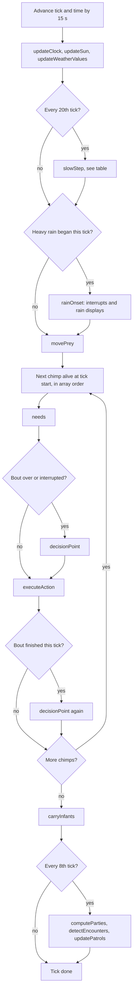

# ChimpBench simulation reference

How the ChimpBench world model works, derived from the code in [src/sim/](../src/sim/) behind [src/simulation.ts](../src/simulation.ts). It is for developers and scientists who are new to the code. Every mechanism names its function and links to its file. Numbers were checked against the code, `pnpm test` (53 passing) and a default [scripts/sim-metrics.ts](../scripts/sim-metrics.ts) run (seeds 48, 7, 21) on 28 September 2026.

[docs/research.md](research.md) holds the evidence: sources, what they show, and open questions. This document holds the mechanisms. Where they meet, research.md is the authority on what the literature says and this file is the authority on what the code does.

**Find it fast**

| I want to know… | Go to |
| --- | --- |
| How one tick runs, in order | [§4 Tick pipeline](#4-tick-pipeline) |
| How a chimp decides what to do | [§7 Perception](#7-perception-and-memory) → [§8 Decision making](#8-decision-making) → [§9 Action catalog](#9-action-catalog) |
| Every constant, with file and line | [§17 Parameter table](#17-parameter-table) |
| How the output compares with field data | [§18 Validation](#18-validation) |
| What is stylized or missing | [§19 Limitations](#19-stylizations-limitations-and-calibration-needs) |
| How to add an action, mechanism, experiment or call | [§20 Extending safely](#20-extending-safely) |

**Contents:** 1 [Scope and evidence](#1-scope-and-evidence-vocabulary) · 2 [Mental model](#2-mental-model) · 3 [Time](#3-time) · 4 [Tick pipeline](#4-tick-pipeline) · 5 [State reference](#5-state-reference) · 6 [Individuals](#6-individuals) · 7 [Perception and memory](#7-perception-and-memory) · 8 [Decision making](#8-decision-making) · 9 [Action catalog](#9-action-catalog) · 10 [Social systems](#10-social-systems) · 11 [Territory](#11-territory) · 12 [Ecology](#12-ecology) · 13 [Reproduction and life history](#13-reproduction-and-life-history) · 14 [Environment](#14-environment) · 15 [Communication](#15-communication) · 16 [Field experiments](#16-field-experiments) · 17 [Parameters](#17-parameter-table) · 18 [Validation](#18-validation) · 19 [Limitations](#19-stylizations-limitations-and-calibration-needs) · 20 [Extending](#20-extending-safely) · 21 [Glossary](#21-glossary) · 22 [Field profile](#22-field-profile-c5a)

---

## 1. Scope and evidence vocabulary

**In scope:** everything that changes `World` state. That is the files in `src/sim/`, re-exported by `src/simulation.ts`.

**Out of scope, owned elsewhere:**
- the renderer (`src/render/`, `src/scene.ts`)
- the UI (`src/ui/`)
- the fixed-step clock that decides how many ticks run per frame ([src/clock.ts](../src/clock.ts))
- the model decision loop ([src/decision.ts](../src/decision.ts))
- the shared type contract ([src/types.ts](../src/types.ts))

These layers only read the world or call the public API, with the three exceptions listed in [§2](#2-mental-model).

**What the world is.** Eastern chimpanzees in a synthetic, Kibale-inspired forest: three invented communities on a 160 m map. It is not a reconstruction of Ngogo or Kanyawara. **No behavior is calibrated** in the research.md sense, meaning fitted to a dataset and checked on held-out data. A few rates are fitted to published summary values (mortality, for example). Those are marked [M].

Evidence tags used in code comments and in this document:

| Tag | Meaning |
| --- | --- |
| **[H]** | The *pattern* is well documented in wild chimpanzees (research.md "observed / high confidence"). The number that implements it is still a design choice unless stated. |
| **[M]**, **[M-H]** | A reasonable mechanism or value consistent with published observations, or a value fitted to a published summary figure. Needs behavioral comparison. |
| **[L]**, **[M/L]** | Weak or indirect support; a plausible starting value. |
| **design** / **assumed** | A constant chosen to make the mechanism work. There is no direct evidence behind it. |
| **stylized** | A deliberate distortion, usually for the compressed map or to keep behavior visible. It is labelled in the code comment. |

Citations below come only from research.md, code comments or the target registry in [realism-design.md](realism-design.md). The code-comment figure "62 hunts in 471 days with ~24 males" (Mitani & Watts 1999) was misread: the 62 are hunting episodes and attempts (13 were finds of chimpanzees already eating meat) and the paper reports 26 adult males (research.md). Section 12 says so where it is used.

---

## 2. Mental model

- **The world is plain data.** A `World` ([src/types.ts](../src/types.ts)) is a JSON-like tree: arrays of chimps, trees, troops, water, parties, interactions, calls, prey and stimuli, plus an environment record and counters. Hidden simulation state also lives on the objects as plain data: `world.sim` (`SimState`) and `chimp.sim` (`ChimpX`), both declared in [state.ts](../src/sim/state.ts). The only non-data pieces are caches keyed by object identity, and they rebuild themselves. Those are:
  - `WeakMap` indexes (`index()`)
  - the stream occupancy grid (`streamCell()`)
  - `candidateMeta`
- **The simulation is the only writer.** The renderer and UI read. Other layers write only these control fields:

  | Field | Written by | Read by the sim in |
  | --- | --- | --- |
  | `chimp.controller` (`'rules'` or `'model'`) | UI and decision loop | `isModelControlled()` in [decide.ts](../src/sim/decide.ts) |
  | `world.modelPolicy` (`mode` off/async/lockstep, `asyncGraceMinutes`) | decision loop (`setPolicy` in [src/decision.ts](../src/decision.ts)) | `decisionPoint()` |
  | `world.ageRate` (1 natural, 365 life course) | settings UI ([src/ui/settings.ts](../src/ui/settings.ts)) | `slowStep()` / `slowLife()` / `maleStrengthDrift()` |

  All other changes go through the public API below.
- **One source of randomness.** `random(world)` in [rng.ts](../src/sim/rng.ts) is xorshift32 over the integer `world.rng`, which is seeded by `mixSeed(seed)`. Code that must not consume random numbers, such as rule scoring and layout offsets, uses the stateless hash `hash01(a, b, c, d)` instead. There is no `Math.random` and no wall-clock read (`Date.now`, `performance.now`) in `src/sim/`. `Date.UTC` appears only in one constant, the moon-phase epoch.
- **Fixed 15 s ticks.** `tickWorld` advances exactly `TICK_SECONDS = 15` ecological seconds. Playback speed only changes how many ticks run per real second ([src/clock.ts](../src/clock.ts)). The tick length never changes.

### Public API ([src/simulation.ts](../src/simulation.ts))

| Export | Semantics |
| --- | --- |
| `TICK_SECONDS` | 15. Ecological seconds per tick. |
| `createWorld(seed = 48, {profile?, params?})` | Builds the founding world: 49 chimps, 240 trees, stream, 6 water sites, 3 colobus groups. Opens at 06:30 on 28 September with everyone in night nests ([generation.ts](../src/sim/generation.ts)). `params` overrides registry values ([§17](#17-parameter-table)); an unknown id, a non-finite value, a value outside the hard range or a fraction for a whole-number entry throws `RangeError`. `profile` is `'compressed'` (default); `'field'` throws until stage C5a. |
| `tickWorld(world)` | Advances exactly one tick ([tick.ts](../src/sim/tick.ts)). |
| `stepWorld(world, dtSeconds)` | Legacy entry. Takes real seconds at 1× (×60 = ecological seconds), runs whole ticks and carries the remainder in `world.sim.carry`. Throws `RangeError` unless `dtSeconds` is finite and in [0, 60]. |
| `getEligibleActions(world, chimp)` | Recomputes and returns `chimp.candidates` (sorted, best first) from the chimp's last perception and current body. No rng. Overwrites `chimp.candidates`. |
| `rulesChoice(world, chimp)` | Pure. Returns a copy of the top candidate, or `null` if dead. Does not touch `chimp.candidates`, the rng or the world. |
| `applyDecision(world, chimpId, {action, targetId}, source, expectedVersion?)` | Validates the pair against a fresh candidate list and starts it. Returns `false` if the chimp is dead or missing, `expectedVersion ≠ chimp.decisionVersion`, or the pair is no longer eligible. |
| `resolveByRules(world, chimpId)` | Applies `rulesChoice` now. Used when a model answer is late. |
| `observe(world, chimp)` | Pure. Returns the chimp's local `DecisionContext` for the model ([§8](#8-decision-making)). |
| `applyIntervention(world, kind, {troopId?, position?})` | Starts a field experiment and returns the `Stimulus`, or `null` ([§16](#16-field-experiments)). |
| `lifeStage(age)` | infant < 5, juvenile < 10, adolescent < 15, adult < 40, elder ≥ 40 years. |
| `relationOf(world, a, b)` | What `b` is to `a`: mother, offspring, maternal-sibling, stranger, ally, rival or community, checked in that order. A rival is a community member `a` feels tension ≥ 0.35 toward, or an adult male within 120 Elo who is not an ally ([§10](#10-social-systems)). |
| `relationshipOf(world, a, b)` | Pure. `a`'s view of `b`: `{bond, tension, lastIncident, counts: {month, year}}`, where `counts` are `PartnerTally` records for this month so far and for the remembered past year ([relations.ts](../src/sim/relations.ts), [§10](#10-social-systems)). |

Conventions ([src/simulation.ts](../src/simulation.ts)):
- **Axes:** +x is east, −z is north, y is height above local ground in metres. `heading` is `atan2(dx, dz)`. `sunAzimuth` is measured clockwise from north.
- **Id ranges:** chimps from 1 (below 100000), trees from 100001, water from 200001, prey from 300001. Interactions, calls and stimuli draw from `world.nextId` starting at 1,000,000, so a `targetId` is never ambiguous.

---

## 3. Time

| Quantity | Definition ([environment.ts](../src/sim/environment.ts) `updateClock`) |
| --- | --- |
| `world.tick` | Ticks since creation. |
| `world.time` | `tick × 15 / 3600` ecological hours since the run opened. 5,760 ticks = 1 ecological day. |
| `world.hour` | `(6.5 + time) mod 24`. The run opens at **06:30 EAT** (UTC+3), civil twilight. |
| `world.day` | `floor((6.5 + time) / 24) + 1`. |
| `environment.dayOfYear` | `((270 + floor((6.5 + time) / 24)) mod 365) + 1`. Starts at **271 = 28 September**. No leap years. No calendar year is tracked, except that the moon phase is anchored to 2026-09-28. |
| season | `wet` in Mar–May and Sep–Nov, else `dry` (`isWetSeason`). |

At the 1× preset one real second is 60 ecological seconds (4 ticks). Presets run from 1 min/s to 1 day/s, plus Max, which runs as many ticks as the frame budget allows ([src/clock.ts](../src/clock.ts) `SPEED_PRESETS`).

### Two clocks

- **Ecological clock** (`world.time`). Needs, movement, bouts, weather, fruit, prey, patrols, hunts, grooming credit, bonds, wound healing and health recovery all run on it.
- **Life-history clock.** Each slow step (every 20 ticks = 5 eco-minutes) advances biology by `bioDays = (5/1440) × world.ageRate` days. That value is 0.00347 days at `ageRate` 1 and 1.27 days at 365. The life-history clock drives:
  - age and life stage
  - the ovarian cycle, gestation, lactational amenorrhea, weaning age and first swelling
  - the dispersal hazard
  - baseline mortality
  - the male strength drift and the female queue in the hierarchy

  At `ageRate` 365 one ecological day is about one biological year. A 36-day ovarian cycle then lasts about 2.4 eco-hours, and a ~228-day gestation about 15 eco-hours. Ecological rates such as feeding stay per eco-hour, so energy budgets and life history no longer match ([§19](#19-stylizations-limitations-and-calibration-needs)).
- `chimp.birthTime` is in ecological hours: founders get `−age × 365.25 × 24`, infants get the birth tick. Age advances on the life-history clock, so `birthTime` and `age` disagree whenever `ageRate ≠ 1`.

### Determinism

**Guaranteed.** The same seed and the same sequence of external inputs at the same ticks give an identical world. External inputs are:
- interventions
- `applyDecision` / `resolveByRules` calls
- writes to `controller`, `modelPolicy` and `ageRate`

This holds regardless of how ticks are batched. `stepWorld(w, 60)`, 240 × `stepWorld(w, 0.25)` and 240 × `tickWorld` produce deep-equal worlds ([tests/simulation.test.ts](../tests/simulation.test.ts)). `rulesChoice` and `observe` consume no random numbers and do not mutate the world ([tests/sim-model.test.ts](../tests/sim-model.test.ts)).

**What breaks it:**
- **Model decisions.** In async mode, whether an answer arrives before the grace period depends on wall-clock latency and speed preset. A seed alone cannot replay a live model.
- **Interventions and UI writes at different ticks.** Several interventions consume `world.rng`: `colobus-troop` spawns prey, and `remove-alpha` can roll a carried-infant event.
- **Different JavaScript engines.** ECMAScript does not require `Math.sin/exp/pow/atan2` to be correctly rounded, so bit-identical results are only expected on the same engine.
- **Mutating world state outside the API**, for example moving a chimp from the console.
- **Update order matters.** Chimps are updated sequentially in `world.chimps` order within a tick, so each one sees the already-updated state of those before it. This is deterministic, but it is part of the model.

**Serialization.** World state is designed to survive a JSON round trip. Continuing a round-tripped world identically is not covered by a test.

---

## 4. Tick pipeline

`tickWorld` in [tick.ts](../src/sim/tick.ts), in exact order:



| Step | Function (file) | Cadence |
| --- | --- | --- |
| Clock, sun, weather values | `updateClock`, `updateSun`, `updateWeatherValues` ([environment.ts](../src/sim/environment.ts)) | every tick |
| Weather state transition | `weatherTransition` (skipped while a forced storm runs) | slow step |
| Season, fruit | `updateSeason`, `updateFruit` ([environment.ts](../src/sim/environment.ts)) | slow step |
| Aging, physiology, mortality, reproduction, female queue, weaning | `slowLife` ([life.ts](../src/sim/life.ts)) → `reproSlow` ([reproduction.ts](../src/sim/reproduction.ts)), `femaleQueue` ([hierarchy.ts](../src/sim/hierarchy.ts)) | slow step |
| Male strength drift | `maleStrengthDrift` ([hierarchy.ts](../src/sim/hierarchy.ts)) | slow step |
| Prey heading, alert decay, respawn, stale hunts | `slowPrey` ([ecology.ts](../src/sim/ecology.ts)) | slow step |
| Prune interactions (30 min after end), calls (after 10 min), stimuli (15 min after end) | `slowStep`, `pruneStimuli` ([interventions.ts](../src/sim/interventions.ts)) | slow step |
| Recompute hierarchies and alpha | `recomputeHierarchies` | slow step, when dirty (in practice every slow step, because the strength drift marks it dirty) |
| Allies, grooming-credit decay | `recomputeAllies`, `hourlyLife` | hourly (eco) |
| 6-hour grooming/play summary event | `summary` | every 6 eco-hours |
| Bond upkeep; range decay and isopleths; hunting-day draw (compressed only); patch ecology | `dailyLife`, `dailyTerritory` ([territory.ts](../src/sim/territory.ts)), `huntingDays`, `materializeFruit` | daily (eco) |
| Heavy-rain onset | `rainOnset` | when rain crosses 0.35, in daylight ≥ 0.1 |
| Prey movement | `movePrey` ([ecology.ts](../src/sim/ecology.ts)) | every tick, no rng |
| Needs and mood | `needs` ([life.ts](../src/sim/life.ts)) | every tick, per chimp |
| Decision point | `decisionPoint` ([decide.ts](../src/sim/decide.ts)) | bout end, interrupt, or finished bout |
| Action execution | `executeAction` ([execution.ts](../src/sim/execution.ts)) | every tick, per chimp |
| Infant carrying | `carryInfants` ([tick.ts](../src/sim/tick.ts)) | every tick |
| Parties, range use, intergroup sightings, patrol waypoints and listening stops | `computeParties`, `recordUse`, `detectEncounters`, `updatePatrols` ([parties.ts](../src/sim/parties.ts)) | every 8 ticks (2 eco-min) |

The slow step runs *before* the chimps in its tick. A chimp that dies in `slowLife` is skipped for the rest of the tick. The loop iterates over a snapshot of the living, so infants born this tick start acting on the next.

---

## 5. State reference

"Who updates" names the writer function. "Units" are ecological unless marked *bio*. Everything in 0..1 is a unitless level.

### World

| Field | Meaning, units | Who updates |
| --- | --- | --- |
| `seed` | Creation seed (uint32). | `createWorld` |
| `time`, `tick`, `hour`, `day` | See [§3](#3-time). | `tickWorld`, `updateClock` |
| `size` | Map side, 160 m (x and z in −80..80). | `createWorld` |
| `chimps` | All individuals ever, dead included (genealogy). | `createWorld`, `giveBirth` |
| `trees` | 240 trees; `fruit` changes. | `makeTrees`, `updateFruit`, `forageTick` |
| `troops` | 3 communities. | see Troop |
| `water` | 6 drinking sites on the stream banks (radius 1.2 m). | `createWorld` |
| `stream` | Channel polyline and fords ([§14](#14-environment)). | `createWorld` |
| `events` | Feed of `SimEvent`s, newest last, capped at 200. | `addEvent` ([events.ts](../src/sim/events.ts)) |
| `parties` | Derived fission-fusion subgroups. | `computeParties` |
| `interactions` | Observable episodes (`Interaction`). | `startInteraction`, `flashInteraction`, `endInteraction`, pruned in `slowStep` |
| `calls` | Vocalizations of the last 10 min. | `emitCall`, playback, pruned in `slowStep` |
| `prey` | Red colobus groups. | `spawnPrey`, `movePrey`, `slowPrey`, `resolveHunt` |
| `stimuli` | Active interventions. | `applyIntervention`, `pruneStimuli` |
| `environment` | See Environment. | [environment.ts](../src/sim/environment.ts) |
| `rng` | xorshift32 state. | `random` |
| `nextId` | Next dynamic id (≥ 1,000,000). | `nextId()` |
| `births`, `deaths` | Legacy mirrors of `stats`. | `giveBirth`, `killChimp` |
| `stats` | Cumulative counters: births, deaths, conflicts (decided within-community contests), injuries, groomingBouts, playBouts, hunts, huntSuccesses, intergroupEncounters, killings, takeovers, transfers, reconciliations. | various |
| `ageRate` | Life-history days per ecological day (1 or 365). | UI (control field) |
| `modelPolicy` | `{mode, asyncGraceMinutes}`, default `{async, 6}`. | decision loop (control field) |

### Chimp

| Field | Meaning, units, range | Who updates |
| --- | --- | --- |
| `id`, `name` | Unique id; invented name from a 40-name pool per community (then "Name 2"). | `makeChimp`, `nextName` |
| `troopId`, `natalTroopId` | Current and birth community. | `doTransfer` |
| `sex`, `age`, `stage` | Age in *bio* years. | `slowLife` |
| `position`, `heading` | Metres; y is height above ground. Radians. | `moveTo`, `carryInfants`, `nestTick` |
| `action`, `targetId`, `actionTime`, `reason` | Current bout. Target is a chimp, tree, water or prey id, or −1. `actionTime` counts eco-seconds in the bout. `reason` is one plain sentence. | `startAction`, `executeAction` |
| `hunger`, `thirst` | 0..1, 1 = maximal need. | `needs`, feeding, drinking, nursing |
| `energy` | 0..1, 1 = rested. | `needs` |
| `social` | 0..1 contact satisfaction; social need is `1 − social`. | `needs`, grooming, play, nursing |
| `stress` | 0..1. Relaxes toward 0.05. | `needs`, conflicts, reconciliation |
| `health` | 0..1. Relaxes toward a condition target. | `slowLife` |
| `injury` | 0..1 wound severity. Heals 0.075 per eco-day. | conflicts, `slowLife` |
| `elo`, `rankOrder`, `rank` | Dominance Elo; rank within own sex hierarchy (1 = top, 0 = unranked); legacy 0..1 standing. | `eloUpdate`, `recomputeHierarchies` |
| `motherId`, `fatherId` | −1 when unknown. `fatherId` is the genetic sire; chimps do not know it. | `makeChimp`, `giveBirth` |
| `birthTime`, `deathTime`, `causeOfDeath` | Ecological hours (see [§3](#3-time)). | `makeChimp`, `killChimp` |
| `skills` | 0..1: climbing (grows in play), foraging (grows while feeding), hunting (+0.01 per capture a hunter took part in), social (grows while grooming). | execution |
| `bonds` | Directed 0..1 by id. Missing = 0.15 same community, 0 otherwise. | grooming, sharing, coalitions, `dailyLife` |
| `personality`, `appearance` | Stable 0..1 seeds. Build scales strength. | `makeChimp` |
| `memory` | ≤ 36 `Memory` records ([§7](#7-perception-and-memory)). | `perceive` |
| `episodes` | ≤ 12 first-person episodes. | `episode()` |
| `candidates` | Last candidate list, best first. | `getEligibleActions` |
| `decisionSource`, `decisionVersion`, `nextDecision` | Who chose the current bout; a counter bumped by every start (and by an interrupt while waiting for the model); bout end time (eco-hours). | `startAction`, `interrupt` |
| `controller`, `awaitingDecisionSince` | Control field; time a model-controlled chimp began waiting, or null. | UI / `decisionPoint` |
| `alive` | False after death. The chimp stays in `chimps`; after a while its record is slimmed (see Death in [§13](#13-reproduction-and-life-history)). | `killChimp`, `slimDead` |
| `pregnancy` | *Bio* days since conception, 0 = not pregnant. | `reproSlow` |
| `swelling`, `cycleDay`, `lactating` | 0..1 anogenital swelling; *bio* day in the cycle or −1; nursing an unweaned infant. | `reproSlow`, `giveBirth`, `slowLife` |
| `carryingMeat` | 0..1 meat units. Eaten at 0.35/h. | `resolveHunt`, sharing, `needs` |
| `nest` | Tree id and nest point, or null. | `nestTick`, `startAction` |
| `mood`, `vocal`, `vocalUntil` | Derived each tick from action and state; current call and its end. | `needs`, `emitCall` |
| `partyId` | Smallest member id of the chimp's party (−1 when dead). | `computeParties` |
| `lastConflict`, `allies` | Last decided conflict; up to 3 coalition partners. | `decided`, `recomputeAllies` |
| `digests` | Optional `MemoryDigest[]`, ordered by end time: yearly digests for life plus monthly digests for the last 12 months ([§7](#7-perception-and-memory)). The month in progress lives in `chimp.sim.month`. | `finalizeMonth`, `compressYear` ([relations.ts](../src/sim/relations.ts)) |
| `carryingDeadId` | Optional. Id of the dead infant a mother is carrying; absent or −1 when none. Plain-data mirror of hidden `carryDead` (its end time) so the renderer need not read `chimp.sim`. Set without any extra RNG draw. | `killChimp` (set; cleared if the mother dies), `slowLife` (cleared when she leaves the body) |
| `cooldown` | Vestigial. Decremented in `slowLife`, never set. | — |

### Troop (community)

| Field | Meaning | Who updates |
| --- | --- | --- |
| `center`, `radius` | Use-weighted centre of the range and the radius of a circle with the range's area, metres. Created at West (−46, 18) r 32; East (48, 14) r 27; North (2, −50) r 25 (field: centres × 33.63, radii 1,600 / 1,350 / 1,250). | `dailyTerritory` ([§11](#11-territory)) |
| `range` | Optional. The 95% isopleth of the community's utilization distribution: grid `cell` (m) and `n`, row-major cell indices `cells`, and the 50% `core`. | `dailyTerritory` |
| `alphaId`, `alphaSince`, `alphaHistory` | Alpha male (−1 vacant) and tenures `{id, from, to, how}`. Founding alphas' tenures are back-dated 2–4.6 years. | `changeAlpha` |
| `maleHierarchy`, `femaleHierarchy` | Living ids by Elo: males ≥ 10 y, females ≥ 15 y. | `recomputeHierarchies` |
| `adultMales` | Living males ≥ 15 y. The type comment says "each tick", but it is refreshed at each hierarchy recompute (every slow step in practice). | `recomputeHierarchies` |
| `name`, `color`, `emblem` | Presentation. | `createWorld` |

### Other records

| Record | Fields and meaning | Who updates |
| --- | --- | --- |
| `Party` | `id` (smallest member id), `troopId`, sorted `members`, `center` (y = 0), `kind`: patrol if ≥ 40% patrolling, hunting ≥ 30%, nesting ≥ 50%, consort if ≤ 3 members with ≥ 2 consorting, foraging ≥ 40%, traveling if travel+follow+transfer ≥ 40%, else social (checked in that order). | `computeParties` |
| `Interaction` | `kind`, actor, target, participants, `start`/`end` (eco-hours, `end` null while open), midpoint `position`, `intensity` 0..1. Emitted kinds: groom, play, reconcile, console, display, rain-display, charge, chase, fight, intergroup, coalition, infanticide, kill, pant-grunt, share, beg, hunt, mate, guard, consort, nurse, patrol, transfer, takeover. The contract's `alarm` kind is never emitted. | [events.ts](../src/sim/events.ts) helpers |
| `Call` | `kind`, `callerId` (−1 for playback), `troopId`, `position`, `time`, `radius` (m). | `emitCall` |
| `PreyGroup` | Red colobus: `position` (y = 17 m), `heading`, `size` (14–37 individuals), `alert` 0..1. | [ecology.ts](../src/sim/ecology.ts) |
| `Environment` | See [§14](#14-environment). `moonPhase`, `lightningAt`, `humidity` and `wind` are computed for rendering; no behavior reads them. | [environment.ts](../src/sim/environment.ts) |
| `Stimulus` | `kind`, `position`, `radius` (m), `start`/`end` (eco-hours), target `troopId`, `label`. | `applyIntervention` |
| `Stream` | `points` (~2 m spacing), `halfWidth` 1.8 m, 3 `crossings` (fords). | `createWorld` |

### Hidden state

**`world.sim` (`SimState`, [state.ts](../src/sim/state.ts))**

| Field | Holds |
| --- | --- |
| `carry` | `stepWorld` remainder, eco-seconds |
| `nextChimpId`, `aliveVersion`, `hierDirty` | index and hierarchy bookkeeping |
| `weather` | Markov state, rain target, heavy-rain latch, cumulative `rainMm`, `forcedUntil` |
| `droughtUntil`, `figTree`/`figUntil` | intervention timers |
| `patrols` | active patrol per community: leader, neighbor, phase, waypoint, `until`, `sector`, `incursion`, listening stop `stopUntil`/`lastStop`, `stops` |
| `ud`, `danger`, `sectorVisit`, `udStamp` | per community: utilization distribution (independent member-hours per cell, daytime, not nesting), danger marks, last periphery visit per compass octant, isopleth version ([§11](#11-territory)) |
| `hunts`, `lastHunt`, `huntDay` | active hunts, last hunt start, end of the current hunting day |
| `encounters` | deduplication keys for encounter episodes |
| `nextPreyId`, `preyAt` | prey id counter and respawn time |
| `gates` | event rate limiters |
| `groomTally`, `playTally`, `lastSummary` | 6-hour summary |
| `aware` | chimps aware of each snake stimulus |
| `names` | per-community name counters |
| `unstableUntil`, `vacantUntil`, `alphaHow` | hierarchy upheaval |
| `kills` | killings per "A>B" community pair |
| `lastDaily`, `lastHourly` | cadence timers |
| `params` | `{registry, profile, overrides}`: the registry hash at creation, the profile and the override set (usually `{}`). The resolved values are derived per world by `paramsOf(world)` ([params.ts](../src/sim/params.ts)) and never stored. |

**`chimp.sim` (`ChimpX`)**, grouped:

| Group | Fields |
| --- | --- |
| Bout | `actEnd`, `phase`, `prog`, goal `gx/gy/gz`, `intr` (pending interrupt reason), `lastIntr`/`lastIntrAt` (last interrupt, for spacing and `observe().recent`), `finished`, `interId`, variant `v`, `aux`, `flag` |
| Perception snapshot | `seen` (attended ids), `seenAt`, `sight`, `ownMales`, `visibleOwn`, `strangers`, `strangerMales`, `nearestStranger`, `isolated`, `newcomers`, `metAt`, `trees`, `fruitNear`, `preyId`, `stims` |
| Hearing | `heardN/At/X/Z/Troop/Stim`, `lastHeard`; same-community call to join: `joinCall/Caller/At/X/Z/Rich` |
| Social bookkeeping | `greet`, `support`, `groomRecv`, `coerce`, `lastDisplay/Call/Mate/Agg/FoodCall`, `victimOf/At`, `lostAt`, `coalA/B/At`, `rivalId`, `recon`, `consoleAt`, `consoledAt`, `gangAt`, `gangRoll` |
| Impulses | `impulse`, `impulseTarget`, `impulseUntil`, `patrolRoll` (last patrol-hazard roll) |
| Slow internal states (stage E4a, [endocrine.ts](../src/sim/endocrine.ts); absent until `endoStates` is on) | `arousal` (competitive arousal, adult males), `affil` (affiliation); the stress load is `chimp.stress` |
| Fast arousal and E4a fixes (stage E4b, [endocrine.ts](../src/sim/endocrine.ts); absent until their switch fires) | `fast`, `fastAt` (the fast state as last kicked, read with decay by `fastNow`); `aggKick` (last aggression stamp that kicked the stress load), `heardFrom` (start of the current hearing episode) |
| Calls as decisions (stage E4c, [calls.ts](../src/sim/calls.ts); absent until the switch is on and the animal first pant-hoots) | `phAt`, `phX`, `phZ` (when and where it last pant-hooted: where its listeners' cues point) |
| Life history | `cycleLen`, `cops`, `near`, `sireId`, `amenUntil`, `firstSwell`, `gestation`, `weanAge`, `weaned`, `caretaker`, `immigrantAge`, `disperser`, `transferTo`, `guardBy`, `carryDead`, `nestTree` |
| Space | female core area `coreX/coreZ` |
| Relationships and memory ([relations.ts](../src/sim/relations.ts)) | `tension` (directed 0..1 by partner id), `incident` (last incident per partner: `[time, code]`, code 0 threat given, 1 threat received, 2 attack given, 3 attack received), `month` (the memory month in progress: `start`, `startRank`, per-partner `partners` tallies, `events`, `encounters`, `lastEncounter`), `monthsSinceYear` |

A few `ChimpX` fields are written but never read (`mateAsk/mateAskAt`, `strangerTroop`, `consortId`), and `lastHuntAt` is never used at all. They are harmless leftovers.

---

## 6. Individuals

**Founders** (`buildCommunity`, [generation.ts](../src/sim/generation.ts)):

| Community | Chimps | Adult males | Adolescent males |
| --- | --- | --- | --- |
| West | 22 | 7 | 1 |
| East | 15 | 4 | 1 |
| North | 12 | 3 | 1 |

- **Structure:** matrilines, male philopatry, and mostly immigrant adult females (`immigrantAge` 12.5–14.5 y). Immature founders get synthetic sires weighted toward high rank (`pickSire`).
- **Starting Elo** comes from rank hints. Adult male build, and hence strength, falls with rank hint, so the alpha starts as the strongest male. That is a design choice so that later aging and contests, not a bad start, reorder ranks.
- **Starting bonds** by relationship:

  | Relationship | Bond |
  | --- | --- |
  | Mother–offspring | 0.88–0.96 |
  | Maternal siblings | 0.5–0.7 |
  | Male–male (≥ 12 y) | 0.28–0.61 |
  | Immature pairs | 0.3–0.5 |
  | Others | 0.12–0.34 |

  A few strong male pairs are set per community.
- **06:30 start:** everyone is in a night nest in 2–3 sleeping clusters, and dependents share the mother's nest. First decisions come 3–39 eco-min in.
- **Starting knowledge:** each chimp remembers its community's water sites and 8 fruiting trees. For females these are weighted toward their core area.

**Individual constants** (`makeChimp`):

| Constant | Range |
| --- | --- |
| Cycle length | 34–38 bio-days |
| First swelling | 10.2–11.4 y |
| Gestation | 222–232 bio-days |
| Weaning age | 4.1–5.2 y |
| Female disperser | 87% of females are |
| Personality | 0..1 on each axis; males get +0.1 boldness and +0.15 aggression; under-10s get +0.15 playfulness |
| Skills | start near `age/22` |

**Needs per eco-hour** (`needs`, [life.ts](../src/sim/life.ts)). "Sleeping" means in a finished nest, or riding in the mother's nest. "Running" is charge, attack, flee or display.

| Need | Rate |
| --- | --- |
| Hunger | +0.06 awake, +0.09 running, +0.022 sleeping. Times a body factor of 0.6–1 below 12 y. Plus 0.012 when lactating (C8c, `lactTaper` on: full until the youngest unweaned offspring is 0.5 y, then falling linearly to 30% at 2 y and level until weaning) and 0.008 when pregnant. |
| Thirst | +0.026 awake (+0.008 above 22 °C, −0.03 × rain), +0.008 sleeping |
| Energy | +0.1 sleeping; +0.06 resting, sheltering, grooming or nursing; −0.25 running; −0.05 walking actions; −0.02 otherwise |
| Social | −0.035 awake, −0.01 sleeping |
| Stress | relaxes toward 0.05 at 25% per hour |
| Meat | eaten at 0.35 units/h; each unit lowers hunger by 1.2 |

At +0.06/h, hunger climbs from a typical 0.3 to 1 in about 12 waking hours without food. Mood is derived each tick from action and state (`moodFor`).

**Energy ledger** (stage E1, `energyLedger`, off by default; [energy.ts](../src/sim/energy.ts), [staging/e1-prereg.md](staging/e1-prereg.md)). With the switch on, the hunger row above and every hunger-unit conversion are replaced by an energy balance in kcal:
- **State** (`chimp.sim.en`, created on the first tick): gut contents, body reserves relative to a set point, lifetime energy in and out, last position.
- **Intake** goes into the gut, up to its capacity (25 kcal per kg of body mass): ripe fruit 9.9 and figs 12.5 kcal per feeding minute (× skill, the under-5 factor, the self-feeding ramp and snare injury, as before; the crop is depleted in proportion), fallback foods 4.2 × the forage field, meat 6.7, milk 2.5 per nursing minute, a shared plant piece 50 kcal.
- **Absorption**: the gut empties into the body first-order over 3 h.
- **Expenditure** per tick: 70 × mass^0.75 kcal/day × 1 asleep, 1.25 awake or 1.38 feeding; 3.8 J/kg per metre moved; mass × g ÷ 0.2 per metre climbed (a carried infant is charged to its carrier); gestation; growth (4.5 kcal/g). A mother pays milk ÷ 0.8 for what her infant drinks; she makes at most 23.2 × mass^0.75 kcal of milk a day (about 307), whenever it is drunk (the store holds a day of synthesis). There is no prescribed lactation cost.
- **Body mass**: 1.8 kg at birth, linear to 31.3 kg at 10 y (females) or 39 kg at 13 y (males).
- **Readouts**: `hunger` = gut emptiness × appetite, with appetite = 0.5 − 5 × reserves ÷ usable reserve (0..1); `cond` = 0.7 × (1 + reserves ÷ usable reserve), read by C8's health, growth and fertility terms as before; reserves at minus the usable reserve (1,300 kcal per kg) are death by starvation. The −0.3 health term at hunger > 0.9 is not used.
- Energy in − energy out = Δgut + Δreserves for every individual (`tests/sim-energy.test.ts`). `scripts/energy-diagnose.ts` prints the budget by class, and unweaned infants by year of age (milk by day and night, own food, growth, daytime nursing and eating).
- **Warning: the ledger is not valid at `ageRate` > 1.** Gestation, milk synthesis and growth are charged per ecological tick at their natural daily rate, so in life-course mode (`ageRate` 365, `scripts/sim-metrics.ts`, `src/field/lifecourse.ts`) reproduction and growth would cost about 1/365 of their real energy. Those runs use the default parameters (ledger off); do not combine them with `energyLedger` 1. `scripts/energy-diagnose.ts` refuses it.
- **Infant energetics** (stage E1c, three more switches, off by default, active only with the ledger; [staging/e1c-prereg.md](staging/e1c-prereg.md)). `ledgerGrowSurplus`: body mass is state (`chimp.sim.en.kg`, opened on the curve for founders and at 1.8 kg at birth), and an animal below adult mass grows at the curve's slope (now its well-fed potential) only while its reserves are above the set point, so an underfed infant stops growing instead of burning its reserve; mass for age becomes an output. `ledgerNightNurse`: an infant sleeping in its mother's nest suckles while hungry, through the same transfer as by day, so night milk is no longer lost to the nest rule and the gland store (24 h, or its sourced 11 h) stops mattering. `ledgerInfantIntake`: intake capacity on fruit and fallback foods scales with (mass ÷ adult mass)^0.75 (design), replacing C8's self-feeding ramp and the under-5 factor, for juveniles too. Measured (2 seeds, 30 + 60 days): infants of 0.5–5 y hold their reserves (they fell 0.13–0.15 of the store without the switches); they grow at the potential in year 1 and at 0.8–1.1 kg/y at 1–3 y; half their milk is drunk at night. Still wrong: infants ≥ 1 y spend 40–67% of daylight suckling an empty gland and 1–7% eating (field about 3% and 17–47%), and mothers' milk cost rises with infant age instead of falling in year 2. Both trace to the nurse act and option (no value for the milk delivered), not to an energy input.
- **Nursing worth the milk** (stage E1d, `ledgerNurseByMilk`, off by default, with the ledger only; [staging/e1d-prereg.md](staging/e1d-prereg.md)). The nurse option's score is multiplied by the share of the infant's gut room the mother's gland store can fill now (0 with a full gut), and a nursing bout ends when the gland can no longer sustain the suckling rate for a tick. No new number; comfort (non-nutritive) suckling is not modelled. Measured (2 seeds, 30 + 60 days, on the stack with the E1c switches): daytime drinking by infants of 1–4 y falls from 40–67% to 10–13% of daylight (field about 3%, comfort included), daylight eating rises to 3–9% (field 25–47%), growth reaches its potential, and the milk freed by day is drunk at night, so mothers still pay the whole yield (about 384 kcal/day at infant ages 1–4 y) and the year-2 recovery does not appear. Milk synthesis falling with the mother's own reserves was considered and not built: output is protected at moderate deficits in baboons and women (roberts1985, prentice1983).
- **One nursing rule and growth potential** (stage E1f, `ledgerNurseBout` and `ledgerGrowPotential`, off by default, with the ledger only; [staging/e1f-prereg.md](staging/e1f-prereg.md)). `ledgerNurseBout` replaces the two nursing routes (E1d's share of the gut room, E1e's share of a full flow): a day bout is worth E ÷ (E + suckling rate × milk-ejection latency), E the milk it can deliver (gland store plus synthesis while it drains, up to the milk the foregut takes); in the act no milk flows for the first 54 s (women, gardner2015, assumed), and the bout ends when a tick delivers less than the full flow. `ledgerGrowPotential` (with `ledgerGrowSurplus`): the growth potential is the captive rate (2.8 kg in year 1, then 3.4 F and 3.8 M kg/y; desilva2011, curry2023 sanctuary) up to the adult mass; growth is spending at that potential, limited only by condition through C8's rule (min(1, cond ÷ `condGood`)), and the drive (E1e) expects it. Measured (2 seeds, 30 + 60 days, term births at day 30): bouts rise to 1.0–1.4 per daylight hour (field 1.1) and nipple contact to 9–11% of daylight (field 2–3.7%); infants and juveniles grow at the captive potential (2.8–3.8 kg/y, about twice the Gombe estimate) while eating 6–12% of daylight (field 22–49%), because their intake per eating minute (size-scaled adult rates, design) is 3–5 times what the field's eating time implies; mothers' milk cost is flat at the yield from 1 y and their balance shows neither the early depression nor the year-2 recovery of emeryThompson2012. A first variant that paid growth only from the day's surplus grew at 0.45 of the potential, but only because growth absorbed every shortfall and so hid it from the appetite. Infant targets T-INF-1 to T-INF-5 are staged in `docs/staging/e-targets.patch.json`.

**Digesta** (stage E1b, `ledgerDigesta`, off by default, read only with `energyLedger` 1; [energy.ts](../src/sim/energy.ts), [staging/e1b-prereg.md](staging/e1b-prereg.md)). The gut holds digesta instead of energy:
- **Foregut** (stomach and small intestine; `en.dm`, `en.fib`, g dry matter): each food fills it by its measured dry matter per kcal (drupes 3.0 g per 9.9 kcal, figs 4.2 per 12.5, fallback 1.89 per 4.2; meat and milk assumed) and carries its fibre share (NDF 0.415 of ripe fruit, 0.534 of fallback). Capacity 5.6 g per kg of body mass (83 mL/kg × 0.45 × 0.15 g/mL, all assumed): 175 g, or 579 kcal of drupes, at 31.3 kg. It empties first-order over 3 h; the non-fibre energy is absorbed, the fibre passes to the hindgut, and only as fast as the hindgut has room.
- **Hindgut** (`en.hind`, g fibre; 9.1 g/kg): fibre leaves first-order so that a share 0.449 is fermented (3 kcal/g absorbed) and the rest passes out (`en.fec`) after the 38 h mean retention time.
- **Absorbed energy** is 0.94–0.97 of the field formula's value (the formula credits fibre at 1.6 kcal/g); absorbing costs 10% of what is absorbed (diet-induced thermogenesis, a `digestion` term). `en.fin` and `en.dmIn` keep the formula energy and dry matter eaten, the field's intake measures.
- **Hunger** = foregut emptiness by bulk × the E1 appetite. Options are still valued by energy (the gut capacity the intake valuation reads is the foregut's, in kcal of drupes).
- in − out − passed out = Δ(gut + 3 × fibre in both pools) + Δreserves for every individual (`tests/sim-digesta.test.ts`).
- **Result: null** (quick check, 2 seeds, 30 + 60 days). Adult females eat 1,308 formula kcal in 171 min (field 2,479 kcal in 309 min); expenditure per kg^0.75 enters T-ENE-8's band with DIT; midday rest does not emerge; lactating females lose 0.23% of their store a day because hunger cannot exceed foregut emptiness, and at the low end of the assumed capacity the population starves. Details in the pre-registration's Results section.

**Two-signal appetite** (stage E1e, `ledgerDrive`, off by default, read only with `energyLedger` 1; [energy.ts](../src/sim/energy.ts), [staging/e1e-prereg.md](staging/e1e-prereg.md)). Hunger = φ × (1 − fill²): φ = need ÷ (intake rate × waking time left), clamped to 1; need = −reserves − energy still in the gut + the day-long average of spending (`en.eAvg`) × (waking time left + the fast after it). Waking time left and the fast come from sleep pressure: hours awake so far = τ·ln((1 − S_wake)/(1 − S)), yesterday's waking day = τ·ln((1 − S_wake)/(1 − S_bed)) (`en.sWake`, `en.sBed`, recorded at waking and falling asleep); the fast is the rest of 24 h. No hour is read. Trees are valued by the energy a bout can deliver before the foregut is full (crop share, need, and the foregut's room plus its emptying while it fills), nursing by the flow the mother's glands give now. Result (quick check, 2 seeds, 30 + 60 days, iteration 2): viable; lactating females hold their reserves (−0.05%/day against −0.26 without it); a late-afternoon rise in feeding appears without a clock; feeding time and daily intake are unchanged (171 min, 1,310 kcal for adult females); keep, provisional. Details: the pre-registration's Results section.

**Wild-cost sensitivity** (stage E1g, `ledgerWildCostMult`, default 1, read only with `energyLedger` 1; [staging/e1g-prereg.md](staging/e1g-prereg.md)). A sensitivity parameter for one unmeasured quantity, the total expenditure of wild chimpanzees: it multiplies the resting × activity term of every individual (the extra is tapped as `wild`). No wild ape has a measured expenditure; wild haplorhines measured with doubly labelled water bound it at 1.0–1.4. Sweep on the full E stack (2 seeds, 30 + 60 days, k 1.0 / 1.3 / 1.6 / 1.9): the activity rows T-ACT-1–4 all enter their bands at about 1.6, but adult females' intake stops at about 1,980 formula kcal and 250 eating minutes (the foregut's throughput: E1b's assumed capacity and emptying with E1e's satiation curve), so mothers starve from 1.3 and 15 of 98 animals starve at 1.6. With the gut at the top of its assumed range, k 1.6 is viable for adults (intake 2,261 kcal, 259 min); infants under 2 y still starve on the human-scaled milk yield. The default stays 1; never fitted.

**Food energy from measured sugars** (stage E1h, `ledgerFoodEnergyFix`, off by default, read only with `energyLedger` 1; [staging/e1h-prereg.md](staging/e1h-prereg.md)). The field formula behind the plant foods' kcal per minute credits total non-structural carbohydrate by difference at 4 kcal/g; where it can be paired with doubly labelled water it overstates expenditure by 13–92% (simmen2017), and its subjects were nursing mothers (docs/staging/e-field-audit.md). The switch replaces it with measured water-soluble sugar plus 5% pectin (simmen2017's rule on uwimbabazi2019's composition): drupes 7.39, figs 8.12, fallback 3.23 kcal/min instead of 9.9, 12.5, 4.2; dry matter per minute and fibre are unchanged, so each kcal brings 1.3–1.5 × the bulk. On the full E stack (2 seeds, 30 + 60 days): adults eat 28–38% longer and T-ACT-1 (0.30 → 0.38), T-ACT-4 (0.46 → 0.36–0.37) and grooming (0.25 → 0.18) move toward their bands at unchanged expenditure, but at E1b's central gut volume nursing mothers are throughput-bound (about 620 g of dry matter a day, absorbing 0.79 of what they spend) and lose 0.85% of their store a day. With the gut at the top of its assumed range (111 mL/kg) mothers eat 266 min and 783 g a day, an observer using the field's kcal/min would record 2,440 kcal (field 2,479 ± 858), and they nearly balance; that arm's held-out distance rose by 0.68 (one hunting row), so the registered result is a narrow null and the switch stays off. The staged rows T-ENE-1 to T-ENE-3 are scored on lactating females, T-ENE-1 flagged contested with a sugar-based comparison band of 1,810–2,070 kcal/day (`scripts/energy-diagnose.ts` prints them). Gut capacity is the input to source next.

**Intake of nursing mothers** (stage E1i, `ledgerSatiationReserve` and `ledgerLactGut`, off by default, read only with `energyLedger` and `ledgerDrive` 1 (the second also with `ledgerDigesta`); [staging/e1i-prereg.md](staging/e1i-prereg.md), diagnosis tool `scripts/intake-diagnose.ts`). With corrected food energy, nursing mothers stopped eating with room in the gut because their drive was saturated (φ = 1: a reserve deficit several times what one waking day can supply), so their hunger was E1e's satiation term 1 − fill² alone, the curve of a balanced animal; bouts ended at need-bucket redraws as the foregut passed 0.775 full, and the rules then chose feeding no more often than in any other class (about 31–33% of daylight eating in every class). `ledgerSatiationReserve` weights the satiation term by the relative store, hunger = min(φ, 1) × (1 − (1 + reserves ÷ store) × fill²) (adiposity signals modulate satiation signals; proportional form, design): mothers then feed 322 min a day (field 309 ± 85) but half of those minutes are spent at a full foregut, whose throughput (at most about 890 g of dry matter a day at 83 mL/kg) binds. `ledgerLactGut` grows a lactating female's foregut and hindgut in proportion to her milk demand, × (1 + m ÷ max(E − m, m)) with E her day-long mean spending and m the cost of her full milk yield (about × 1.30; direction from small mammals, magnitude design, no primate source). Together (quick check, seeds 48 and 7, 30 + 30 days): mothers absorb 0.99 of what they spend (−0.04% of the store a day against −0.79 without), eat 278 min and 796 g of dry matter a day, an observer using the field's kcal/min would record 2,484 kcal (field 2,479 ± 858), every class is viable, and the bench sums move inside noise against the mean of four reference realizations; keep (provisional) for the pair, pending a 5-seed confirm. Mothers then range further relative to males (T-RNG-5 0.67 → 0.84), and mothers of infants of 2 y or more still groom about a third of daylight, mostly answering their own infant's grooming.

**Mothers' ranging** (stage E1j; no switch; [staging/e1j-prereg.md](staging/e1j-prereg.md), diagnosis tool `scripts/ranging-diagnose.ts`). T-RNG-5's band (lactating ÷ male day range, 0.3–0.6) is one site's: Budongo's six lactating or gestating females on 13 follow-days of at least 8 h, with fixes only while travelling (batesByrne2009; 1.2 ± 0.8 against 2.7 ± 1.5 km). Gombe's mostly anoestrous females give 0.67–0.74 (wrangham1975, primary), and pontzerWrangham2004 through wilson2021 gives 0.83 at Kanyawara and 0.70 at Gombe for adult females (secondary); a multi-site band is staged in `docs/staging/e1j-targets.patch.json`, not applied. The observer sums every 5-min fix of a complete follow, inside halts too: the field's rule moves the ratio by −0.03 on R and 0 on B, the 5-min resolution is the same for mothers and males (0.90–0.94 of the per-tick path), and a quick run's value is the simulation's ratio times about ±0.1 of follow-day sampling (13–24 mothers' days per run). In simulation truth (every chimp-day) the ratio is 0.79 ± 0.03 over the reference stack R's four quick realizations (the observer reads 0.71 ± 0.08: about 90% of a quick run's spread is follow-day sampling), 0.69 with every switch off and 0.69 with E1i's fed mothers, whose quick observer value of 0.84 was sampling. Mothers walk about the field's distance (observer 1.33 ± 0.11 km/day over R's four quick realizations; Budongo 1.2 ± 0.8). R's ratio is higher than B's because its **males' food trips are about half as long (205 → 112 m)** while the mothers' shorter trips are refilled by walks to water and to play with the infant. Every adult walks to water 2.3–3.1 times a day, about 0.45 km (thirst timers; C5a tuned `fruitThirstFactor` and `drinkDistScaleM` against T-RNG-4). Carrying is charged by the ledger (11 kcal/day) but no decision reads it; a net-energy trip value would change trips by at most 4%. No mechanism was built. An attribution run without thirst (A1) shows that the thirst timers also drive fission–fusion: without walks to water parties stay together (T-PTY-1 3.8 → 4.4), males stop walking to rejoin callers, males lose 0.64 km/day and mothers 0.38 (truth ratio 0.79 → 0.86), T-RNG-4 falls to the band's floor and grooming rises out of its band; a water balance in place of the timers will have to replace that fission driver too.

**Daily rhythm from body state (stage E2a, [rhythm.ts](../src/sim/rhythm.ts); three switches, off by default; [staging/e2a-prereg.md](staging/e2a-prereg.md)).** No hour of the day is read by this mechanism.
- **`rhythmSleep`.** Sleep pressure `S` (`chimp.sim.slp`, 0..1) rises awake as `1 − (1 − S)·exp(−dt/18.2 h)` and falls asleep in a nest as `S·exp(−dt/4.2 h)` (the two-process model's process S; human time constants, *assumed*). Light suppresses felt sleepiness: `energy = 1 − S·(1 − daylight)`, which replaces the energy timers. A nest (build or stay) is worth `(1 − daylight)·(0.9·S + 2.2)`, and a new nest is offered only while `daylight < 1`. This replaces the nest clock ramp, the `hour ≥ 12` gate, the 05:45 cap of the night bout and the night rest bonus. Nest bouts follow light: 60–100 min in the dark, 4–9 min in changing light, 12–20 min in full light, and returning light cuts a bout drawn in the dark.
- **`rhythmHeat`.** A thermal load `H` (`chimp.sim.heat`, −1..1) from a heat balance per kg: basal rate (Kleiber) × 1 asleep, 1.38 feeding, 1.25 otherwise; the work of the metres actually walked (3.8 J/kg/m) and climbed; sun under cloud and canopy (2% of open sky on the ground and for a resting animal, up to 50% at canopy height); losses between a vasoconstricted minimum and a vasodilated maximum plus evaporation, scaled by body − air temperature and tripled by a soaked coat. A surplus is stored (H > 0), a shortfall is a debt (H < 0). Rest gains `1.6·max(0, H)`; shelter is offered in rain (≥ 0.12) to an animal in debt at `1.6·max(0, −H)`. This replaces the midday rest literal, the temperature bonus, the midday rest bout and the shelter rule. The dissipation values are *assumed*: no thermoneutral zone has been measured for chimpanzees.
- **`rhythmFreeNight`.** The rules policy's menu is not filtered by day phase ([§8](#8-decision-making)); models keep the night and dusk menus.
- **Measured** (quick check, 2 seeds, 30 days; `scripts/rhythm-metrics.ts`): results and misses are in the pre-registration's Results section.

**Nest departure (stage E2b, [departure.ts](../src/sim/departure.ts), [rg.ts](../src/sim/rg.ts); three switches, off by default; [staging/e2b-prereg.md](staging/e2b-prereg.md)).** Built on `rhythmSleep`; no hour of the day is read.
- **`departRace`.** The nest's value (staying or building) is lowered by the largest stake of delay among the animal's feeding options: food worth × competitors × the part of the meal they take when they eat with it rather than after it (the party-size share rule) × whether they will be eating when it arrives (1 when seen eating now; for remembered competitors the daylight expected at its arrival, from the brightening it perceives). Competitors of a remembered crown are those seen feeding in it when it was last seen (`chimp.sim.treeFeed`, kept beside `treeCrop`) and not in view now.
- **`nestLightDecide`.** While the light rises, an animal in its own finished nest re-decides at the end of every nest bout; the intention gate does not hold the nest across them. Without it the dawn departure is set by the gate: the 30-min maximum intention age and the period change at daylight 0.97 (E2a's "leave when daylight reaches about 0.9").
- **`nurseWake`.** With night nursing (E1c), a tick in which the infant feeds (drinks from a gland that can sustain the suckling rate, E1d's test) is a waking tick for the mother's sleep pressure.
- **Measured** (quick check, 2 seeds, 30 + 30 days; `scripts/rhythm-metrics.ts` now also reports departures by breakfast fruit and distance): with `departRace` and `nestLightDecide` on the timer-needs reference, 5% of adult females' departures are before sunrise (the field observer's T-FOOD-10: 0.09, inside 0.08–0.30; Taï 18%), median departure +18 min (from +45); they are driven by hunger (lactating females 7%, males 1%), not by fig crops or distance as at Taï. On the full Track E stack (energy ledger and infant energetics) sated adults leave at +28 min and none before sunrise. `nurseWake` costs mothers about 3% of the night and does not shorten their day. The field's lactating contrast (batesByrne2009: nesting about an hour before sunset, in full light) is out of reach of a nest valued only in falling light. Details and the open problems (a darkness weight with no physical consequence; no hetero-specific frugivores) in the pre-registration's §7–8.

**Darkness by its consequences (stage E2c, [light.ts](../src/sim/light.ts); switch `darkCost`, off by default, a recorded null; [staging/e2c-prereg.md](staging/e2c-prereg.md)).** Built on `rhythmSleep`; replaces the darkness weight `rhythmDarkW` (reclassed as a prescription) by what darkness does.
- **Light and vision.** Open-sky illuminance from the sun's altitude (the U.S. Naval Observatory sky model: about 980 lux at the horizon, 3 lux at −6°, 0.005 lux at −12°), under the E2a cloud attenuation and canopy profile (2% on the floor, 50% at 25 m). Relative visual acuity from a fit to Shlaer (1937), human, taken relative to full daylight at the same height and sky, so it is exactly 1 whenever daylight is 1.
- **Consequences.** Fruit and leaf intake and the sight radius follow vision; the walking and climbing pace runs from 0.92 (Figueiro et al. 2011, 0.015 lux) to 1; trips are valued with the pace over the walk and the vision in the crown on arrival. No predation term: leopards are absent from Kibale. The nest is worth the rest score with felt sleepiness; rest outside a nest loses the sleepiness; no rest offer inside the own nest; under the switch a night or dusk menu of one option is that option.
- **Measured** (quick check, 2 seeds, 30 + 30 days): vision in the crowns recovers about 15 minutes before sunrise, so adults leave at the first decision after light arousal (13 min before sunrise; 100% before sunrise on the timer-needs reference, 73% of adult females on the full stack, against Taï's 18%), nest after sunset, and keep a 12 h 15 – 12 h 31 day (T-RHY-1 above). Juveniles under 8, whom the night menu does not filter, leave their nests at night. On the full stack far crowns are left for earlier than near ones (the janmaat2014 direction for figs), through the light expected on arrival. Departure light falls from about 3,000 to 24–60 lux. Background removal of fruit by other frugivores is not modelled: no measured rate was found.

**A circadian sleep gate (stage E2d, [circadian.ts](../src/sim/circadian.ts); switch `rhythmCircadian`, off by default, a recorded null; [staging/e2d-prereg.md](staging/e2d-prereg.md)).** Built on `rhythmSleep`; replaces the darkness weight `rhythmDarkW` and the light masking of sleepiness by process C of the two-process model.
- **Mechanism.** Each animal carries the human circadian pacemaker model (Forger et al. 1999), driven by the light at its eyes (E2c's sky illuminance × the canopy share at its height; none while asleep). A sleep latch follows the two-process thresholds (Daan et al. 1984: 0.67 and 0.17 ± 0.12 × the oscillator): only sleep discharges sleep pressure, and an asleep animal makes no decision until it wakes. The nest is worth the rest score plus `rhythmSleepW` × felt sleepiness (where S stands between the thresholds); new nests keep E2a's light gate.
- **Measured** (quick check, 2 seeds, 30 + 30 days): sleep starts about 100 min after sunset and ends about 125 min before sunrise (8.2 h; captive chimpanzees sleep 8.8 h), and no animal leaves its nest during it. The two hours awake before dawn are held only by the night menu: adults leave at its boundary, 13 min before sunrise (99–100% of adult females' departures before sunrise; with the menu off they leave on waking and spend 15% of the night out), and juveniles, outside the menu, are out 4–5% of the night (1.7% on the full Track E stack). Offered at any light (iteration 1), the nest took a third of the daytime as day nests; with the light gate the evening nest starts 38–40 min before sunset, much of it at the gate. The rhythm benchmark had counted the first measured tick as a solar midnight (fixed; E2c's "adults out at solar midnight" was most likely that artefact).

**Pre-dawn company at the nest (stage E2e, [candidates.ts](../src/sim/candidates.ts), [execution.ts](../src/sim/execution.ts); switches `nestCompany`, `nestAudience`, off by default; [staging/e2e-prereg.md](staging/e2e-prereg.md)).** What could hold an awake chimpanzee in its nest for the two hours before dawn without the night menu.
- **Mechanism.** `nestCompany`: staying in its own finished nest keeps the company of the best nest-mate (own community, 12 y or more, in a nest within 50 m, asleep or awake), valued with C13e's join terms (no new magnitude). `nestAudience`: awake nest-sitters are the audience of a departure attempt (`departPersist`), notice a companion setting off, and a given-up attempt returns the initiator to its nest.
- **Measured** (quick check, seeds 48 and 7, 30 + 30 days, on the E2d reference: `rhythmSleep`, `rhythmHeat`, `departRace`, `nestLightDecide`, `rhythmCircadian`; `rhythmDarkW` is not read there): with the night menu on, departures before sunrise fall from 99% to 83–84% (T-FOOD-10 1.00 → 0.83–0.88, band 0.08–0.30), independent 5–8-year-olds are out of a nest 53–55% of the two hours before dawn instead of 96%, juveniles' night activity halves, and co-departures fall (43% → 35–36%: the menu released everyone at one tick). With the menu off company moves the median departure from waking (−124 min) to about −60 min but adults are still out of a nest 9% of the night: animals with an adult nest-mate leave at a sun altitude of about −4° (some 13 min before sunrise), while those that nested with no adult within 50 m (about half the adults' pre-dawn time; parties are small, T-PTY-1 2.8 against 3–9) leave on waking. Adding E2c's darkness cost holds few more (7.3%). On the full physiological stack, where `rhythmDarkW` holds the night, company makes late departures later (p90 +51 → +155 min) and the active day shorter (males 11.3 → 10.5 h): it does not fade with light.
- **Not built:** nest insulation. E2a's heat balance gives every class a lower critical temperature below the model's 15 °C pre-dawn air when dry (adult male 8.2 °C asleep, 5-y juvenile 12.2 °C), so a dry animal out of its nest runs no heat debt, and pre-dawn rain fell in 0.8% of the window.

**The chimpanzee sleep window (stage E2f, [circadian.ts](../src/sim/circadian.ts); switch `sleepChimp`, off by default; [staging/e2f-prereg.md](staging/e2f-prereg.md)).** E2d's process S and process C carried human values; the human model sleeps 8.2 h under Kibale light, captive chimpanzees 9.7 h by EEG (Bert et al. 1970; immatures 10.8–11.9 h).
- **Mechanism.** Both two-process thresholds fall by `sleepDriveShift` (0.0654), the drive to sleep-active neurons (Skeldon & Dijk 2025: their distance unchanged), so the model's steady state sleeps 9.7 h; the shift is derived offline from the model's own oscillator and sun by `scripts/sleep-calibrate.ts`. No waking, nesting or departure time is an input; τ and the light response stay human (the only chimpanzee period, 24.8 h in constant light for one animal, is not used).
- **Measured** (quick check, seeds 48 and 7, 30 + 30 days, on the E2d/E2e reference; against the mean of its four realizations): waking moves from 128 to 65 min before sunrise and sleep onset from 97 to 67 min after sunset. With the night menu, adults still leave at −13 min (99% before sunrise), independent 5–8-year-olds are out of a nest 51% of the pre-dawn window instead of 96%, juveniles' night activity falls from 4.6% to 1.9%; benchmark inside noise; no prescription removed. Without the menu, adults leave on waking and are out 6.2% of the night (killed). Without the menu but with E2c's darkness cost and E2e's company at the nest, the night holds for the first time without the menu: adults 3.0% of the night (field 1.8–3.3% of activity records), T-RHY-5 0.029, juveniles 3.5%, in four realizations; prescriptions 115 → 113; benchmark inside noise (T-FOOD-10 1.00 → 0.82). Departures stay 83% before sunrise (Taï 18%): captive chimpanzees leave their platform 45–60 min before sunrise, about when this window wakes them, and nothing measured holds an awake wild one until sunrise. At 10.5 h of sleep (a video lower bound, not an input) the night holds without the menu even without company and darkness.

**The water ledger (stage E2g, [water.ts](../src/sim/water.ts); switch `waterLedger`, off by default, read only with `energyLedger` and `ledgerDigesta`; [staging/e2g-prereg.md](staging/e2g-prereg.md), diagnosis tool `scripts/water-diagnose.ts`).** With the switch, thirst is read from a body-water deficit in mL instead of the thirst timers. In: the water of each food eaten (its dry matter per kcal from E1b × water share ÷ dry share; ripe fruit 75% water, masi2015 [M]; figs and leaves the same [L]), metabolic water (0.14 mL per kcal the energy ledger spends; stoichiometry [L]), and drinking at a site (3.1 mL/kg/min until the deficit is replaced; human drinking to satiation in 3–10 min [L]). Out: the evaporative part of E2a's heat loss ÷ 2,426 J/g, insensible respiration and skin diffusion (Fanger / ISO 7730 with the air's vapour pressure [L]), faecal water (E1b's passed dry matter, faeces 75% water [L]), obligatory urine (10.7 mL/kg/day [L]), milk (the mother loses what her infant drinks), and any water above euhydration as urine at once. Thirst is 0 below a deficit of 1% of body mass and full at 2% (human thirst onset at 1–2% [L]); the drink offer is worth thirst × 1.5 × the share of the trip spent drinking, walk included (a food trip's valuation under the ledger) − 0.05. The thirst timers, the fruit factor, the drink relief rate and the drink distance scale are not read (prescriptions on the reference stack 103 → 97). Quick check on the reference stack R (seeds 48 and 7, 30 + 30 days, against R's four realizations): drinking becomes a dawn rehydration (a night without food leaves a deficit of 1.8–2.4% of body mass; 88% of adult drinking events fall at 07:00–09:00), walks to water fall from 2.8 to 1.0 a day and from 22% to 10% of adult movement, daylight drinking time from 1.8% to 0.6% (Gombe mothers 0.12%, nelson2022: point samples, not bouts), and the truth day ranges from 2.16 to 1.78 km/day (males) and 1.70 to 1.40 (mothers); T-RNG-4 1.65, T-PTY-1 4.09, T-ACT-3 0.28; the sums move inside noise (fitted z +0.50, held-out −0.23, −0.14 without T-HUN-4 and T-BRD-1), viable: a provisional keep candidate, confirm pending. Each walk to water still splits the walker's party as often as before (≈ 0.7), so the prescribed fission clock shrinks with the walks. The dawn deficit rests on human inputs [L] (bare-skin diffusion, continuous night urine and faeces).

**Condition** (`slowLife`):
- Wounds heal 0.075 per eco-day.
- Health relaxes (time constant 0.5 eco-day) toward `1 − 0.45·injury − 0.015·max(0, age − 45) − (0.3 if hunger > 0.9)`.
- Death occurs when health ≤ 0.02 or a hazard draw succeeds ([§13](#13-reproduction-and-life-history)).

**Strength** (`strength`, [hierarchy.ts](../src/sim/hierarchy.ts)) is fighting ability. It follows a design curve after the age–rank pattern at Gombe and Ngogo [M]:
- **Males:** `age/25` below 10 y; rises 0.043 per year from 0.4 at 10 y to 1.0 at 24 y; stays 1.0 to 28 y; then falls 0.035 per year (floor 0.3).
- **Females:** `age/30` below 12 y; 0.5 from 12 to 35 y; then −0.012 per year (floor 0.3).
- **Modifiers:** multiplied by `(0.85 + 0.3·build)·(0.4 + 0.6·health)·(1 − 0.7·injury)`.

**Movement** (`moveTo`, `speedFactor`, [execution.ts](../src/sim/execution.ts)):

| Speed | Value |
| --- | --- |
| Walk | 0.04 m/s (0.6 m per tick, 144 m per eco-hour) |
| Run | 0.3 m/s |
| Climb | 0.22 m/s |

These are stylized for the compressed map. The speed factor multiplies them by:
- age: 0.55 under 2 y, 0.7 under 5 y, 0.88 under 10 y, 0.82 at 40 y and over, else 1
- `(1 − 0.6·injury)`
- `(0.7 + 0.3·energy)`
- `(1 − 0.3·rain)`

Chimps in a tree climb down before walking more than 3 m, and climb once within 3 m of an elevated goal. On the ground the stream channel is impassable except at fords ([§14](#14-environment)). Positions are clamped 1 m inside the map edge.

**Infant carrying** (`carryInfants`, `isCarried` [H]):
- Infants under 1.2 y always ride.
- Infants under 4 y ride while the mother travels, patrols, flees, consorts, transfers, hunts, charges, follows or nests.
- Ventral below 0.45 y, dorsal after. Riders copy the mother's position and heading, and take her nest.

**Night nests** (`chooseNestTree` in [candidates.ts](../src/sim/candidates.ts), `nestTick` in execution.ts) [H]:
- Chimps of 3 y and over build their own nest in a tree at least 9 m tall within 16 m. Last night's tree is penalized, so it is a new nest most nights.
- The nest sits at 60–80% of tree height.
- Construction takes 3–5 eco-min, after which the chimp stays in place.
- Dependents sleep in the caretaker's nest.

---

## 7. Perception and memory

`perceive` ([perception.ts](../src/sim/perception.ts)) runs at every decision point and only then; model-controlled chimps waiting for an answer re-perceive each eco-minute. It fills the perception snapshot in `chimp.sim`. There is no global knowledge.

| Sense | Rule |
| --- | --- |
| Sight radius (`sightRadius`) | `5 + 10·daylight` m, × `(1 − 0.3·rain)`, × 1.15 when more than 4 m up, × 0.8 under 3 y. That is 15 m by day and 5 m at night (stylized; a third of a range width). |
| Individuals | All chimps in radius are scanned. The nearest **16** are attended (`seen`). Strangers and adult males in radius are counted (`strangers`, `strangerMales`, `ownMales` including self). `newcomers` counts adolescents and adults not seen for more than 1 h (reunions). `isolated` is an attended stranger of 10 y or more with no other stranger of 5 y or more within 15 m. |
| Trees | Within `min(1.6 × sight, 26)` m. The best 5 by `fruit / (1 + d/25)` are kept (`trees`). `fruitNear` is the best crop seen. Trees seen with fruit below 0.04 are forgotten. |
| Water | Sites within `1.22 × sight` are remembered permanently. |
| Prey | The nearest group within `1.2 × sight` in daylight above 0.3, or the prey of the chimp's own community's ongoing hunt within 30 m ("the hunt is loud"). |
| Stimuli | Snake model within 12 m (or already aware); colobus within `1.2 × sight`; fig mast within `sight`; storm and drought everywhere (radius = map). Seeing a snake within 12 m adds the chimp to `sim.aware`. |
| Hearing | Pushed by the caller ([§15](#15-communication)); stored in `heard*` / `join*`. |

**Memory** (`remember`, `recall`, `forget`):
- Each perception stores the 10 nearest attended chimps, up to 4 top fruit trees with fruit above 0.2, water, and prey.
- Lifetimes: chimp 15 min, tree 72 h, prey 30 min, water permanent. Expired memories are dropped at each perception.
- The cap is 36 (field 48); when full the stalest non-water memory goes. In the field profile (stage C6b) fruit trees have a separate cap of 60, so remembered trees are not pushed out by animals.
- Remembered trees drive `travel` candidates, and remembered water drives `drink`.

**Episodes** (`episode`, [events.ts](../src/sim/events.ts)) are first-person sentences ("Lost a fight with …"), up to 12 per chimp. A repeat of the same text within 15 min only updates the time. They feed `observe().recent` and the inspector.

**Long-term social memory: monthly and yearly digests** ([relations.ts](../src/sim/relations.ts)). Chimpanzees and bonobos recognize former groupmates after decades apart, and attend more to those they had positive histories with (Lewis et al. 2023) [M]. The simulation keeps a bounded, structured record of each individual's social life on top of the 12 recent episodes:

- **Tallies accumulate as things happen** (cheap increments on existing events), per partner, from the owner's point of view (`PartnerTally` in [src/types.ts](../src/types.ts)):

  | Tally | Recorded in | When |
  | --- | --- | --- |
  | `groomGiven`, `groomReceived` (hours) | `recordGrooming` | every tick of grooming contact (`pairTick`) |
  | `supportGiven`, `supportReceived` | `recordSupport` | a coalition charge starts (`onStart`, variant COALITION) |
  | `threatsGiven`/`Received`, `attacksGiven`/`Received` | `recordAggression` | a charge, targeted display or attack starts within the community; both sides of an escalated fight count an attack |
  | `reconciliations` | `recordReconciliation` | a reconciliation reaches contact (both partners) |
  | `consoledThem`, `consoledMe` | `recordConsolation` | a consolation reaches contact |
  | `matings` | `recordMating` | each copulation (both partners) |
  | `meatGiven`, `meatReceived` | `recordMeat` | each meat share |

- **Notable events** go into the month in progress through `noteEvent` (at most 16 held; the least important are dropped first). Priority, highest first: death of kin or infanticide (6); birth of own infant or a maternal sibling, transfer (5); alpha change (4, for the new and old alpha and every community member of 5 y or more); serious injury (3: a fight wound ≥ 0.3, or being wounded in a gang attack); rank change (2, a move of 2 or more places, checked when the month closes); intergroup (1: the first encounter of the month, or joining a killing). `encounters` counts intergroup encounters seen or heard, at most one per 6 h.
- **Every 30 ecological days** (checked once a day in `dailyRelations`, from the individual's creation) `finalizeMonth` turns the month into a `MemoryDigest`: the 10 most salient partners, totals over all partners, the encounter count, the 8 most important events, and one text line such as "Days 1–30: groomed most with Sanaki (87.0 h); backed by Sanaki 19×; threatened Mbelo 60×; made up 33×; mated 142×; 3 intergroup encounters". Salience weights (design): grooming hours ×2, support ×1.5, threats ×0.5, attacks ×2, reconciliations ×1.5, consolations, meat and matings ×0.5–1.
- **Every 12 monthly digests** `compressYear` merges them into a yearly digest: summed totals, the 5 most salient partners, at most 5 events. Monthly digests older than the latest 12 are dropped; yearly digests are kept for life. A 40-year life therefore holds at most 12 monthly and 40 yearly digests (tested: under 80 KB of JSON).
- **Clocks.** Digests follow ecological time, like the interactions they count. In life-course mode (`ageRate` 365) one 30-day month spans ~30 biological years, so a 40-year life course produces about one monthly digest; use natural aging to see memory build up. A "year" is 12 digest months (360 ecological days).
- The founding world starts with empty ledgers (`resetMemory`, so the initial alpha assignment is not remembered).

**Impulses** (`rollImpulses`). Rare behaviors are drawn with the rng *at perception*, so candidate scoring stays rng-free. An impulse lasts 6 eco-min and adds a high-scoring candidate. Only adult males roll them.
- **Gang attack:** needs an isolated stranger of 10 y or more (not a swollen, non-lactating female) within 15 m, at least 3 own adult males in view, at most 1 stranger male, and the chimp on patrol or in the outer 30% of its range. The victim must not have been attacked in the last 24 h, and each chimp rolls at most once per 6 h. Probability 0.5.
- **Escalation:** for each attended adult male within 15 m and within 90 Elo, probability `0.002 + 0.006·aggression`.
- **Infanticide:** for each attended infant under 1.5 y. Probability 0.004 if it is a stranger's infant and own adult males outnumber stranger males by 3 or more; 0.0005 if the chimp is a community alpha of under 30 days who did not sire the infant (or the mother's current pregnancy).
- **Patrol** ([§11](#11-territory)): an hourly hazard for adult males with ≥ 3 own adult males in view, 08:00–15:30, no patrol running, rain < 0.3.
- **Rain display:** drawn in `rainOnset` at storm onset for 12% of males of 15 y and over.
- **Stage E4a switches** (off by default; [§10](#10-social-systems) "Slow internal states"): with `endoEscalate` the escalation impulse is not drawn, with `endoRainDisplay` the rain display is not drawn (the storm onset is noted in `world.sim.stormAt`). The options are then offered from the animal's standing state. With `endoFast` (stage E4b) the storm onset also kicks the fast arousal of every awake animal, and the rain display is scored from it.
- **Transfer:** drawn in `reproSlow` ([§13](#13-reproduction-and-life-history)).

---

## 8. Decision making

### Decision points

A chimp decides only at a decision point (`decisionPoint`, [decide.ts](../src/sim/decide.ts)). There are three kinds:

1. **Bout end.** `nextDecision ≤ time`. `startAction` sets `nextDecision = actEnd = now + bout length`. Bout lengths are drawn deterministically from the action's range by `hash01(id, decisionVersion, …)` (`DUR` and `boutHours` in [execution.ts](../src/sim/execution.ts)).
2. **Interrupt.** `interrupt(world, chimp, reason, urgent)` ([events.ts](../src/sim/events.ts)) sets `nextDecision = now`. Non-urgent interrupts are dropped while one is pending or within 2 eco-min of the last. An interrupt on a chimp waiting for the model bumps `decisionVersion`, which invalidates the pending request. Interrupt sources:
   - **Urgent:** being charged or attacked, losing a fight, strangers in sight, stranger pant-hoots (at most once per ~5 min per listener), playback, a snake within 8 m.
   - **Group events:** a dominant displaying within 12 m, a patrol or hunt starting nearby, a capture with meat within 25 m.
   - **Weather:** heavy-rain onset.
   - **Partners:** a grooming, play, begging, mating or consort partner acting on you; an alarm hoo; the scream of your offspring or ally; a coalition alert; a partner walking away; a rival approaching the female one is guarding; the alpha's removal (for top males); fig mast within 15 m; colobus within 18 m.
3. **Finished bout.** An action calls `finish()`, for example the tree is empty or the target left. A new decision point follows in the same tick.

At a decision point the chimp perceives, `getEligibleActions` builds the list, and then:
- **Rules:** `startAction(candidates[0])`.
- **Model control:** see below.

### Candidate generation

`computeCandidates` in [candidates.ts](../src/sim/candidates.ts) is **pure**: no rng and no world mutation. Its inputs are:
- **The perception snapshot:** who is attended, which trees and prey, impulses.
- **Live values:** the current positions and actions of those attended individuals, the chimp's own body, memory, and community state.

Each behavior calls `offer(action, target, score, variant, aux)`. The rules are:
- Scores of −0.4 or less are dropped.
- **Jitter:** `± 0.12` from `hash01(id, decisionVersion, actionCode, target)`. It is reproducible, and changes with every decision.
- **Continuation:** +0.25 for the current action and target while the bout is still running; −0.5 for an action that just finished.
- **Per-action slot limits** (the best targets are kept): forage 3; groom, play, charge, travel, mate, follow, flee, share, attack and patrol 2; everything else 1. At most 48 candidates.
- **Variants** (`V` codes such as STATUS, COERCE, FEED, STRANGER or MOTHER) record *why* an action is offered. They are stored in the `candidateMeta` WeakMap and change execution and the reason text.
- **Output:** sorted by raw score (ties by target id, then action code). `score` is published clamped to 0..3 and rounded to 0.001. Each candidate carries a verb-first `reason` of at most 120 characters that uses names, not ids (`reasonFor`).

**Who gets which behavior blocks:**

| Chimps | Blocks |
| --- | --- |
| Everyone | sleep and rest, shelter (if not carried), threat responses when a dominant or stranger aggressor targets them (submit, flee; counter-charge and fight back from 12 y) |
| Dependents: unweaned, under 6 y, with a living mother or caretaker (`dependentOn`) | follow caretaker, nurse, beg plant food, forage |
| Everyone else | feeding, travel, drinking, climbing |
| Everyone who is not carried, within each behavior's age limits | social blocks toward attended community members: groom (≥ 2 y), play (≥ 1 y), pant-grunt (≥ 5 y), rivalry bookkeeping |
| Chimps of 12 y and over who are not dependents | displays (males), `aggression`, `intergroup`, `reproduction`, `meatAndHunting`, `affiliationRepair`, `patrolAndCalls` |
| Younger chimps who are not carried | `affiliationRepair`, `meatAndHunting` |
| Chimps aware of a snake | alarm and flee |
| Natal females with a transfer impulse or intent | transfer |

### Rules choice

`rulesChoice` computes the same list into a scratch array and returns a copy of the top candidate (the **argmax**). It is pure. `resolveByRules` and the decision loop use it to report "the rules' pick".

**The rules policy (stage C13, `rgOn`, on in both profiles).** A rules-driven chimp aged `rgMinAge` (8) or over does not simply take the argmax at its own decision points ([rg.ts](../src/sim/rg.ts); [realism-design.md "C13 pre-registration"](realism-design.md)):
- **It holds its intention.** It keeps its current act and target unless something salient has changed: an interrupt, a need changing bucket, a new period of the day, 30 min passing (`rgMaxAgeH`, C13c; 90 min in the Jev gate), the act ending or becoming illegal, or a much better food place in view or memory while feeding. This is the Jev free arms' gate, `src/decide/gate.ts`. A trip that ends at its tree becomes feeding there.
- **Otherwise it samples.** It picks from the bounded menu a model would be offered ([menu.ts](../src/sim/menu.ts): at most 8 options, night and dusk menus) by a softmax of the rules' scores at `rgTemperature` (0.152 compressed, 0.164 field), one draw from `world.rng`. The temperature gives the rules' top option a median probability of 0.77 (design rule).
- **Exceptions.** Younger chimps, a menu of fewer than two options, and a model chimp's late-answer fallback keep the argmax. `rgOn` 0 restores the argmax everywhere, hash-identical to before C13.
- **Urgency (stage E3, off by default; [urgency.ts](../src/sim/urgency.ts), docs/staging/e3-prereg.md).** Three switches replace the fixed constants above with the animal's deficits (hunger, thirst, 1 − energy, 1 − social, stress; drive = the sum of their squares, Keramati & Gutkin 2014, pending e-sources):
  - `urgencyChoice`: the temperature is T = `candidateJitterSpan` ÷ (π√2 × U), where U is the largest deficit the menu can act on (hunger with food, thirst with water or a fruit crown, fatigue with rest, shelter or a nest, loneliness with a grooming or play partner; stress always). Decision noise equals the score jitter's noise at full urgency and grows as urgency falls. `rgTemperature` has no effect.
  - `urgencyPersist`: an act that serves a deficit is kept while it reduces drive at least as fast as the best alternative on the menu would, switch time included (the marginal value theorem at ratio 1, over every deficit). An act that serves no deficit is kept while it is the rules' top option. `rgMaxAgeH`, the need buckets and the gate's patch ratio have no effect. The period trigger and interrupts are unchanged.
  - `urgencySwitchCost`: `continueBonus` and `finishedPenalty` are not applied (the cost of switching is already in each alternative's score).
  - The relief rates are those of the mechanisms that run: under `energyLedger` feeding fills the animal's own gut; under `rhythmSleep` only sleep in a nest lowers fatigue (felt sleepiness), so rest, shelter and grooming pay nothing for it and fatigue counts in U only with a nest on the menu.
  - Result (three iterations, quick checks on seeds 48 and 7; staging/e3-prereg.md §9): all three stay off. On the timer readouts urgency was mostly loneliness and resting never paid. On the E1 + E2a stack, `urgencyChoice` is viable and removes one prescription with no effect beyond seed noise (a 5-seed confirmation is pending); `urgencyPersist` with `urgencySwitchCost` halves crown bouts (30 → 14 min) and moves feeding from fruit to leaves underfoot (T-FOOD-2 0.66 → 0.33), because drive reduction per hour on a small, fast-filling gut makes the walk to a crown rarely pay.

**Food valued by intake rate (stage C13b, `intakeValue`, on in both profiles).** Each feeding option's food worth is scaled by its expected intake per hour, walk included, relative to the animal's own ripe-fruit rate ([intake.ts](../src/sim/intake.ts)). A fruit tree counts feed ÷ (walk + feed), where feeding lasts until the crown's share runs out (C13c, `intakeCropOnly`; before C13c also until the hunger ran out, which counted hunger twice). Leaves count their rate here ÷ the fruit rate. So a hungry animal walks to remembered fruit rather than eating leaves at half the rate. `intakeValue` 0 restores the earlier worth.

`startAction` ([execution.ts](../src/sim/execution.ts)) is the single commit path for both rules and model. It does the following:
- **Same action and target:** it only extends the bout.
- **New action:** it cleans up the old bout (ends its interaction, releases guarding or consortship), resets progress, and runs `onStart` side effects: interactions, calls, victim marking, coalition alerts, patrol and hunt creation.
- **Always:** it bumps `decisionVersion` and clears `awaitingDecisionSince`.

### Model control

`isModelControlled` is `controller === 'model' && modelPolicy.mode !== 'off'`. When such a chimp reaches a decision point:
- It perceives, builds candidates, and sets `awaitingDecisionSince`.
- It keeps doing its current action if that is still a candidate and not finished. Otherwise it rests with the reason "Waiting for a decision".
- It re-checks every eco-minute.

| Mode | Behavior |
| --- | --- |
| `off` | Everyone is decided by rules. |
| `async` | After `asyncGraceMinutes` (default 6 eco-min) of waiting, rules decide (`decideByRules`). A late model answer then fails `applyDecision` because the version changed. |
| `lockstep` | The sim never falls back by itself. The clock stops ticking while any model-controlled chimp is waiting (`advance(…, isBlocked)` in [src/clock.ts](../src/clock.ts)). The decision loop falls back to `resolveByRules` after its own 6 s wall-clock timeout (`timeoutMs` in [src/decision.ts](../src/decision.ts)). |

`applyDecision` re-validates against a fresh list, so a model can only pick an action–target pair the rules would also consider eligible *now*.

### What the model sees

`observe` ([observe.ts](../src/sim/observe.ts)) returns a `DecisionContext` built only from the focal chimp's own perception, memory and body:

| Part | Contents |
| --- | --- |
| `focal` | Body, needs, rank, swelling, lactation, dependent infant, meat, current action, mood, personality, skills. Values rounded to 0.01. |
| `environment` | Hour, day phase (night if daylight ≤ 0.03, day if ≥ 0.97), weather, rain, temperature, best fruit in view, party size (1 + visible community members), adult males in view, near-edge flag (beyond 0.8 × range radius), strangers seen, strangers heard (last 15 min). |
| `social` | At most 8 individuals. First, perceivable targets of candidates in score order. Then attended individuals ranked by relevance: mother or offspring 10, stranger 7, ally or rival 5, maternal sibling 4, other 1; +6 for the alpha, +4 for swollen females (to males), +4.5 for meat holders, +5 for the last conflict opponent, + closeness and bond. Strangers carry `rankOrder` 0. Own-community members carry `tension` (the focal animal's view, 0..1, rounded to 0.01). |
| `candidates` | The full list, minus chimp-targeted candidates whose target is not in `social`. |
| `recent` | At most 5 plain sentences: the interrupt if within 3 min ("Just now: …" in its own tick, then "N min ago: …" with progressive verbs in the past, since the act may be over), the coalition pair ("N min ago: A clashed with B") when a later conflict reset it while its interrupt was throttled, then episodes, newest first, with "N min ago". |
| `stimuli` | Plain-word descriptions of perceived interventions and of heard stranger calls. |
| `history` | Optional, at most 3 lines of long-term memory about individuals in `social` only (`historyLines`): "This month: …" from the month in progress, "Last month: …" from the latest monthly digest, "Last year: …" from the latest yearly digest. Each line holds the 2 most salient facts (for example "Kato attacked me 3×; Sanaki backed me twice", "groomed with Mbelo 7.5 h") and at most 110 characters. Omitted when nothing relevant is remembered. |

**On the way to the model** ([server/decide.ts](../server/decide.ts)): the server accepts `history` (≤ 3 lines of ≤ 120 characters, no control characters) and `tension` (0..1) as optional keys and still rejects any other key. The packet names tension only when marked ("tense" from 0.25, "very tense" from 0.5) and adds `history` to the state. An offline token estimate (`estimateInputTokens`: 2.127 × words − 85.8, a least-squares fit on 3,129 real receipts, residual sd 12, worst under-estimate 38) keeps each packet at or under 612 estimated tokens (about 650 real): history lines are dropped first, oldest last, then the oldest memories. Measured on seed 7 at days 2–400, history and tension words add 18–49 tokens on average (at most 81); the largest packet estimated 601 and none needed trimming.

`observe` computes its own candidate list rather than reading `chimp.candidates`, so calling it never changes what the chimp will do.

---

## 9. Action catalog

All 30 actions. "Offered when" gives the main eligibility and score terms; `h` = hunger, `e` = energy, `d` = distance in m. Candidate code is in [candidates.ts](../src/sim/candidates.ts). Execution is `executeAction` / `onStart` in [execution.ts](../src/sim/execution.ts). Bout = the `DUR` range in eco-minutes; the bout ends early on `finish()`.

| Action | Offered when (main score terms) | Execution and effects | Bout |
| --- | --- | --- | --- |
| `rest` | Always. 0.12 + 0.9(1−e) + 0.3 at 11:30–14:30 + 0.2 if sated (h < 0.2) + 0.1 above 23 °C + 0.5·injury + 0.4 at night + 0.1 for dependents. | Stationary. Energy +0.06/h. | 8–20 (15–30 midday) |
| `forage` | Tree (≤ 3 perceived fruiting trees): (1.6h+0.1)(0.55+0.45·q), with q = min(1, fruit/0.45), − d/55 − crowding (scarcity-weighted) − 0.45·rain − 0.6 × territory cost ([§11](#11-territory)) − female core-area cost + fig-mast bonus. Ground (target −1): 0.65h + 0.03 − 0.3·rain. Dependents: ground from 1.2 y; mother's tree from 1.5 y. | Walk and climb into the crown, then eat ≤ 0.055 fruit/h (× skill; × 0.4 under 5 y). Hunger −4.4 × intake, thirst −1.1 × intake. Arrival pant-hoot at rich figs (50%) or food-grunt. Ground: hunger −0.11/h. Ends when hunger < 0.06 or crop < 0.02 (tree forgotten). | 20–45 |
| `drink` | Remembered water, thirst > 0.25, age ≥ 3: 1.5·thirst − d/80 − 0.05. | Walk to the bank site. Thirst −1.4/h; ends below 0.05. | 6–10 |
| `travel` | To a remembered tree (≤ 72 h, ≥ 12 m away), toward a community member's pant-hoots (≤ 18 min ago, > 8 m; stronger if the caller is at food), or home when outside the own 97% isopleth (score rises toward the 100% edge; +0.5 beyond 2 × radius). Remembered trees carry 0.8 × the territory cost. | Walk. Stop 3 m from a tree, 6 m from a caller, 0.6 × radius from the center. Adult males pant-hoot while travelling or following ([§15](#15-communication)). | 12–22 |
| `groom` | A settled (resting, grooming, sheltering or nursing) community member within 20 m; actor ≥ 2 y. + social need, bond, kin, reciprocity, up-rank, alpha grooming allies, invitation; −0.5·tension, −h, −rain, −night. Adult females are less keen on non-kin (−0.12). | Approach to 1.05 m. Per hour: actor social +0.18 and stress −0.1; recipient social +0.3 and stress −0.25; bonds +0.012 (actor) and +0.02 (recipient toward actor); grooming credit; tension both ways falls 15% per hour of contact. Ends if the partner moves more than 2.6 m away. | 5–18 |
| `play` | Partners within 14 m: ages 1–15 within 7 y of each other, or adults with young aged 1–8. + playfulness, energy, invitation. | Circling chase with laughs. Energy −0.03/h, social +0.15/h, climbing skill up. Rough play escalates at 0.0015 per tick (to a screaming victim) when the partner is more than 2 years younger. | 3–9 |
| `follow` | Carried or dependent young → caretaker; juvenile under 10 y more than 8 m from its mother; recent immigrant female → adult male 3–15 m away. | Walk (or run after a fleeing or charging target). Stop at 1, 3 or 2.5 m. | 4–8 |
| `climb` | Ages 1.5–16 into the best perceived fruit tree: 0.06 + playfulness + youth − rain; not at night. | Climb to 40% of tree height. | 4–10 |
| `patrol` | **Lead:** adult male holding a patrol impulse (hourly hazard, [§11](#11-territory)), ≥ 3 adult males in view, h < 0.75, rain < 0.3. **Join:** leader in view (males keen; lactating females not). **Approach:** silent advance on heard strangers ([§11](#11-territory)). | Silent (no vocal). Leader follows waypoints (`updatePatrols`) and stops to listen; members keep about 2.5 m from the leader. At most 2.5 h. | 12–20 |
| `display` | Males ≥ 12 y, e > 0.3, ≥ 45 min since last: aggression, boldness, rival closeness, reunion, instability, alpha. Also toward strangers, and the storm rain display (1.5). | Run 7 m (or to 2.5 m short of a rival), drum at start, pant-hoot at end. Interrupts subordinates within 12 m, who are then likely to pant-grunt. | 0.75–1.25 |
| `flee` | Dominant or stranger aggressor, outnumbering strangers, heard stranger calls while outnumbered, snake within 6 m. **Avoidance** (variant AVOID): a chimp of 5 y or more with tension ≥ 0.35 toward a dominant community member who comes within 2.5 m, approaches it or displays within 4 m: 1.5·(tension − 0.3) + 0.05. | Move 8 m away per step. Retreat from strangers is silent at 1.8 × walk and biased homeward. Avoidance is silent at 1.2 × walk, biased homeward, and ends beyond 8 m. Scream when fleeing an aggressor. | 1–2.5 |
| `hunt` | **Lead:** male ≥ 12 y, prey perceived, ≥ 6 h since the community's last hunt, rain < 0.3, e > 0.35, and either a community hunting day with ≥ 3 adult males in view (compressed) or, in the field profile, an adult male who has just met that colobus group with ≥ 2 adult males in view ([§12](#12-ecology)). **Join:** anyone ≥ 12 y near the ongoing hunt (females −0.8). | Converge under the prey. Resolves 5–11 min after start (`resolveHunt`, [§12](#12-ecology)). | 8–14 |
| `mate` | Male ≥ 10 y → unrelated community female ≥ 10 y with swelling ≥ 0.75 within 25 m, ≥ 1.5 h since his last mating; −1 if guarded by a dominant. Female ≥ 0.75 swollen → male within 14 m (rank, coercion history, bond, his approach). | Approach to 1 m. Copulate if the female is not refusing (fleeing, charging, attacking, submitting) and swelling ≥ 0.6. | 2–4 |
| `nurse` | Infant with its mother, age < weaning age + 0.3 y: 0.25 + 1.5h (× 1.3 under 0.5 y) × (1 − age/7). | Refusal from 3.2 y, probability rising linearly to 0.8 at 5 y (whimper, stress). Otherwise hunger −0.5(1 − age/6)/h, thirst −0.4/h, social +0.2/h, mother's energy −0.02/h. Ends when hunger < 0.08. | 3–8 |
| `dead` | Only candidate after death. | Nothing. | — |
| `nest` | Nest drive: 2.2 × smoothstep(17.9–18.9 h) + 0.6 at night (afternoon); 2.6 × (1 − smoothstep(daylight 0.05–0.4)) (morning); + 0.3(1−e); + 0.3 for rain at night. Dependents join the caretaker's nest (+0.4). | Choose a tree, climb, build for 3–5 min, then stay in the nest. | 60–100 at night (capped at 05:45); 4–9 morning; 12–20 day |
| `pant-grunt` | Chimp ≥ 5 y → the single best dominant within 9 m (males ≥ 13 y or anyone ≥ 15 y) not greeted in 8 h: 0.3 + 0.4 for the alpha + 0.8 if displaying + stress + reunion + female-to-male 0.1. | Approach to 1.4 m, call, Elo update with k = 20 (recipient wins). | 0.75–1.25 |
| `charge` | Variants: status rival, redirected after a loss, coercion of a swollen female, resident female vs immigrant, feeding supplant when fruit is scarce, adolescent male vs adult female, mother defending offspring, coalition support (−0.6·tension toward the one supported), stranger (outnumbering), mate-guard rival, counter-charge, **grudge** (variant TENSION: a dominant with tension ≥ 0.35 toward a subordinate whose aggression toward it was the last incident: 0.9·(tension − 0.3) + 0.25·aggression − 0.1 − 0.25h). Tension also raises status (+0.25·t), redirected (+0.6·t) and feeding-supplant (+0.5·t) charges. | Run to 1.3 m. Resolves on arrival, after 60 s, or after 30 s if the target is more than 14 m away (`resolveCharge`, [§10](#10-social-systems)). Bark, or pant-hoot for status. | 0.75–1.5 |
| `attack` | Escalation impulse (close-Elo males), infanticide impulse, gang impulse (intergroup), fight back when attacked within 4 m. | Run in, grapple 30 s, then `resolveFight`. | 0.75–1.25 |
| `submit` | Target of a dominant or stranger aggressor within 20 m, not carried. | Face the aggressor, scream. | 0.5–1 |
| `reconcile` | Within 18 min of a decided conflict, the opponent in view within 25 m and calm: 0.9·bond + kin + loser bonus − stress − 0.29. | Approach, 60 s of contact. Both stress −0.2 and bond +0.03; each side's tension falls by 35% + 45% × its bond ([§10](#10-social-systems)). | 1.5–3 |
| `console` | Bystander ≥ 5 y with bond ≥ 0.55 or kin to a victim within 6 m, within 9 min of the attack, if not yet consoled: 0.6·bond + kin − d/30 − 0.27. | 60 s of contact. Victim stress −0.15; victim's bond to the consoler +0.04. | 1.5–3 |
| `share` | Meat holder (> 0.25) begged by someone within 5 m: 0.15 + 0.8·bond + 0.35 ally + 0.5 kin + 0.08 swollen − 0.8·tension − 0.3h. A mother foraging, begged by her offspring, shares plant food. | Give 0.2 meat (or −0.08 hunger for plant food). Bonds +0.03 and +0.05. | 1–2 |
| `beg` | Meat holder (> 0.15) within 12 m (−0.4·tension toward the holder); dependents ≥ 1 y beg a foraging caretaker within 5 m when h > 0.35. | Approach to 1 m, then wait. Ends when meat is received or the holder runs out. | 2–4 |
| `guard` | Male ≥ 15 y, rank ≤ 2 or alpha, female within 25 m with swelling ≥ 0.9, not guarded by another: 0.55 + (0.35 alpha, else 0.15) + 0.2·swelling − 0.9h. | Stay within 2 m. Every 4 ticks, a subordinate male courting her or within 2.5 m triggers a guard charge (score 1.3). Copulates when possible. | 8–15 |
| `consort` | Non-alpha male ≥ 15 y with bond ≥ 0.35 to a female swollen ≥ 0.6, before 16:00; she accepts (0.6 + 0.5·bond). | Male leads to a point at 0.85 × radius in the periphery; the female follows; copulations. Ends if swelling < 0.3 or she stops reciprocating. | 30–60 |
| `shelter` | Rain ≥ 0.3, daytime, not carried: 0.2 + 1.6·rain − 0.2h. | Sit hunched. Ends when rain < 0.12. | 8–15 |
| `call` | Food call (foraging with best crop ≥ 0.6, 30 min since last call), dawn and dusk chorus (06:24–07:24, 18:00–19:00, 1.5 h since last), reunion (males), counter-call to strangers. | Pant-hoot; ranked males ≥ 15 y add drumming on counter-calls and reunions. | 0.5–1 |
| `transfer` | Transfer impulse or intent (natal females, [§13](#13-reproduction-and-life-history)). | Walk to 0.3 × radius of the neighbor's center; `doTransfer` inside 0.7 × radius. | 20–30 |
| `alarm` | Aware of a snake within 20 m, age ≥ 5 y: 0.2 + 0.32 × min(unaware community members in view, 5). | Face the snake; alarm-hoo at start and every 60 s. | 1–2 |

---

## 10. Social systems

**Bonds** (`bond`, `addBond`, `dailyLife`, [hierarchy.ts](../src/sim/hierarchy.ts), [life.ts](../src/sim/life.ts)):
- Bonds are directed.
- **Growth:** grooming; sharing (+0.03 giver, +0.05 receiver); reconciliation (+0.03 each); consolation (+0.04 victim to consoler); coalition support (+0.05 helped to helper, +0.02 back).
- **Decay:** each eco-day bonds relax 1.5% toward 0.6 (maternal kin) or 0.2 (others).
- **The dead:** bonds to dead non-kin are dropped after 30 days.
- **Grooming credit:** `groomRecv`, the hours of grooming received per partner, decays 3% per hour. It raises reciprocal grooming.

**Tension** ([relations.ts](../src/sim/relations.ts)). Relationship quality has separable components, value, compatibility and security; in captive chimpanzees aggression loaded on compatibility and grooming on value (Fraser, Schino & Aureli 2008) [M]. Here `bond` stands for value and `tension` for the inverse of compatibility: recent aggression that has not been repaired. Security is not modelled separately. Every number below is a design assumption.
- Tension is directed (a's view of b), 0..1, stored per partner in `chimp.sim.tension`, and only arises within a community. It rises by `t += inc × (1 − t)` (`recordAggression`, `recordWound`). The aggressor's own view rises little, so habitual aggression does not feed on itself:

  | Incident | Aggressor's view | Target's view |
  | --- | --- | --- |
  | Display aimed at a target | +0.01 | +0.05 |
  | Charge | +0.02 | +0.10 |
  | Coercive charge (at a swollen female) | +0.02 | +0.12 |
  | Feeding supplant | +0.015 | +0.08 |
  | Attack (in an escalated fight both sides count as attacker and target) | +0.06 | +0.25 |
  | Fight wound (loser only) | — | +0.3 × injury |

- **Repair:** reconciliation removes 35% + 45% × bond of each side's tension (44–80%), so it repairs valuable relationships most; grooming removes 15% per hour of contact, both ways; coalition support 10% (the helped one's view of the helper) and 5% (the helper's view); a meat share 10% (receiver) and 5% (giver); consolation 5% (victim's view of the consoler).
- **Decay:** half-life 21 ecological days without incidents (`dailyRelations`, ×0.967 per day). Entries below 0.005, or toward partners dead for 30 days, are dropped; the last incident per partner (`relationshipOf().lastIncident`) is kept 90 days.
- **Bonds are unchanged by fights** (there is no evidence here for a direct cost); tension changes bonds only indirectly, through less grooming.
- **Effects on behavior** (candidate weights, [candidates.ts](../src/sim/candidates.ts); t = the actor's tension toward the other):

  | Behavior | Effect |
  | --- | --- |
  | Grooming | −0.5·t |
  | Coalition support | alert probability × (1 − t) toward the one needing help (`notifyAllies`); supporting charge −0.6·t |
  | Tolerance | meat share −0.8·t; begging for meat −0.4·t; feeding supplant charge +0.5·t |
  | Avoidance | from t ≥ 0.35, keep away from a dominant who comes within 2.5 m, approaches or displays (flee, variant AVOID); not from one approaching to reconcile, groom, console, play or share, nor from the last opponent within 18 min when their bond is ≥ 0.35 |
  | Reconciliation | +0.4·t·bond: the more a valuable relationship is strained, the stronger the pull to repair it |
  | Aggression | status charge +0.25·t; redirected aggression after a loss +0.6·t, so the loser picks a tense bystander; grudge charge by a dominant (t ≥ 0.35, the other's aggression was the last incident) |
  | Relation | `relationOf` returns `rival` for t ≥ 0.35 (after kin and allies); adult males within 120 Elo who are not allies stay rivals as before |

- Reconciliation stays driven by value (score 0.9·bond + …, with the repair term above), as in the valuable-relationship hypothesis.
- Measured effect on the default run: decided conflicts −9%, reconciled share 17% → 16%, adult male grooming 26% → 24% of the day, 5% of directed community pairs tense at year end ([§18](#18-validation)).

**Allies** (`recomputeAllies`, hourly):
- For chimps of 10 y and over, the ally score of a community partner of 8 y and over is `bond + 0.06 × min(6, mutual support count)`.
- Scores of 0.42 and above qualify; the top 3 become allies [M-H].

**Dominance** (`dominates`):
- Within a sex, ranked individuals are ordered by Elo. Ranked means males ≥ 10 y and females ≥ 15 y.
- Adult males (≥ 15 y) dominate all females [H].
- Adolescent males (10–15 y) dominate all females under 15 y and progressively dominate adult females, low-ranking ones first. A female of rank n is dominated once `(age − 10)/5 > 1 − min(1, n/8)`.
- Within a sex, a ranked chimp outranks an unranked one; unranked chimps are ordered by age. Across sexes below 10 y, the older chimp dominates.

**Elo** (`eloUpdate`), a progressive Elo after Neumann et al. 2011:
- Updates only within a community, within a sex, and between ranked individuals.
- Expected win probability is `1 / (1 + e^(−0.01·ΔElo))`. The winner gains and the loser loses `k(1 − p)`.
- k = 100 for decided contests and 20 for pant-grunts, which express existing dominance.

**Slow hierarchy drifts:**
- **Male strength drift** (`maleStrengthDrift`, design). Each slow step, male Elo relaxes toward `1000 + 150 × (position in the order of current strength, from the bottom)` with time constant 500 bio-days (~1.4 years). This runs at every `ageRate`, so aging alphas are overtaken alive after some years even when few contests fit into accelerated time.
- **Female queue** (`femaleQueue`), after Foerster et al. 2016 "females queue, males compete" [M]:
  - Target Elo is `1000 + 12·min(age − 15, 20) + 18·min(tenure, 12)`, minus 80 if tenure is under 2 y, minus `8(age − 45)` above 45.
  - Tenure counts from 10 y for natal females and from immigration for immigrants.
  - Time constant 150 bio-days.

**Alpha** (`recomputeHierarchies`, `changeAlpha`, `tryTakeover`):
- The alpha is the top-Elo adult male.
- A change closes the old tenure, logs how it happened, and marks the community *unstable* for 48 h, which boosts displays and status charges.
- **Coalition takeover** [M]: a male who wins a decided conflict against the alpha while at least one ally charges or attacks the alpha within 8 m, and whose Elo is within 220 of the alpha's, takes over at once. He goes to at least alpha + 25, the alpha loses 40, and a `takeover` interaction is emitted.
- **Vacancy:** after `remove-alpha` the position stays vacant for up to 48 h while the top two adult males are within 100 Elo. Their Elo gaps were flattened to ±25, so contests decide.

**Conflict resolution** ([conflict.ts](../src/sim/conflict.ts)):
- **Contest** (`contest`): `P(a beats b) = pa³ / (pa³ + pb³)`.
  - Power `p = strength × (1 + 0.2·tanh(ΔElo/400))` within a sex, plus `0.6 × strength` of each community member charging or attacking the same target within 8 m.
- **Charge** (`resolveCharge`):
  - Charges at strangers never touch Elo.
  - **Target gave way** (submitted, fled or pant-grunted toward the charger): the charger wins. In 12% of those cases a brief hit lands if within 1.6 m (injury 0.01–0.05). Contact is the exception [H].
  - **Target counter-charged or attacked:** escalation to a contact fight with probability `0.08 + 0.3·even⁴`, where `even` is the weaker/stronger strength ratio. Otherwise a contest decides.
  - **Target stood its ground:** the charger wins if dominant, else a contest decides.
- **Fight** (`resolveFight`):
  - A contest decides.
  - The loser takes injury 0.04–0.16, plus 0.3 with 5% probability; serious injury is rare [H].
  - The winner is lightly injured in 20% of fights.
  - A loser at injury ≥ 0.98 dies with 10% probability.
- **Decided outcome** (`decided`):
  - Elo update with k = 100 and `lastConflict` set for both.
  - Loser stress +0.2 (+0.35 after a fight).
  - With probability `0.08 + 0.15·aggression` the loser is primed to redirect aggression at a lower-ranked bystander [M]. With `endoRedirect` (stage E4a) nothing is drawn: every loss is noted.
  - `stats.conflicts++` and the takeover check.
**Slow internal states** (stage E4a, [endocrine.ts](../src/sim/endocrine.ts), [docs/staging/e4a-prereg.md](staging/e4a-prereg.md); switches `endoStates`, `endoEscalate`, `endoRedirect`, `endoRainDisplay`, all 0 by default, so default worlds are unchanged). Rare acts follow from an animal's standing state instead of a probability that opens an option.
- **Three states in 0..1**, each matched to a hormone field teams measure in urine, each a leaky integrator `S += (target − S)·(1 − exp(−dt/τ))` stepped every slow step from the last perception, plus bounded kicks `S += k·(1 − S)` at events. No randomness. Every magnitude is a design assumption; the directions and the stress time scale come from the wild-chimpanzee endocrine studies listed in the registry notes (keys in [research.md](research.md), Track E sources; the magnitudes are assumed, so the registry tags them assumed).
  - **Stress load** (cortisol-like) is `chimp.stress` itself. Target: `stressFloor` + bereavement + `endoStressDeficitW`·(½ hunger + ½ (1 − cond)) + `endoStressStrangerW` with strangers in view. Kicks: `endoStressAggrKick` on starting a charge or attack and on being its target; `endoStressStrangerW` on hearing a stranger chorus. τ = `endoStressTauH` (3.4 h), and recovery is faster by `1 + endoAffilBufferK·affiliation`. Loss, win, grooming, reconciliation and consolation act on `stress` where they happen, as before.
  - **Competitive arousal** (testosterone-like), adult males only. Target: `endoArousalOestrusW` × the largest swelling among parous, unrelated females of the community in view + `endoArousalRivalW` × rank closeness of the closest-rank adult male in view. Kick: `endoArousalWinKick` on a conflict won. τ = `endoArousalTauH` (6 h, assumed).
  - **Affiliation** (oxytocin-like). Target: the bond with the partner while in grooming contact. Kicks: `endoAffilShareKick` on food sharing, `endoAffilRepairKick` on reconciliation and consolation. τ = `endoAffilTauH` (1 h, assumed).
  - Not wired, so they remain tests: rank, hierarchy instability, time of day, patrols, intergroup conflict → affiliation.
- **One scoring rule**: the constant score the dice-opened option had is the ceiling, and levels in 0..1 scale it.
  - `endoEscalate`: an attack on an adult male within `escalateEloGap` Elo and `escalateDistM` is offered whenever the animal is an adult male with no aggression in the last 1.5 h, at `endoEscalateScore` × arousal × ½(aggression + tension toward him) × (1 − stress) × (1 − affiliation × bond).
  - `endoRedirect`: after every lost conflict a charge at a dominated unrelated bystander is offered at stress × (`redirectBase` + `redirectAggrW`·aggression + `redirectTensionW`·t + `redirectStressW`). The defeat is considered once: the loser's first choice after it closes the option, whatever he chooses (`startAction` clears `lostAt`; iteration 1, because a window of `endoStressTauH` let the slow state stand in for an acute reaction and most "redirects" came half an hour or more after the loss).
  - `endoRainDisplay`: for `impulseDurationH` after a daytime storm onset every adult male is offered the display once, at `rainDisplayScore` × arousal × boldness.
  - With a switch on, its probability parameters are not read and nothing is drawn from `world.rng` (tests/sim-endocrine.test.ts).
  - **Result** (quick check, seeds 48 and 7, 30 + 30 days, timer needs and the E1/E2a stack; `docs/staging/e4a-prereg.md` §7). Viability passes, no fight deaths, prescriptions 138 → 133 (132 with the rain switch); no target row moves beyond the noise floor of a 30-day window. Redirects stay within a minute of the defeat at 2–4% of decided conflicts (dice 2%); escalations stay a handful. `endoRainDisplay` is a null: male arousal is near zero at most storm onsets and the rain display all but vanishes (12 → 0–2 per community-year). Genuine endocrine rows: T-END-2, -3, -6 (rank half) pass in the weak form; T-END-8 (arousal with pant-hoots) and T-END-12 (affiliation around intergroup contact) fail in reverse; T-END-1 is not testable in 30 days. All four switches stay off by default.
- **Fast arousal** (stage E4b, [endocrine.ts](../src/sim/endocrine.ts), [docs/staging/e4b-prereg.md](staging/e4b-prereg.md); switches `endoFast`, `endoFastRedirect`, both 0 by default and off unless `endoStates` is 1). The slow states set the gain of acute reactions but cannot carry them, so a catecholamine-like state `fast` (with `fastAt`) rises at salient events and falls back in minutes: kicks S += k·(1 − S) of `endoFastStormKick` for every awake animal at a daytime storm onset and `endoFastThreatKick` on aggression received (charged or attacked, a decided loss, a gang attack); exact decay with `endoFastTauMin` (5 min, between catecholamine clearance and post-conflict anxiety lasting 10 min in captive chimpanzees, fraser2008), read by `fastNow` (pure, nothing per tick).
  - With `endoRainDisplay`, the rain display scores `rainDisplayScore` × min(1, fast × (1 + arousal)) × boldness, offered for `endoFastSpanTau` time constants after the onset, once. With `endoFastRedirect` (needs `endoRedirect`), the redirected charge scores fast × (`redirectBase` + `redirectAggrW`·aggression + `redirectStressW`·stress + `redirectTensionW`·t) and stays open for the same span; E4a's once-per-defeat rule is dropped.
  - Not wired, on purpose: stranger calls or sight, attacks seen, food finds, reunions (no act reads the fast state there), pant-hoots, affiliation.
  - Fixes to E4a in the same stage: the stranger-call stress kick fires once per hearing episode (`endoHeardEpisodeH`), one aggression kick per interaction, and the dependent switches count as off without `endoStates`.
  - **Result** (quick check, seeds 48 and 7, 30 + 30 days, timer needs and the stack; prereg §8). No kill criterion met; viability passes, no fight deaths. The fast state carries the rain display at the storm onset (1.6–3.2 adult males per onset against 0.4–0.8 with the 12% roll; no wild rate exists), and prescriptions fall 133 → 132: provisional keep candidate, pending a field row for the display. `endoFastRedirect` keeps redirects within a minute of the defeat without the event gate and doubles them (9% of decided conflicts; Taï context 10%, wittig2003), removes no counted prescription and on the stack drops T-SOC-9 out of band: stays off. Decided conflicts move ±34% between noise trajectories in this window. T-END-8 scored as fedurek2016 defines it (within-male correlation across hours of the day) still fails: the model's pant-hoots come from isolation and a fitted travel hazard. T-END-12 stays a genuine failing test: the contact-seeking route is ruled out by samuni2017's own controls.
- **Sleep-gated secretion** (stage E4d, [endocrine.ts](../src/sim/endocrine.ts), [docs/staging/e4d-prereg.md](staging/e4d-prereg.md); switch `endoRhythm`, 0 by default and off unless `endoStates` is 1). The slow states integrated events while awake and decayed asleep, so the testosterone-like state rose through the day while field testosterone and cortisol fall (mullerLipson2003, fedurek2016, girardButtoz2021). With the switch, while an animal sleeps (in its own finished nest, or riding in its mother's) the stress load's target is `endoRhythmGainC` × its waking tonic target (floor, bereavement, energy deficit) and an adult male's arousal target is `endoRhythmGainT` × his waking drive (the oestrus and rival terms integrated over his waking slow steps with `endoArousalTauH`, held in `ard` through sleep). Both states peak at waking and fall through the day with their own time constants; testosterone's nightly rise follows sleep, not the clock (axelsson2005). The gains are derived from the field's urinary 07 h ÷ 17 h ratios (testosterone 2.43, cortisol 2.64), not fitted to behaviour. Removes no prescription (`removesNothing`).
  - **Result** (quick check on the reference stack + `callValue`, seeds 48 and 7, 30 + 30 days; prereg §9). Pooled adult-male arousal 0.027 at 07 h and 0.076 at 17 h (ratio 0.36) becomes 0.214 and 0.118 (1.82; iteration 1, which held the drive of the last waking step, stayed flat at 1.12: the drive is 0 at dusk on most nights); stress 0.117 and 0.077 (1.52) becomes 0.304 and 0.085 (3.58). Adult-male pant-hoots keep no daily course (07–08 h ÷ 15–18 h 0.85 → 0.92; field ≈ 4.3): no call reads the states. So T-END-8 in fedurek2016's form, which passed for the wrong reason (mean within-male r 0.36, 25 of 28 males positive, both rising in the afternoon), now fails (−0.29, 4 of 28). Against the mean of four reference runs (docs/staging/e-noise.md) every band-distance sum is inside noise (fitted −0.81 (z −1.0, 16 rows), held-out +0.31 (z +0.2, 12 rows), held-out without T-HUN-4 and T-BRD-1 +0.47 (z +0.9, 11 rows)); escalated attacks rise (8 against 1 ± 1 in 60 seed-days) and redirected charges shift to the morning (0.69 of them against 0.38 ± 0.05), with no field row for either; viability passes; prescriptions 92 → 92. Not kept: it removes no prescription; it is a physiology correction that makes T-END-8 an honest test of the call system's daily course.
- **Coalitions** (`notifyAllies`) [M-H]. When a charge or attack starts, bystanders who are awake, within 25 m of the victim, and either males of 12 y and over or kin of either party may be alerted:
  - **Aggressor's side:** members of the aggressor's community with bond > 0.45 to the aggressor (or kin), within 15 m of the victim (25 m if the victim is a stranger). Probability `0.5 × bond`, or 0.8 against a stranger.
  - **Victim's side:** members of the victim's community with bond > 0.45 to the victim (or kin), within 15 m. Probability `0.5 × bond`.
  - An alerted chimp may then offer a coalition charge.

**Reconciliation and consolation** (`affiliationRepair`) [M-H]:
- Both are offered for minutes after a conflict and favor valuable relationships.
- Across three 365-day runs (seeds 48, 7, 21), 16% of decided conflicts were reconciled (14–18% per seed; field: 14–22%) and 11% were followed by consolation ([§18](#18-validation)).
- Tension adds a repair motive: the reconciliation score gains 0.4 × tension × bond, and a chimp does not avoid its last opponent within the 18-minute window if their bond is ≥ 0.35.

**Grooming, play, sharing:** see the action catalog. Mothers share plant food with begging offspring [M]. Meat sharing favors allies, kin and bonded partners; the "meat-for-sex" effect is kept weak because it is contested [M].

**Parties** (`computeParties`, [parties.ts](../src/sim/parties.ts)):
- Every 2 eco-min, living members of each community are joined by union-find when within **9 m** (chained).
- A party is a connected component. Its id is the smallest member id; its kind is classified from members' actions.
- **Fission-fusion** emerges from the cues below; it is not scripted [H].
  - food: crowding costs rise when fruit is scarce; calls at rich trees attract
  - reunions and calls
  - patrols
  - female core areas

---

## 11. Territory

Stage C6 ([realism-design.md §5.2–5.3](realism-design.md)) replaced the fixed range circles with ranges that come from use ([territory.ts](../src/sim/territory.ts)). There are no scripted range shifts: a range moves only because the community uses different places.

**Utilization distribution (UD)** per community, on a grid of `udCellM` cells (4 m compressed, 100 m field):
- **Use:** at every party update (2 eco-min), each non-nesting party adds (independent members × Δt) to the cell of its centre, only in daylight ≥ 0.3 (ranges are estimated from daytime locations, not night nests). Adult-male parties in the periphery (isopleth ≥ 0.8) refresh the last-visit time of their compass octant (`sectorVisit`).
- **Seed:** at creation, a Gaussian whose 95% isopleth is the nominal circle, worth 30 days of use (field: 3 days since C6b, so the starting circle is forgotten within weeks).
- **Daily** (`dailyTerritory`): the day's use (buffered in `udNew`) is merged, use decays with a 180-day time constant, danger with 60 days. Two isopleth maps are ranked from the UD (0 = densest cell, 1 = unused):
  - **familiarity** (`levels`): smoothed with σ `udKernelM` (8 → 400 m). Animals know more than the places they spent time in, so the territory cost, call suppression and the pull home read it.
  - **use** (`useLevels`, stage C6b, field): smoothed with the reference bandwidth of the community's own use (Worton 1989, as the observer estimates ranges), 100–400 m. The **range** (95% isopleth), **core** (50%), `troop.center` (use-weighted), `troop.radius` (equal-area), range edges, incursion depths and periphery visits read it. In the compressed profile both maps are the familiarity map.

**Contact memory** (`contact.ts`, §5.3.1 P2; replaced the community-wide danger map). Each animal keeps up to 8 hot spots with a contact weight (a stranger chorus heard +1, strangers seen +1 at most every 15 min, a stranger killed by own members in view +5) and a loss weight (its own retreat from strangers or a patrol turning back +1, a wound from strangers +2, a group member killed by strangers in view +5). Weights decay with a 60-day time constant; places within 2 cells merge; the weakest spot is evicted when full. Every hour, party members share spots at half weight, taking the max with their own, never the sum. The territory cost and call suppression read the animal's own losses (÷ 3, capped at 1).

**Foraging between crowns** (stage C6b, field; design): remembered fruit trees keep a memory of their own (60 records) and a crown the individual has just fed in scores 0.5 × exp(−hours since / 12 h) less for forage and travel, so parties move on instead of returning to the same few trees (Taï chimpanzees pick the nearest productive tree only 30% of the time, normand2009, and approach out-of-sight trees from a mean 537.5 m, ban2014). This is a light stand-in for stage C7's long-term tree memory.

**Goal-directed foraging** (stage C7a, field; docs/realism-design.md "C7a mechanisms"). Crowns are valued by their crop (up to a full crown, `fruitValueRef` 1), and remembered trees by the crop the animal last saw there (`treeCrop`, pruned daily to remembered trees). Each day every community lists its 40 trees with the highest expected crop (capacity × the share of that species' trees in fruit) inside its familiar range; adults treat them as goals, overridden by their own sightings. Distance barely matters within the range (`travelDistScaleM` 60 km, fitted), trips to remembered trees are not re-decided on the way (`travelCommit`), crops scale with crown area within a species (`cropSkewExp` 2), only goal-directed departures alert companions and a party member follows the leader rather than a follower (`partyLeaderFollow`), food trees stand at 9.8 per ha (P-FOOD-1), and familiarity is full inside the 95% familiarity isopleth (`familiarFullLevel`). Effects and remaining gaps: realism-design.md "C7a results".

**Communication** (stage C10; realism-design.md "C10 pre-registration"; on by default, each part has a registry switch). Pant-hoots carry six standardized signature features (`Call.features`): the caller's constant signature, a natal-community offset plus an individual offset, plus call-to-call noise, all hashed from ids (`src/sim/signals.ts`). The two offset SDs come from an offline Monte Carlo of the observer's recorder protocol, so caller identity is discriminable at 2.8× chance, as in desai2022. Drums carry inter-hit intervals: median 4 hits, mode 3, 229 ms alternating short and long (eleuteri2025). Listeners count stranger callers (`heardN`) by perceived features, with noise growing with distance, so repeated calls are sometimes heard as extra callers (`callerDiscrim`). Food grunts on arrival in a fruiting crown are probabilistic, about one in two, and more likely with more males or a bonded partner in sight (kalanBoesch2015, slocombe2010; `foodCallRule`). Rank, status-arrival and drumming party-size effects are not built, so T-COM-2, -7 and -9 stay held out. Value ranges for the renderer and audio: pant-hoot features ≈ N(0, 1.07²) per feature (|x| < 4); drum intervals 40–450 ms, 1–10 per bout in 98% of bouts (rarely more).

**Feeding competition and joint travel** (stage C7b, field; [staging/c7b-prereg.md](staging/c7b-prereg.md); implemented, **off by default**). The C7b diagnosis found food at ~50× the community's demand (2% of the ripe crop in a range eaten per day; 90% of fed-in crowns hold one adult) and parties split by individually chosen far goals. Four pre-registered switches: crowns rarely full (`cropFullMin`, `cropFullExp` 11.9: crowns more than half filled ≥ 9× scarcer, janmaat2016), 5.9 food trees per ha, committed joint travel (`followCommit` 1) and intake-rate trip values (`tripRateValue` 1, the marginal value theorem with a need cap). The direction check (two seeds, not a proof) moved straightness up (0.19 → 0.28) but party size down (2.38 → 1.79), turning up and fruit share down (animals switch to unlimited ground foods), so all four stay off. The field keeps `travelDistScaleM` 60 km, declared as no distance cost (design).

**Fallback foods and joint trips** (stage C7c, field; [staging/c7b-prereg.md](staging/c7b-prereg.md) §6; `fallback.ts`). Pith, herbs and sapling leaves are fed on at 0.39 of the ripe-fruit intake rate (energy intake of pith and young leaves vs ripe fruit at Kanyawara, weighted by their feeding shares) and are depletable per 100 m cell. A cell holds on average one animal-hour of feeding when full, is patchy, regrows over 30 days, and yields in proportion to what is left. The ground-forage candidate is worth the best rate in view, and animals feeding on the ground walk on at the forage pace once their cell is half used, so fruit scarcity makes them range instead of sit. A companion who would follow an animal on a committed trip to a tree travels to that tree itself, which gives a shared goal and no drop-outs, and the initiator waits (up to 5 min per trip) while a joiner lags more than sight distance behind (initiators wait in 54–58% of travel initiations, gruberZuberbuhler2013). The field distance cost is derived from travel energetics: daily energy ÷ (hunger weight × cost of walking a metre) ≈ 62.9 km. Walking 1 km costs ~1% of a day's energy. After the direction check (c7b-prereg §7), joint trips and the energetic distance cost are on in the field. The fallback limits are implemented but off (`fallbackCapH` 0): alone they shrank the range kernel and all but removed fallback feeding.

**Territory cost** of a place for a community member (`territoryCost`), subtracted from forage (× 0.6) and remembered-tree travel (× 0.8) scores:
`a·(1 − f) + b·g·risk`, with `f` the familiarity-weighted own-range percentile (1 up to the `familiarFullLevel` isopleth, 0.95 in the field profile since C7a rule 9 and the 50% core in the compressed profile, falling linearly to 0 at the 99% isopleth; immigrants know their new range from 30% to fully over 2 years), `g` the neighbours' use (sum of 1 − their levels) plus own danger (÷ 3, capped at 1), and `risk = 1 / (1 + 0.3 × own adult males in view)`. `a` (`territoryCostA`) = 1 and `b` = 0.5 (design; `a` was planned as fitted but was not, see realism-design.md "C6 review fixes"). Beyond 2 range radii from the centre the pull home gains 0.5.
- Adult females also forage within individual **core areas** (random points at 15–55% of the radius; offspring share their mother's): 0.35 per range-radius of distance, 0.6 when lactating [H].
- Outside the own 97% isopleth a chimp gets a `travel` home candidate, stronger toward the edge.
- Food calls, reunion and contact pant-hoots and choruses score lower where `g` is high (0.3 × pressure) [M: quiet at edges], and travel pant-hoots are suppressed with that probability.

**Border patrols** (`rollImpulses`, `startPatrol`, `updatePatrols`) [H for the pattern]:
- **Hazard:** every adult male with ≥ 3 own adult males in view rolls, between 08:00 and 15:30 with no patrol running and rain < 0.3, a patrol impulse with hourly hazard `h = h0 · 1.17^(males − 3) · S · (1 + β·heard24h)`, β = 0 and no energy gate since the §5.3.1 corrections (P1, A2). **Who initiates a patrol is weakly evidenced**: the lead score (party males, boldness) is design; there is no alpha bonus (A4). `1.17` is the per-male odds ratio of Mitani & Watts 2005 [M]; `S = 1 − exp(−days since the stalest neighbour-facing octant was visited / 7)` is boundary staleness; `E` falls below mean energy 0.4 (food); `heard24h` is 1 if a neighbour was heard in the last 24 h. `h0` (`patrolH0`) was set on simulation truth against the T-PAT-1 band in development (tuned). No patrol is rolled or led at rain ≥ 0.3 or (leading) hunger ≥ 0.75.
- **Route:** out to the own range edge in the neighbour-facing octant with the best score `0.25·S + min(1, C/3) − min(1, L/3)·risk` from the leader's contact memory (§5.3.1 A1: contested edges attract, losses repel unless many males are present); then either sweep to the range edge in the adjacent octant or, with probability `patrolIncursionP` (0.4, design; not fitted), push into the neighbour's range, past its 95% edge, to a depth drawn between that edge and its core (50% isopleth); then home.
- **Listening stops:** the leader stops silently for 2–4 min every 15 min of travel and at each waypoint (Watts & Mitani 2001 describe patrollers pausing to listen); the party waits.
- **Rules:** patrollers travel in single file (3 m behind the member ahead, in join order), make no calls or displays until the release, move at 0.6 × walking speed outside their own 95% isopleth and at 1.3 × on the way home until back in the core. A patrol turns home (a loss in every member's contact memory) when stranger males in sight match its males, or a neighbour chorus of at least that size was heard within 6 min. It ends when the leader completes the route, after 6 h (§5.3.1 A3), or when no patroller is left; after contact (P 1) or on returning home (P 0.5) the males pant-hoot in chorus, drum and display. The patrol party carries `patrolPhase` ('out', 'listen', 'incursion', 'return') with members in file order.

**Encounters.** Encounter episodes are counted once per community pair per 12 h, in `stats.intergroupEncounters`.
- **Seen** (`detectEncounters`, in daylight ≥ 0.15): parties of different communities whose closest members are within the current sight distance (`15 × daylight × (1 − 0.3·rain)`).
  - All members within 1.2 × that distance of the other party's closest member get an urgent interrupt, except sleepers.
  - A party pair re-triggers at most every 12 min.
- **Heard** (`hear`, [perception.ts](../src/sim/perception.ts)): stranger pant-hoots or drums within 36 m (30 m for drums), in daylight > 0.1. The listener counts distinct callers of that community in the last 3 min.

**Numerical assessment** (`intergroup` in candidates.ts), after Wilson, Hauser & Wrangham 2001 and Watts & Mitani 2001 [M-H]:

| Situation | Response |
| --- | --- |
| Strangers in sight; males with ≥ 3 own adult males in view and at least 2 more than the strangers | Charge the nearest stranger. A gang-attack impulse can add an attack ([§7](#7-perception-and-memory)). |
| Outnumbered, alone, or a female (especially a lactating one) | Flee silently toward home. |
| Evenly matched | Males display and counter-call; females retreat. |
| Swollen, non-lactating stranger females (potential immigrants) | Males tolerate them. |
| Heard only (in the last 12 min, no strangers in sight), ≥ 3 own adult males | Males silently approach the calls (up to 15 → 60 min, `approachTimeoutS`, to within 4 → 25 m) and counter-call. Females join only when the calls come from inside their own range; otherwise they stay quiet with the males. |
| Heard only, fewer than 3 own adult males | Retreat silently. |

This is tested with playback ([§16](#16-field-experiments)).

**Gang attacks and killings** (`gangAttack`) [M]:
- **Attackers** are the actor plus every community member charging or attacking the victim within 8 m.
- **Injury:** with fewer than 3 attackers the victim takes 0.05–0.10, capped at 0.85. With 3 or more it takes `0.08 + 0.06 × n × U`.
- **Kill probability,** rolled at most once per 30 min per victim, needs n ≥ 3:

  | Victim | Probability |
  | --- | --- |
  | Male ≥ 10 y | `min(0.45, 0.12(n − 2))` |
  | Infant < 5 y | 0.3 |
  | Anyone else | 0.03 |
  | Any victim whose injury reaches 1 | certain |

- **Range change after killings** is not scripted: a killing marks danger for the losers where it happened, so they avoid the place and their patrols turn back there, and winners can use the vacated ground. Ngogo's range grew ~22% after 18 killings over ~10 years (Mitani et al. 2010); the expansion scenario (`scripts/field-scenario.ts expansion`, T-LET-4) is a held-out test of whether this emerges.

**Infanticide** (`infanticide`) [H occurs, L rates]:
- A mother within 3 m defends with probability `0.35 × strength ratio + 0.2 × helpers`.
- Undefended attacks kill in 70% of cases; otherwise the infant is wounded (+0.2).

---

## 12. Ecology

**Trees** (`makeTrees`, [generation.ts](../src/sim/generation.ts)):
- 240 trees of the nine source-recorded species (research.md §1), weighted: *Celtis durandii* 0.24, *Uvariopsis congensis* 0.2, three figs 0.16 in total, others 0.1 each.
- Placement: 150 are spread over the three ranges (50 each, within 0.95 × radius) and 90 anywhere. Trunks stand at least 2 m from the channel edge and clear of drinking spots.
- Each species has a height, canopy and `maxFruit` range.

**Fruit** (`fruitIndexNow`, `updateFruit`, [environment.ts](../src/sim/environment.ts)) [L for rates]:
- The habitat index is `clamp(0.32 + 0.38 × rainfall(day − 45)/185 + 0.08 × sin(6π·day/365), 0.12, 0.95)`. Fruit lags rainfall by 45 days (design). A drought multiplies it by 0.25.
- **Figs** fruit asynchronously [H for asynchrony]. Availability is `0.12 + 0.88 × max(0, sin(2π(days/120 + phase)))²`, on a 120-day cycle with a per-tree phase.
- **Other trees** follow `index × (0.35 + 0.65 × max(0, sin(2π(days/200 + phase))))`.
- Each crop approaches `maxFruit × availability`, rising with rate 2/day and falling with 0.5/day.
- Feeding depletes crops. Empty trees are forgotten. Scarcity raises contest competition and splits parties.
- Ground foraging on leaves and pith is a low-yield fallback that never runs out [H].

**Water:** 6 drinking sites, two per community, on the stream bank on the community's side, radius 1.2 m. There is no finite stock or refill.

**Red colobus** ([ecology.ts](../src/sim/ecology.ts)):
- About 3 groups. When fewer than 3 remain, a new one spawns, at most one per 12 h. Groups have 14–37 individuals and are removed at 3 or fewer.
- Groups drift at `0.025 + 0.1 × alert` m/s with a random-walk heading. Alert decays 0.6 per hour.

**Hunting** (`huntingDays`, `meatAndHunting`, `onStart` / `hunt`, `resolveHunt`) [M-H for the pattern]:
- **Hunting days (compressed profile):** once per eco-day each community draws one with probability `0.0045 × adult males`. That is ≈ 11.5 per year for West (7 males), 6.6 for East and 4.9 for North. A hunting day lasts 13 h.
  - The rate was derived from reading Mitani & Watts 1999 (Ngogo) as "62 hunts in 471 days with ~24 males". That is a misreading: the 62 are hunting episodes and attempts, 13 of them finds of chimpanzees already eating meat, and the paper reports 26 adult males (research.md). The rate is a design value.
- **Starting a hunt (compressed)** requires all of: a male of 12 y or over, a hunting day, prey in view, at least 3 adult males together (no solo colobus hunts at Ngogo), 6 h since the community's last hunt, light rain at most, and enough energy.
- **Starting a hunt (field profile; hunting fix, `huntEncounter`, 1 October 2026):** the decision is made at the colobus encounter, as the field statistic is defined (hunts per encounter within 100 m, gilby2015) [H]. No hunting day is drawn.
  - An adult male who newly perceives a colobus group (not the group he perceived at his previous decision point), with at least 2 adult males in view, himself included (`huntEncMinMales`; design assumption: no solo hunts, and a capture needs two hunters), gets a hunt impulse for that group.
  - With the impulse, leading the hunt is offered under the other conditions above (6 h gap, light rain, energy) at the same score. It stays on the bounded RG menu and breaks the intention gate; the impulse ends with his next choice, so he weighs the hunt once per encounter.
  - Nothing is fitted: how often he hunts follows from the lead score against his other options (about 0.10–0.13 per male per encounter on the development seeds, lower when hungry).
  - Why: with the lottery, a hunting day held at 0.7% of the decision points of males who perceived colobus and three adult males in view at 10%, never both (seed 48, 30 days), so the hunt was not offered. C13 did not cause it (hunting was near zero before); its smaller parties lowered the three-male share from 24% to 10%.
  - A hunting day set by the colobus-troop field experiment still opens the hunt, with 3 adult males as before.
  - The model's menu (`src/decision.ts`) is unchanged: a model-driven male is offered the lead only when it ranks among his eight options.
- **During the hunt:** starting it alerts the prey and interrupts community members of 12 y and over within 25 m, who may join.
- **Resolution:** after 5–11 min. Hunters count if they are still hunting within 12 m of the prey. Success needs at least 2 hunters and has probability `0.8 × (1 − e^(−0.3(n − 1)))`:

  | Hunters | Success probability |
  | --- | --- |
  | 2 | 0.21 |
  | 3 | 0.36 |
  | 5 | 0.56 |
  | 13 | 0.78 |

  Success rises with hunters, as at Ngogo.
- **Capture:** the captor is chosen by hunting skill plus a hash draw. He gets 1 meat unit, prey size drops by 1, and community members within 25 m are interrupted and may beg.
  - **Several captures (field; `huntExtraKillP` 0.17, compressed 0):** in a successful hunt each other hunter makes a capture of his own with probability 0.17 while the group has more than 4 members. Derived, not fitted: Ngogo's 3.41 kills per successful hunt (mitaniWatts1999) with 15.2 adult males present (wattsMitani2002) give (3.41 − 1) ÷ (15.2 − 1) [M]; the binomial form and the use of males present for hunters are design assumptions.
- **Measured (compressed):** 11.4 hunts per community-year (8.7–16.0 per seed) at 34% success ([§18](#18-validation)). That is more than the ≈ 7.7 hunting days drawn per community-year, because one 13 h hunting day can hold more than one hunt at least 6 h apart.
- **Measured (field, hunting fix; development seeds 48 and 7, 30-day burn-in + 30 days, a direction check, not a proof):** 67 hunts per community-year in truth (33 hunts; before: 0 in the same window, 1.6 per community-year over a year), of which the observer's party-follow teams record 20 per community-year (T-HUN-1, band 5–25). Hunts follow 2.4% of observed colobus encounters (T-HUN-3: 4 of 165; before 0.03%; band 5–40%). Success is 27% (9 of 33; T-HUN-2 0.17 on 12 observed hunts, band 50–80%): 10 of 32 hunts were left with one hunter at the resolution, and two hunters succeed 21% of the time on the unchanged design curve. 10 captures in 9 successful hunts.
  - The two rate rows cannot both pass here: the observer records about 11 colobus encounters per 100 follow-hours (Kanyawara 3.7), and the ratio of observed hunts per community-year to hunts per encounter is about 850 (Kanyawara: 132), so 5% per encounter means over 40 observed hunts per community-year.
  - Viability: no deaths in the window in either arm. Over 4 to 5 re-draws per arm and seed, median adult hunger is 0.003 and 0.011 higher with the fix and the lactating-female median 0.012 and 0.018 higher; single runs vary by 0.02–0.04, so a rise of 0.01–0.02 cannot be excluded.
  - Not resolved by 30 days: kills per successful hunt (2 observed), the odds per adult male (4 hunted encounters), who captures, seasonality and bursts (T-HUN-4 to T-HUN-9).
  - The ablation set `hunting` (`huntEncounter` 0, `huntExtraKillP` 0) reproduces the model before the fix exactly.
- **Hunting from state (stage E4e; `huntValue`, 0 by default; acts only with `energyLedger` and `ledgerDrive`; [huntvalue.ts](../src/sim/huntvalue.ts), [docs/staging/e4e-prereg.md](staging/e4e-prereg.md)).** A hunt is food. At a colobus encounter the lead is offered when a capture can be expected and is scored as a feeding trip to a crown, in the crown currency: (1.6 × hunger + 0.1) × expected meat energy per hour of the hunt (approach, chase to resolution, eating) ÷ the male's ripe-fruit rate − distance ÷ `forageDistScaleM`. The expectation is the model's own physics: the success curve with the adult males in view as hunters, his chance to hold meat after a success, 1,149 kcal a capture. No community gap (`huntGapH` is switched out: the stack's count 103 → 102) and no hand-set lead value.
  - Why: on the stack, spare time puts adult males together at colobus encounters and the old lead value rose 0.15 per male above 3, so the stack hunted twice as often as the model with every switch off. T-HUN-1's excess over its band is mostly the encounter rate (the observer records about 2.6 × Kanyawara's colobus encounters per follow-hour), with T-HUN-3 inside its band.
  - At the model's values a hunt yields 0.43–0.54 of a ripe crown's energy per hour, so it is worth about half a crown; on the stack, sated males weigh it at about 0.05 against grooming and other options near 0.8.
  - Quick check (seeds 48 and 7, 30 + 30 days, against the stack's four realizations): hunts fall from 0.20–0.26 to 0.07 per community-day in truth; T-HUN-3 0.10 → 0.027 (now below its band), T-HUN-1 45.6 → 14.2 (inside the registered 5–25; above the staged 4–11, `docs/staging/e4e-targets.patch.json`); fitted sum −1.65 (z −1.8), held-out sums inside noise; viability passes. Males who hunt less feed slightly more (T-ACT-1 toward its band). Males who choose the hunt are not hungrier than those who refuse it: feeding gains more from hunger than hunting does.
  - 5-seed confirm (30 + 60 days): truth hunting −73% (75.9 → 20.3 per community-year); T-HUN-1 9.7 (inside both bands), T-HUN-3 0.022 (below its band); fitted −0.94 (z −2.8), held-out inside noise (z +0.9; without T-HUN-4 and T-BRD-1 z +1.9: nursing mothers range farther, T-RNG-5). The T-HUN-1 pass is two errors cancelling (2.7 × Kanyawara's encounter rate, 0.28 × its hunted share), so the switch stays off until the colobus encounter rate is resolved.
  - The T-HUN-1 band audit: the band 5–25 "(3–7 males)" was never scaled to the model's males (it brackets Kanyawara's unscaled 10.4 per year at 11.4 adult males); linear scaling per adult male (Kanyawara and Ngogo) gives 4–11 for the field profile's 4.7, staged and not applied.
- **Colobus encounters from sourced ecology (stage E4f; `preyKanyawara`, 0 by default; [docs/staging/e4f-prereg.md](staging/e4f-prereg.md)).** gilby2015's Kanyawara encounter is a run of positive 15-min party scans in which colobus are "detected within 100 m of the chimpanzees". The model's colobus density was Ngogo's in 1997–99 (2.48 groups/km², before the decline); Kanyawara's is about 2.2 (the K-30 study area, [L], bonnell2010; stable over 26–36 years in its logged and unlogged compartments, chapman2010ecol). Colobus group size, speed, night travel, ranging and spread have no source (literals; groups are points that wander the whole map day and night at 90 m/h).
  - Diagnosis on the stack (R and its three re-draws, seeds 48 and 7, 30 + 30 days): the observer's 2.55 × Kanyawara's rate per follow-hour (9.50 against 3.73) decomposes into the follow type (T-HUN-3 counts encounters on focal follows; gilby2015's are party scans: ×1.42), the counting rule (today a change of nearest group starts a new encounter: ×1.07), the density (×1.12) and a residual ×1.50 that no sourced input explains (the field counts colobus its observers detect; no detection probability was found). Colobus drift adds at most ×1.1.
  - With `preyKanyawara` 1 the field map holds 142 groups instead of 159. Quick check against the stack's four realizations: encounters per 100 follow-hours 8.99 (9.50 ± 0.42), T-HUN-1 46.6 (45.6 ± 12.9), sums inside noise, count unchanged (an input correction), viable. With `huntValue` as well: T-HUN-1 6.1 (inside both bands) and T-HUN-3 0.013 (below its band), so a site-matched density does not let the hunt decision pass both rows.
  - Staged, not applied (scorer changes for the integrator, `docs/staging/e4f-protocol.patch.json`): gilby2015's run rule, T-HUN-3/4 on party follows, and (found after the runs, not registered) T-HUN-1 counting only hunts matched to an encounter of the followed party, as gilby2015 did: today 0.39 ± 0.10 of the stack's detected hunts are, so the stack makes 17 ± 4 matched hunts per community-year (Kanyawara 10.4) at a hunted share of 0.087 ± 0.019 (0.079).

---

## 13. Reproduction and life history

All durations here are on the life-history clock ([§3](#3-time)). Code is in [reproduction.ts](../src/sim/reproduction.ts) unless noted.

**Ovarian cycle** [M-H]. Each female's cycle (34–38 bio-days) is mapped onto a 36-day template:

| Template days | Phase |
| --- | --- |
| 0–5 | No swelling |
| 5–12 | Swelling rises (smoothstep) |
| 12–23 | Maximal swelling (~11 days) |
| 23–25.5 | Detumescence |
| 17.5–23 | Periovulatory window |
| 22 | Ovulation |

Cycling starts at the first-swelling age (10.2–11.4 y) once lactational amenorrhea is over, and stops at 50 y.

**Mating record** (`recordCopulation`, `recordAssociation`):
- Copulations from template day 11 to 23 are counted per male, and count double in the periovulatory window.
- While swelling is 0.9 or more, time spent within 12 m of unrelated males of 12 y and over accumulates as "association" in bio-days.
- **Association stands in for copulations** that do not fit into accelerated ecological time (stylized).

**Conception** (`ovulate`), decided once per cycle at ovulation [M]:
- `mating = min(1, (copulation weight + 0.6 × association days) / 3)`.
- `P = fecundity(age) × conditionFertility(cond) × mating × (0.5 if health ≤ 0.6) × (0 at the population cap)`.
- `fecundity` (stage C8) is 0 below 13 y, ramps to 0.22 at 14.5 y (adolescent subfecundity), stays 0.22 to 25 y, then falls linearly to 0 at 50 y (about 4% of the peak per year: emeryThompson2007 report fertility falling ~0.008 births/y per year after 25; no births after 50 at Ngogo, wood2023) [M].
- `conditionFertility` = 0.5 + 0.5 × min(1, cond / condGood): body condition scales conception (design). No rank term: female rank reaches fertility only through feeding and condition (`tests/sim-reproduction.test.ts`; T-DEM-14 held out and sealed).
- With ample mating an adult conceives in about 1 of 4–5 cycles (design target ~4).
- **Paternity:** the sire is drawn in proportion to copulation weights, or to association if there were no copulations. Mate-guarding high-rankers therefore sire a disproportionate share [M]. A "(Genetic record)" event notes conception; chimps do not know paternity.

**Birth** (`giveBirth`):
- Gestation is 222–232 bio-days (Gombe mean 225.3 d, research.md §8).
- At the population cap (120 living) the pregnancy ends without a live birth.
- The infant's appearance mixes the parents'. Its bonds are 0.95 with the mother and 0.5 with maternal siblings.
- **Prenatal condition** (C8): the mother keeps a running mean of her condition over the pregnancy (`gestCond`); the newborn starts at that condition, with a growth record of min(1, gestCond / condGood) (`birthCondFromMother`; lemoine2020a's hypothesis, design).
- **After birth:** the mother lactates, and lactational amenorrhea lasts 3.5–4.5 y. If an unweaned infant dies, cycling resumes about 0.15 y later.
- **Weaning** happens at the individual weaning age (4.1–5.2 y; Kanyawara mean suckling end 4.8 y, research.md §2). Nursing refusals start at 3.2 y.

**Female dispersal** (`reproSlow` → transfer impulse, `doTransfer`) [M-H]:
- 87% of females are dispersers.
- A natal disperser aged 10.8–15 y and swollen ≥ 0.5 draws a transfer impulse with hazard 3 per bio-year.
- She travels to the nearest neighbor community and joins inside 0.7 × its radius.
- On joining she enters at the bottom of the female queue (lowest resident Elo − 30). Her bonds to non-members fall to 35%, allies are cleared, and `immigrantAge` is set.
- For about 2 years residents may target her and she stays near adult males.

**Mortality** (`hazard`, `slowLife`, [life.ts](../src/sim/life.ts)). The registry's annual hazards are all-cause hazards fitted to Ngogo (Wood et al. 2017) [M]:

| Age | Female | Male |
| --- | --- | --- |
| < 1 | 0.1625 | 0.1625 |
| 1–5 | 0.027 | 0.027 |
| 5–15 | 0.011 | 0.011 |
| 15–25 | 0.011 | 0.03 |
| 25–35 | 0.011 | 0.042 |
| 35–45 | 0.017 | 0.042·e^(0.08(age−35)) |
| ≥ 45 | 0.017·e^(0.12(age−45)) | (same curve) |

- **Re-fitted baseline (C8).** The baseline is the all-cause value minus the expected epidemic hazard at the registry's epidemic parameters (arrival × the SIR final size at `epidemicR0` × the mean case fatality, by age class: infants, 5–29 y, 30 y and over), floored at 20% of the all-cause value, so epidemic deaths, now modelled explicitly, are not counted twice. Epidemics run on the ecological clock, so at ageRate r only 1/r of that hazard is removed (life-course mode stays near the all-cause table). Baseline deaths are recorded as illness (old age after 45).
- The hazard is multiplied by `1 + 8·max(0, 0.6 − health) + 3·injury`. The old orphan hazard is gone (C8): losing the mother acts through feeding, condition and protection.
- The death probability per slow step is `1 − exp(−h × bioDays/365.25)`.
- With health 1 and no injury the baseline plus the expected epidemic hazard gives q1 = 0.15 and e15 ≈ 35 y (female) / 21 y (male), as in the test (analytic life table).
- **Known source mismatch (C8b ruling, not fixed).** For females aged 30–47 the expected epidemic hazard (0.0154 per year: 0.1 arrivals × 0.62 attack × about 0.25 case fatality at the 30+ odds ratio) exceeds wood2017's all-cause hazard (0.011–0.017), so the baseline sits at the 20% floor. The model's expected mortality at those ages is then about 11% above the life table (analytic female e15 34.3 y, inside the band). The likely cause is that wood2017's life table (Ngogo 1995–2016) largely predates Ngogo's 2016–17 outbreak, while the arrival rate and fatality come from Kanyawara, Gombe and Ngogo 2017. Measured adult-female deaths match expectation (5 against 7.2 all-cause and 8.0 model-expected in 522 female-years; docs/staging/c8-lactation-diagnosis.md).
- Violence, poor condition, snares and the realized epidemics come on top of the baseline. Before C8 the simulated life course gave e15 = 32.6 / 19.5 y, below Ngogo's 35.1 / 21.0 ([§18](#18-validation)).

**Body condition and growth** (C8, [life.ts](../src/sim/life.ts); docs/staging/early-life-prereg.md §2.6):
- Condition `cond` is an exponential average of (1 − hunger) with a 30 eco-day time constant. Below `condLow` (0.3) the health target falls linearly (to 0 at condition 0), on top of the old −0.3 when hunger is above 0.9.
- The growth record `grow` averages min(1, cond / condGood) with a 3-year time constant until 15 y, then freezes. `strength` is multiplied by 0.5 + 0.5 × grow ([hierarchy.ts](../src/sim/hierarchy.ts)); contests and orders use ratios, so an equal record changes nothing except at the strength floors.
- A pre-run check with every maternal channel off (field, 2 years) found a pooled juvenile median condition of 0.60 (p5 0.52), inside the design band 0.55–0.85, so `condGood` and `condLow` kept their design values.
- Unweaned animals feed themselves only partly: their fruit and fallback intake ramps from 0 at 0.5 y to 1 at their own weaning age ([execution.ts](../src/sim/execution.ts) `selfFeed`). A motherless unweaned infant starves in about 55 eco-days; a weaned juvenile orphan keeps its condition.

**Respiratory epidemics** (C8, [disease.ts](../src/sim/disease.ts)) [M rates, design mechanism]:
- A human-origin respiratory virus reaches a community without a running outbreak at 0.1 per community-year (Poisson, ecological clock; T-DEM-5 fitted).
- It spreads within parties: at each slow step every susceptible party member catches it with probability 1 − (1 − p)^(ill members), p = 1 − exp(−β·Δt). A case lasts 3.2 eco-days (infectious throughout), then recovers (immune to that outbreak) or dies: case fatality 0.07 at 5–29 y at median virulence, odds × 5.01 for infants and × 3.86 at 30 y or more (negrey2019 as priors; T-DEM-7 held out), with a per-outbreak log-normal virulence (sd 0.8). Sick animals rest more (rest +0.5) and their health target drops 0.25. The observer's health monitoring sees who is ill (`chimp.sim.ill`).
- In life-course mode (ageRate 365) outbreaks are rare per biological year: a known distortion ([§3](#3-time)).

**Snare injuries** (C8, [snares.ts](../src/sim/snares.ts)) [design; T-DEM-9 fitted]:
- Risk is 0.2 in the interior and rises to 1 at the map edge over the outer quarter of the half-width (park-boundary proxy). Independent walkers on the ground are caught at `snareHazardPerKm` × risk per km walked (slow-step displacement).
- An injury is permanent: severity 0.3–1, feeding intake × (1 − 0.2 × severity); an acute wound of 0.3; death risk 2% (Ngogo reports no known snare deaths). Slower climbing is not modelled (stylization).

**Death** (`killChimp`, `slimDead` in [life.ts](../src/sim/life.ts)):
- The chimp stays in `world.chimps` with `deathTime` and `causeOfDeath`. Its spatial memory and perception snapshot are dropped at once (nothing reads them).
- **Slim dead records.** After 30 ecological days dead, or one biological year dead (one ecological day in life-course mode), whichever comes first, `slimDead` keeps only what genealogy, the society views, names in the digests of the living, `relationOf` and the renderer need: identity, sex, community and natal community, parents, birth, death, cause, final age, stage, rank, appearance and position. Numbers are rounded to display precision. Memory, episodes, candidates, bonds, allies, digests and all hidden state (`chimp.sim`) are removed, and the living drop their per-individual scratch about the dead (`metAt`, `greet`, `support`). Event gates older than 48 h and encounter keys older than 24 h are pruned from `world.sim` (their longest gaps are 24 h and 12 h). None of this is read by the model, so behavior is unchanged: a life-course and a natural run are identical to a no-slimming build. A 40-year life course (seed 48, 108 dead) serializes to 1.6 MB instead of 2.5 MB; a slimmed record is ~1 KB instead of ~9 KB, and each additional death adds ~1.2 KB. The record count still grows linearly with deaths, only with a much smaller slope. `tensionOf` and `relationshipOf` read slim records without re-creating hidden state.
- Kin get episodes.
- A mother whose unweaned infant under 3 y dies carries the body for 1–4 days in 35% of cases [M]. While she does, `mother.carryingDeadId` holds the infant's id (−1 once she leaves the body or dies). The renderer draws the body limp against her chest (stylization) and, when she leaves it, lays it where she was and fades it out; the dead infant's own `position` never moves.

**Orphans** (`adopt`; stage C8 fixes, docs/staging/early-life-prereg.md §2.11) [M ages; design rates]:
- Offspring under 8 y, or unweaned, may be adopted by an older maternal sibling of 8 y or over (sisters first, then the oldest). The probability is 0.15 if the orphan is under 3 y and 0.6 otherwise.
- Otherwise, orphans of 3 y and over are adopted with probability 0.3 by their most-bonded community member of 12 y and over (bond > 0.35).
- When a caretaker dies, adoption re-runs only for wards the same rule covers (no RNG is drawn otherwise, and the link is cleared). Adoption no longer weans: unweaned orphans stay on the self-feeding ramp.
- The offspring of a mother who dies, under 12 y and in her community, get a bereavement stress of +0.2 on the resting stress floor that halves every 180 bio-days (girardButtoz2021's 2-year window; no permanent offset).

**Guardians** (C8, [candidates.ts](../src/sim/candidates.ts) `guardianOf`, [conflict.ts](../src/sim/conflict.ts)): after weaning the mother, or an adoptive caretaker while the ward is under 12, acts only through existing levers. (1) Feeding tolerance: a within-community feeding supplant of a ward is less likely (−0.3) while the guardian is seen, within the defence range and not dominated by the supplanter; a guardian never supplants its ward. (2) Protection: the same test lowers status, redirect, grudge, coercion and immigrant charges (−0.3); guardians defend. (3) Association: weaned juveniles under 10 follow the guardian. (4) Coalition support: caretakers count as kin until the ward is 12 (mothers at any age, as before). Guardians share plant food. No rule reads the ward's sex or keys paternity, rank or fertility on orphan status (`tests/sim-orphan-blind.test.ts`). `maternalLevers` 0 is the ablation switch. With today's unlimited fallback food the feeding lever is weak: a supplanted juvenile loses little intake (see the C8 report).

**Population cap:** 120 living (`POP_CAP`). It blocks conception and live birth only; nobody is culled.

---

## 14. Environment

**Location:** 0.5° N, 30.4° E, East Africa Time (UTC+3) ([environment.ts](../src/sim/environment.ts)).

**Sun and light** (`updateSun`):
- NOAA-style solar position.
- In late September, sunrise is ≈ 06:49 and sunset ≈ 18:49 EAT; days are ~12 h all year.
- `daylight` is a smoothstep of sun altitude from −8° (0) to +12° (1). Full daylight arrives ≈ 07:29 and night (≤ 0.03) falls ≈ 19:13 at the start date.
- Daylight scales sight, nest drive, calls and encounter detection.
- `moonPhase` comes from a reference new moon (2000-01-06 18:14 UTC) with synodic month 29.530588853 d. It is ≈ 0.55 (just past full) at the start, and is used only for rendering.

**Weather** (`weatherTransition`, `setWeather`, `updateWeatherValues`) [M]. A seeded Markov chain over clear, cloudy, rain and storm, stepped every 5 eco-min. It is modulated by `wet = monthly rainfall / 120` and an hour factor:

| Hour factor | Value |
| --- | --- |
| 12:30–19:00 (afternoon convection) | 2.6 |
| Night | 0.55 |
| Morning | 0.4 |

| Transition | Probability per step |
| --- | --- |
| clear → cloudy | `0.012 (0.6 + wet) × (1.8 at 10–18 h else 0.7)` |
| cloudy → rain or storm | `0.0015 × wet × hour factor` (40% storm in the afternoon) |
| cloudy → clear | `0.03 (1.5 − min(1, wet))` |
| rain → cloudy / storm | 0.07 / 0.006 (afternoon only) |
| storm → rain | 0.1 |

- **Rain intensity:** rain 0.12–0.40, storm 0.55–0.90, with 1.0 ≈ 30 mm/h (design). Values are smoothed per tick.
- **Monthly rainfall table:** 62, 78, 150, 185, 160, 78, 60, 110, 155, 185, 180, 95 mm, bimodal with Mar–May and Sep–Nov wet. It shapes the chain; the chain itself yields ≈ 1,650 mm/yr (Kanyawara ~1,570).
- **Temperature** relaxes 4% per tick toward `15.8 + 8.6·diurnal − night cooling (≤ 0.8) − 1.6·cloud·diurnal − 3·rain`. That is ≈ 15 °C before dawn and ≈ 24 °C in the early afternoon.
- **Humidity, wind and lightning** are for rendering.

**Behavioral effects of weather:**
- Rain shrinks sight, slows movement, and lowers foraging, travel, grooming and play scores.
- Rain of 0.3 or more offers `shelter` (with `rhythmHeat` 1: rain of 0.12 or more, to an animal in heat debt; [§6](#6-individuals)).
- **Heavy-rain onset** (rain crossing 0.35, `rainOnset`) interrupts everyone awake in daylight. In storms, 12% of adult males get a rain-display impulse (Goodall's "rain dance" [M/L]).

**Stream** ([stream.ts](../src/sim/stream.ts)):
- **Geometry** (`generateStreamPath`): a Catmull-Rom polyline through 15 control points jittered ±2 m per seed, at ~2 m spacing. It crosses the map west to east, separates part of the West–North boundary and loops into North's range, so all three communities drink from it.
- **Channel:** half-width 1.8 m.
- **Fords** (`makeCrossings`): three, each 4 points from where the stream passes closest to a community center, radius 2.6 m.
- **Occupancy grid** (`streamCell`): a 1 m grid labels bank A, bank B, channel and ford. It is derived and cached.
- **Movement** (`moveTo`):
  - On the ground, a goal on the other bank is reached through the ford with the shortest detour (`bestFord`, `fordExits`).
  - A straight step that would enter the channel follows the bank instead, in one committed direction along the stream (`ChimpX.slide`), until the straight way to the goal (checked 15 m ahead with `clearOfChannel`) stays on the bank. A goal on the same bank behind the northern loop is therefore reached by walking around the loop. Before this, a chimp east of the loop's eastern arm heading west could pace at one spot indefinitely; in the seed-48 year run a West male stuck there from day 78 inflated intergroup encounters threefold (fixed with the tension work; tested in [sim-stream.test.ts](../tests/sim-stream.test.ts)).
  - Chimps up a tree above the channel move through the crown until they are over dry ground.
- **Placement:** feeding and nest points are pulled out of the channel (`dryPoint`).
- Measured ground time inside the channel: 0% ([§18](#18-validation)).

---

## 15. Communication

`emitCall` ([events.ts](../src/sim/events.ts)) records a `Call` and sets the caller's `vocal` for rendering. Radii are stylized to about a third of a range (real pant-hoots carry 1–2 km). Only pant-hoot, drum, alarm-hoo and scream are *heard* by the simulation; the others are for rendering and the feed.

| Call | Radius (m) | Duration (min) | Emitted by | Heard effect (`hear`, [perception.ts](../src/sim/perception.ts)) |
| --- | --- | --- | --- | --- |
| pant-hoot | 36 | 0.75 | `call`; display end; status charges; arrival at rich figs; adult males while travelling or following (hazard 3 per travel-hour, ≥ 6 min apart, suppressed near neighbours; 1.40 calls per male-hour with 43% after travel, Mitani & Nishida 1993 [M]; stage C6) | Community member: stores a join cue (`travel` toward the caller). Stranger: `heard*`, encounter episode, urgent interrupt, numerical assessment. |
| drum | 30 | 0.5 | display start; ranked males' counter-calls and reunions | As for a pant-hoot. |
| scream | 20 | 0.75 | submit, flee from aggressor, fight loser, gang or infanticide victims, captor, rough play | Interrupts the screamer's mother and allies. |
| bark | 18 | 0.5 | charges and attacks (except status charges, gang attacks and infanticide), hunt start | — |
| alarm-hoo | 15 | 0.75 | `alarm` | Listeners become aware of a snake within 25 m of the caller; community members are interrupted. |
| food-grunt | 10 | 0.75 | arrival at a fruiting tree | — |
| pant-grunt | 8 | 0.5 | `pant-grunt` | — |
| whimper | 6 | 1 | nursing refusal | — |
| laugh | 5 | 1 | play | — |

Stranger-call listeners count distinct callers of the calling community heard in the last 3 minutes (`heardN`). Same-community calls carry whether the caller is feeding at a tree (`joinRich`), and a rich call pulls harder when fruit is plentiful [M].

**Calls as decisions** (stage E4c, [calls.ts](../src/sim/calls.ts), [docs/staging/e4c-prereg.md](staging/e4c-prereg.md); switch `callValue`, 0 by default). With 1, eleven prescriptions go (the travel pant-hoot hazard and its gap, the contact-call quota, the chorus windows, the rich-fig arrival coin, the travel-hoo probabilities, the food-call probability terms), and each call is valued from the caller's own perception and memory, with no draw from `world.rng`:
- Pant-hoot: gain = (`contactCallBase` + `contactCallW` × social need) × the share of its ally bond weight it has neither seen nor heard within `callFixH` × how stale its own last pant-hoot is; cost = the C6 hush and, at a crown, the share of its need it would lose to the community members likely within earshot (iteration 1: every member aged 5 or more it does not see × the share of its range within `hearPantHootM`). Offered as the 'call' act, and given on arrival in a crown, when the net value is positive.
- Travel hoo and food grunt: the bond with the companions within earshot who would not notice a silent departure (hoo) or are not yet feeding (grunt), against the share of the need lost to them.
- **Result** (quick check, seeds 48 and 7, 30 + 30 days, timer needs and the stack; prereg §9). Adult males call 0.49 (timer) and 0.59 (stack) times per awake hour with no rate written anywhere, and 28% and 20% of their arrivals in a crown carry a pant-hoot (field 4–35%; the first pass, which counted only remembered competitors, gave 63–73%). Party size, intergroup contacts and the fitted distance return to the reference, held-out distance stays inside noise, viability passes and prescriptions fall 129 → 118 (stack 103 → 92): provisional keep candidate, off by default. Misses: T-COM-1 0.46 in the timer world; food calls at arrival above the Taï arrival-minute value; no daily course (a burst after the night, then flat, where the field calls about 4 times more at 07–08 h than at 15–18 h); choruses 6–7% (no reply is modelled); low-ranking males call more. T-END-8 turns positive on the stack for the wrong reason: the slow arousal state rises through the day, while field testosterone falls.

---

## 16. Field experiments

`applyIntervention(world, kind, {troopId?, position?})` ([interventions.ts](../src/sim/interventions.ts)).
- **Target community:** `troopId`, or else the largest community (adult males plus ranked females).
- **Focus:** `position` is the observer's focus, for example the selected chimp. Without it, the focus is the center of the community's largest party, or else the range center.
- **Placement:** each protocol places its stimulus relative to the focus.
- Only chimps who can perceive a stimulus react. Each stimulus appears in `observe().stimuli` as plain words.

| Kind | Protocol | Duration | Who reacts |
| --- | --- | --- | --- |
| `playback-stranger` | Speaker 18 m from the focus, outward toward the range edge (toward the nearest neighbor if the focus is at the center), after Wilson, Hauser & Wrangham 2001. Emits a pant-hoot attributed to the neighbor nearest the speaker. | 0.4 h | Everyone within 30 m except that neighbor's members: `heard*` set, urgent interrupt. Parties with ≥ 3 adult males approach and counter-call; outnumbered parties retreat silently (tested). |
| `snake-model` | Placed 4 m from the focus (or from a middle party member), after Crockford et al. 2012. | 1.5 h | Chimps within 8 m are aware at once; others become aware by seeing it (≤ 12 m) or hearing alarm hoos. Alarm scores rise with *unaware* community members in view [M]. |
| `fig-mast` | The fig nearest the focus fills to 1.6 × `maxFruit` and is held there. | 72 h | Chimps within 15 m are interrupted; others find it by sight or join calls. |
| `storm` | Forces a storm at intensity 0.95 (≈ 28.5 mm/h) and blocks weather transitions. | 1.2 h | Everyone (heavy-rain onset). |
| `drought` | All crops × 0.3; fruit index × 0.25 while it lasts; fig availability halved. | 72 h | Everyone, through food scarcity. |
| `remove-alpha` | The alpha "disappears" (dies, cause recorded). The top 3 remaining adult males' Elo is flattened to ±25 around their mean. Vacant for up to 48 h; unstable for 72 h. | instant | Top males are interrupted; contests decide the new alpha (tested: within 2 days). |
| `colobus-troop` | A colobus group spawns 10 m from the focus; the community gets a 6 h hunting day. | 1 h | Chimps within 18 m are interrupted; hunts need ≥ 3 males as usual. |

---

## 17. Parameter table

Every evidence-tagged constant and every distance lives in the parameter registry, [data/params.json](../data/params.json) (stages C4 and C5a, [realism-design.md §4](realism-design.md#4-parameter-registry-o2)): value, plausible range and its basis (`rangeBasis`: `source`, or an assumed band that calibration treats as a weak prior), hard limits, units, evidence, sources, clock, code symbol and file. Untagged score weights in `candidates.ts` (for example `0.3 + pers.sociability * 0.25`) are still literals (design). This table groups them and names their registry ids (`prefix*` means every id with that prefix); `tests/sim-params.test.ts` checks that every row resolves to registry ids and that every live registry id appears in some row. Evidence tags as in [§1](#1-scope-and-evidence-vocabulary). The registry also holds 10 *planned* entries, parameter constraints (P-* in realism-design.md §2) whose mechanisms arrive in stages C6–C8. Values written a → b are compressed → field profile (stage C5a, `createWorld(seed, { profile: 'field' })`, [§22](#22-field-profile-c5a)); a single value is the same in both.

| Parameter | Value | Units | Registry ids | Evidence | Basis |
| --- | --- | --- | --- | --- | --- |
| Tick | 15 | eco-s | `tickSeconds` | design | resolution vs cost |
| Start | 06:30, day 271 | EAT, DOY | `startHour` `startDoy` | design | Kibale second wet season |
| Slow step | 20 | ticks (5 eco-min) | `slowEveryTicks` | design |  |
| Party update | 8 | ticks (2 eco-min) | `partyEveryTicks` | design |  |
| Population cap | 120 | living | `popCap` | design | performance |
| Map | 160 × 160 → 8,000 × 8,000 | m | `mapSizeM` | stylized → design | compressed ranges; field = layout × 50 |
| Starting range radii | 32 / 27 / 25 → 1,600 / 1,350 / 1,250 (seed of the UD; ranges then follow use, [§11](#11-territory)) | m | `rangeRadius*` | stylized → design | field: community size at Kanyawara density |
| Sight day / night | 15 / 5 → 35 / 10 | m | `sightDayM` `sightNightM` | stylized → [M] | ≈ ⅓ range width; field P-SCALE-2 |
| Party link | 9 → 50 | m | `partyLinkM` | stylized → [M] | field P-SCALE-1 (wilson2001) |
| Walk / run / climb | 0.04 / 0.3 / 0.22 → 0.35 / 2.5 / 0.22 | m/s | `walkMps` `runMps` `climbMps` | stylized → [M] walk | field walk P-SCALE-6 |
| Attention | 16 | nearest chimps | `attentionN` | design |  |
| Memory lifetimes | chimp 0.25, tree 72, prey 0.5, water ∞ | h | `memTtl*` | design |  |
| Memory / episode / event caps | 36 → 48 / 12 / 200 | records | `memoryCap` `episodeCap` `eventCap` | design |  |
| Candidate jitter | ±0.12 | score | `candidateJitterSpan` | design | variety without rng |
| Continuation / just-finished | +0.25 / −0.5 | score | `continueBonus` `finishedPenalty` | design | bout persistence |
| Per-action slot limits | forage 3; 10 actions 2 (see [§8](#candidate-generation)); others 1 | candidates | `slotsForage` `slotsMulti` | design |  |
| Bout durations | see [§9](#9-action-catalog) | eco-min | `bout*` `nestWakeHour` | design |  |
| Async grace | 6 | eco-min | `asyncGraceMin` | design |  |
| Non-urgent interrupt spacing | 2 | eco-min | `interruptSpacingMin` | design |  |
| Hunger / thirst / energy rates | see [§6](#6-individuals) | per eco-h | `hunger*` `thirst*` `energy*` `social*` `stress*` `meat*` `bodyChild*` | design |  |
| Fruit intake | 0.055 × (0.75 + 0.25·skill) | fruit/h | `fruitIntake*` | design | feed ~½ day |
| Fruit → hunger | ×4.4 |  | `fruitHungerFactor` `fruitThirstFactor` | design |  |
| Fallback food | 0.11 | hunger/h | `fallbackHungerPerH` | design [H for fallback use] |  |
| Energy ledger (E1, off by default) | 1 = hunger, condition and starvation come from an energy balance in kcal (gut contents, body reserves; [energy.ts](../src/sim/energy.ts)); the hunger timers and hunger-unit conversions above are then not used | switch | `energyLedger` | design | staging/e1-prereg.md |
| Ledger: body mass | adult 31.3 kg (F), 39 kg (M); 1.8 kg at birth, linear to 10 y (F) / 13 y (M) | kg, y | `ledgerMassFemaleKg` `ledgerMassMaleKg` `ledgerMassBirthKg` `ledgerMassMatureFemaleY` `ledgerMassMatureMaleY` | assumed (Gombe medians, Pusey et al. 2005; pending e-sources); curve stylized |  |
| Ledger: expenditure | resting 70 × mass^0.75 kcal/day × 1 asleep, 1.25 awake, 1.38 feeding; + 3.8 J/kg per metre moved; + mass × g ÷ 0.2 per metre climbed; + gestation 7 kcal/day per kg^0.75 (mean; 0 → 2× at term); + growth 4.5 kcal/g | kcal, J | `ledgerRmrCoef` `ledgerRmrExp` `ledgerActSleep` `ledgerActRest` `ledgerActFeed` `ledgerWalkJPerKgM` `ledgerClimbEff` `ledgerPregnancyCoef` `ledgerGrowthKcalPerG` | [M] walking (sockol2007); the rest assumed (Kleiber 1947, human or cross-species; pending e-sources) | daily expenditure is a target, never set |
| Ledger: wild cost (E1g, sensitivity) | the resting × activity term × `ledgerWildCostMult` (1 = the captive-based sum, hash-identical); stands for wild costs no term models (thermoregulation, immune function, tissue repair, vigilance); unmeasured in wild apes, bounded at 1.0–1.4 by wild haplorhines measured with doubly labelled water | × | `ledgerWildCostMult` | assumed (simmen2021, nagyMilton1979, pontzer2012); never fitted | [staging/e1g-prereg.md](staging/e1g-prereg.md) |
| Ledger: intake | ripe fruit 9.9, figs 12.5, fallback 4.2 (× forage field), meat 6.7 kcal/min; milk 2.5 kcal per nursing minute from glands that make 23.2 kcal/day per kg^0.75 (the store holds a day of it), costing the mother milk ÷ 0.8; a shared plant piece 50 kcal | kcal/min, kcal | `ledgerFruitKcalPerMin` `ledgerFigKcalPerMin` `ledgerFallbackKcalPerMin` `ledgerMeatKcalPerMin` `ledgerMilkKcalPerMin` `ledgerMilkYieldCoef` `ledgerMilkStoreH` `ledgerMilkEff` `ledgerPlantShareKcal` | [H] plant foods (uwimbabazi2019, potts2011); meat and milk assumed; shared piece design | feeding minutes and daily kcal are targets, never set |
| Ledger: food energy from measured sugars (E1h, off by default) | `ledgerFoodEnergyFix` 1: plant foods carry metabolisable energy from measured water-soluble sugar plus pectin (5% of dry matter) instead of TNC by difference at 4 kcal/g: drupes 7.39, figs 8.12, fallback 3.23 kcal/min (factors 0.746, 0.649, 0.770 on uwimbabazi2019 Table 2); dry matter per minute and fibre unchanged | switch, kcal/min | `ledgerFoodEnergyFix` `ledgerFruitKcalPerMinSugar` `ledgerFigKcalPerMinSugar` `ledgerFallbackKcalPerMinSugar` | design (switch); [M] derived (uwimbabazi2019 composition, simmen2017's rule) | [staging/e1h-prereg.md](staging/e1h-prereg.md) |
| Ledger: satiation weighted by the store (E1i, off by default) | `ledgerSatiationReserve` 1 (with `ledgerDrive`): hunger = min(φ, 1) × (1 − w × fill²), w = max(0, 1 + reserves ÷ usable store), the relative store the condition readout uses; a depleted animal's satiation at a given fill is weaker (adiposity signals modulate satiation signals) | switch | `ledgerSatiationReserve` | design (switch; proportional form design, direction [M]: grill2010, polidori2016) | [staging/e1i-prereg.md](staging/e1i-prereg.md) |
| Ledger: lactational gut (E1i iteration 2, off by default) | `ledgerLactGut` 1 (with `ledgerDigesta`, `ledgerDrive`): a lactating female's foregut and hindgut capacities × (1 + m ÷ max(E − m, m)), E her day-long mean spending (`en.eAvg`), m the cost of synthesising her full milk yield | switch | `ledgerLactGut` | design (switch; matched-capacity form design, direction [M] small mammals: speakman2008; no primate value) | [staging/e1i-prereg.md](staging/e1i-prereg.md) |
| Ledger: gut and reserves | gut capacity 25 kcal per kg, emptied first-order over 3 h; usable reserve 1,300 kcal per kg at the set point (exhausted = starvation) | kcal/kg, h | `ledgerGutCapKcalPerKg` `ledgerGutEmptyH` `ledgerReserveKcalPerKg` | assumed (pending e-sources) |  |
| Ledger: readouts | hunger = gut emptiness × appetite; appetite = 0.5 − 5 × reserves ÷ usable reserve (0..1); condition = 0.7 × (1 + reserves ÷ usable reserve) | 0..1 | `ledgerAppetiteSet` `ledgerAppetiteGain` `ledgerCondSet` | design | not physiology: maps the balance onto the 0..1 scales the scoring reads |
| Digesta (E1b, off by default) | 1 = the gut holds dry matter and fibre (foregut, hindgut) instead of energy; hunger reads foregut bulk; read only with `energyLedger` 1 | switch | `ledgerDigesta` | design | staging/e1b-prereg.md |
| Digesta: foods | dry matter 3.0 (drupes), 4.2 (figs), 1.89 (fallback) g/min at the ledger's kcal/min; fibre (NDF) 0.415 of ripe fruit, 0.534 of fallback; formula fibre credit 1.6 kcal/g (used to split formula energy); meat 0.23 and milk 0.185 g/kcal | g/min, fraction, kcal/g | `digestaDrupeDmGPerMin` `digestaFigDmGPerMin` `digestaFallbackDmGPerMin` `digestaFruitNdf` `digestaFallbackNdf` `digestaNdfCreditKcalPerG` `digestaMeatDmGPerKcal` `digestaMilkDmGPerKcal` | [H] plant foods (uwimbabazi2019, potts2011); meat and milk assumed | daily dry matter is a target (T-ENE-3), never set |
| Digesta: gut and digestion | gut 83 mL/kg, 0.45 of it foregut; 0.15 (foregut) and 0.20 (hindgut) g dry matter/mL; mean retention 38 h; fibre digestibility 0.449 at 3 kcal/g fermented; diet-induced thermogenesis 0.10 of energy absorbed | mL/kg, g/mL, h, fraction | `digestaGutMlPerKg` `digestaForegutShare` `digestaForegutDmGPerMl` `digestaHindgutDmGPerMl` `digestaMrtH` `digestaNdfDigestibility` `digestaFermentKcalPerG` `digestaTefFrac` | assumed (nakamura2017, milton1999, miltonDemment1988, masi2015 via remisDierenfeld2004, westerterp2004; cross-species or derived) | capacity has no ape source: bounded sensitivity in the pre-registration |
| Two-signal appetite (E1e, off by default) | 1 = hunger is the energy needed before the next chance to feed (deficit, less the gut's yield, plus spending at the day-long average over the waking time left and the fast after it, both read from sleep pressure) ÷ (intake rate × waking time left), × (1 − foregut fill²); trees are worth the energy a bout delivers at the gut's pace, nursing the milk the glands deliver; read only with `energyLedger` 1 | switch, h | `ledgerDrive` `driveAvgH` `driveFirstDayH` | design | staging/e1e-prereg.md |
| Ledger: infant energetics (E1c, off by default) | `ledgerGrowSurplus` 1: mass is state (`en.kg`), growth at the curve's slope only while reserves are above the set point. `ledgerNightNurse` 1: an infant in its mother's nest suckles while hungry. `ledgerInfantIntake` 1: fruit and fallback intake × (mass ÷ adult mass)^0.75 replace the self-feeding ramp and the under-5 factor | switch, exponent | `ledgerGrowSurplus` `ledgerNightNurse` `ledgerInfantIntake` `ledgerIntakeSizeExp` | design (switches, exponent); growth potential and cost as above | [staging/e1c-prereg.md](staging/e1c-prereg.md); mass for age is an output |
| Ledger: nursing worth the milk (E1d, off by default) | `ledgerNurseByMilk` 1: the nurse option × min(1, gland store ÷ the infant's gut room), and a bout ends when the gland cannot sustain the suckling rate for a tick | switch | `ledgerNurseByMilk` | design | [staging/e1d-prereg.md](staging/e1d-prereg.md) |
| Ledger: one nursing rule (E1f, off by default) | `ledgerNurseBout` 1: the nurse option × E ÷ (E + suckling rate × milk-ejection latency), E = min(gland store plus what is made while it drains, milk the infant's foregut can take); in the act no milk flows for the first `ledgerLetDownS`, and the bout ends when a tick delivers less than the full flow. Supersedes `ledgerNurseByMilk` and the nursing term of `ledgerDrive` | switch, s | `ledgerNurseBout` `ledgerLetDownS` | design (switch); latency assumed (women, gardner2015) | [staging/e1f-prereg.md](staging/e1f-prereg.md) |
| Ledger: growth potential (E1f, off by default) | `ledgerGrowPotential` 1 (with `ledgerGrowSurplus`): potential 2.8 kg in the first year, then 3.4 (F) / 3.8 (M) kg/y to the adult mass; founders open on that curve; growth is spending at the potential × min(1, cond ÷ `condGood`) (C8's rule); with `ledgerDrive` the drive expects the day-long mean of other spending + growth at the potential | switch, kg/y | `ledgerGrowPotential` `ledgerGrowFirstYearKg` `ledgerGrowFemaleKgPerY` `ledgerGrowMaleKgPerY` | design (switch); rates [M] captive (desilva2011, curry2023 sanctuary) | [staging/e1f-prereg.md](staging/e1f-prereg.md); wild mass for age is a target (T-INF-4) |
| Drinking | 1.4 | thirst/h | `drinkThirstPerH` | design |  |
| Wound healing | 0.075 | per eco-day | `woundHealPerDay` | assumed |  |
| Baseline hazards | table in [§13](#13-reproduction-and-life-history); C8: minus the expected epidemic hazard, floored at 20% | per bio-year | `hazardInfant` `hazardYoung` `hazardJuvenile` `hazardFemale*` `hazardMale*` `hazardHealth*` `hazardInjuryWeight` `hazardBaseFloor` | [M] | Wood et al. 2017 q1, e15 |
| Respiratory epidemics (C8) | arrival 0.1 per community-year; transmission 0.001 → 0.03 per infectious party co-member per h (the index party is exposed); cases 3.2 eco-days; case fatality 0.07 at 5–29 y, odds × 5.01 infants, × 3.86 at 30+, per-outbreak virulence sd 0.8; sick animals rest more and cough 4 times per waking hour (a silent `cough` call heard within 9 m, 20 m field; display only, `Chimp.sick` while ill, `Chimp.snared` after a snare injury); expected attack = SIR final size at R0 1.55 | per year, per h, eco-days | `epidemicArrivalPerY` `epidemicBetaPerH` `epidemicIllDays` `epidemicFatality` `epidemicInfantOR` `epidemicOldOR` `epidemicVirulenceSd` `epidemicRestW` `epidemicHealthDrop` `epidemicR0` `coughPerH` `hearCoughM` `callCoughMin` | [M] rates, ORs; design | emeryThompson2018, williams2008, negrey2019, scully2018 (T-DEM-5, -6 fitted) |
| Snare injuries (C8) | hazard per ground km 6e-5 → field (0.0023 compressed) × risk (0.2 interior, rising to 1 at the map edge over the outer quarter); permanent intake loss 0.2 × severity; wound 0.3; death 2% | per km, fraction | `snareHazardPerKm` `snareEdgeBandFrac` `snareInteriorRisk` `snareIntakeLoss` `snareWound` `snareDeathP` `snareSeverityMin` | design | T-DEM-9 fitted (wood2017, emeryThompson2020) |
| Guardian levers (C8) | feeding supplant −0.3, other charges −0.3 while the ward's guardian is seen, within the defence range and not dominated; guardians defend, share plant food and are followed to 10 y; caretakers count as coalition kin and guardians to 12 y; `maternalLevers` 0 = ablation | score, y | `guardFeedDeterW` `guardDeterW` `guardMaxAgeY` `juvenileFollowMaxAgeY` `maternalLevers` | design; [M] 12 y | early-life-prereg §2.2–2.5 (crockford2020, hobaiter2014) |
| Body condition and growth (C8) | condition τ 30 eco-days; health falls below 0.3; growth record τ 3 y, limited below 0.5, frozen at 15 y | eco-days, condition, y | `condTauD` `condLow` `condGood` `growTauY` `growEndY` | design | early-life-prereg §2.6 |
| Bereavement stress (C8) | +0.2 on the stress floor for offspring under 12, half-life 180 bio-days | stress, bio-days | `bereaveStress` `bereaveMaxAgeY` `bereaveHalfLifeD` | stylized; [M] 12 y | girardButtoz2021 (2-year window) |
| Lactation-cost taper (C8c) | lactation hunger × 1 until the youngest unweaned offspring is 0.5 y, linear to 0.3 at 2 y, then 0.3 until weaning; 0 = constant cost | flag, y, fraction | `lactTaper` `lactTaperStartY` `lactTaperEndY` `lactTaperFloor` | [M] knots; design floor and peak | emeryThompson2012 (C-peptide time course), badescu2022 (nursing continues to 5 y) |
| Self-feeding ramp and prenatal condition (C8) | unweaned intake 0 at 0.5 y → 1 at weaning; newborn condition = the mother's pregnancy mean | y, flag | `selfFeedStartY` `birthCondFromMother` | design | replaces the orphan hazard; hobaiter2014, lemoine2020a |
| Elo k (contest / greeting) | 100 / 20 | Elo | `eloK` `eloKGreeting` | [M] / design | Neumann et al. 2011 |
| Elo logistic scale | 0.01 | 1/Elo | `eloLogisticScale` | design |  |
| Male strength drift τ | 500 | bio-days | `maleDriftTauDays` | design | tenures ~1.7–8 y (Gombe) |
| Core cost relief with hunger (C7a amendment, C8) | an adult female's core-area cost × (1 − hunger) | fraction | `coreHungerRelief` | design | c8-lactation-diagnosis |
| Growth record → strength (C8) | strength × (0.5 + 0.5 · grow); the observer's lean-mass proxy uses the same factor | fraction | `growStrengthW` | design | early-life-prereg §2.6 |
| Female queue τ | 150 | bio-days | `femaleQueueTauDays` | [M] pattern | Foerster et al. 2016 |
| Rank edge / ally weight in power | 0.2·tanh(ΔElo/400) / 0.6 |  | `power*` | design |  |
| Takeover window | alpha Elo − 220 | Elo | `takeoverEloWindow` | design |  |
| Vacancy gap | 100 | Elo | `vacancyEloGap` | design |  |
| Instability after an alpha change | 48 | h | `instabilityH` | design |  |
| Ally threshold, count | 0.42, 3 | bond | `allyThreshold` `allyCount` | design |  |
| Contest exponent | 3 |  | `contestExponent` | design |  |
| Brief hit on giving way | 12% |  | `hitRangeM` `hitP` | design [H: contact rare] |  |
| Escalation | 0.08 + 0.3·even⁴ |  | `escalation*` | design [M: contact rare] |  |
| Fight injury | 0.04–0.16, +0.3 at 5% | injury | `fightInjury*` `seriousInjury*` | design [H: serious injury rare] |  |
| Redirect after loss | 0.08 + 0.15·aggression |  | `redirectBaseP` `redirectAggrP` | [M] |  |
| Coalition alert | 0.5·bond / 0.8 vs strangers |  | `coalitionBondMin` `coalitionRange*` `coalitionStrangerP` `coalitionBondP` | [M-H] |  |
| Gang kill probability | ≤ 0.45 males, 0.3 infants, 0.03 others | per roll | `gangKill*` | [M] |  |
| Utilization distribution | cell 4 → 100 m; kernel σ 8 → the reference bandwidth of the community's own use, 100–400 m (C6b); seed 30 → 3 days; use decays τ 180 d; daylight ≥ 0.3; range 95%, core 50%, familiarity 0 beyond 99%, periphery ≥ 80% isopleth | m, d |  `udCellM` `udKernelM` `udKernelRef` `udOuterLevel` `udSeedDays` `udTauDays` `udMinDaylight` `udRangeLevel` `udCoreLevel` `peripheryLevel` | design | stage C6, [§11](#11-territory) |
| Contact memory | ≤ 8 spots per chimp; contact +1 (heard, seen ≥ 0.25 h apart), +5 for a stranger killed by own members; loss: flee 1, injury 2, group member killed 5; τ 60 d; shared hourly in parties at 0.5× (max); normalised ÷ 3 | weight, d | `contactSlots` `contactShareFrac` `contactSeenGapH` `dangerFleeW` `dangerInjuryW` `dangerDeathW` `dangerTauDays` `dangerScale` | design | §5.3.1 P2 |
| Territory cost | a·(1 − f) + b·g·risk: a 1.0, b 0.5, risk 1/(1 + 0.3 × own males); immigrants' familiarity 0.3 → 1 over 2 y; home travel beyond the 97% isopleth × 1.0, +0.5 beyond 2 radii; call suppression 0.3 × pressure | score | `territoryCostA` `territoryCostB` `riskMaleW` `familiarityStart` `familiarityYears` `homeLevel` `homeW` `homeFarRadii` `homeFarW` `callSuppressW` | design (a not fitted) | C6 review finding 2 |
| Infanticide success | 0.7 undefended |  | `infanticideKillP` | [L] |  |
| Gang impulse | 0.5, ≥ 6 h between rolls |  | `gangImpulseP` `gangRollGapH` `gangMinOwnMales` `gangEdgeFrac` `gangVictimGapH` `gangMaxDistM` | design [M-H pattern] |  |
| Escalation impulse | 0.002 + 0.006·aggression | per perception | `escalateImpulse*` `escalateEloGap` `escalateDistM` | design |  |
| Infanticide impulse | 0.004 stranger / 0.0005 new alpha | per perception | `infanticideStrangerP` `infanticideNewAlpha*` `infanticideMaxAgeY` `infanticideMaleMargin` | [L] |  |
| Rain display | 12% of adult males | per storm onset | `rainDisplay*` `impulseDurationH` | [M/L] | Goodall |
| Slow-state switches (E4a) | 0 (off) | switch | `endoStates` `endoEscalate` `endoRedirect` `endoRainDisplay` | design | docs/staging/e4a-prereg.md; 0 = today's dice |
| Slow-state time constants (E4a) | stress 3.4, arousal 6, affiliation 1 | eco-h | `endoStressTauH` `endoArousalTauH` `endoAffilTauH` | assumed | stress: urinary peak 135–270 min after an event (wittig2015, research.md) |
| Stress load drivers (E4a) | deficit 0.3, strangers 0.2, aggression kick 0.1, affiliation buffer 1 | state | `endoStressDeficitW` `endoStressStrangerW` `endoStressAggrKick` `endoAffilBufferK` | assumed | directions from research.md (Track E sources); sizes assumed |
| Arousal drivers (E4a) | parous swollen female 0.6, close-rank rival 0.4, win kick 0.15; parous from 15 y | state | `endoArousalOestrusW` `endoArousalRivalW` `endoArousalWinKick` `endoParousAgeY` | assumed | oestrus direction from research.md (sobolewski2013); the rest assumed |
| Affiliation kicks (E4a) | sharing 0.5, reconciliation and consolation 0.3 | state | `endoAffilShareKick` `endoAffilRepairKick` | assumed | directions from research.md (Track E sources) |
| Escalated attack score | 1.25 (ceiling with `endoEscalate`) | score | `endoEscalateScore` | design | moved literal |
| Fast-state switches (E4b) | 0 (off) | switch | `endoFast` `endoFastRedirect` | design | docs/staging/e4b-prereg.md; 0 = E4a |
| Fast arousal (E4b) | τ 5 min; storm and threat kicks 0.8; options open 3 τ | eco-min, state | `endoFastTauMin` `endoFastStormKick` `endoFastThreatKick` `endoFastSpanTau` | assumed (τ), design | τ between catecholamine clearance (secondary) and post-conflict anxiety (fraser2008, research.md E.15) |
| Hearing episode (E4b fix) | 0.25 | h | `endoHeardEpisodeH` | design | only the start of an episode of stranger calls kicks the stress load |
| Sleep-gated secretion (E4d; off by default) | `endoRhythm` 0 = E4a–E4c; with 1, asleep the stress load's tonic target × 3.38 and an adult male's arousal target × 4.35 his waking drive (integrated over his waking hours with `endoArousalTauH`, held through sleep) | switch, ratio | `endoRhythm` `endoRhythmGainC` `endoRhythmGainT` | design (switch), assumed (gains derived from [M] figures) | docs/staging/e4d-prereg.md; gains give the tonic course the field's 07 h ÷ 17 h ratio (cortisol 2.64, girardButtoz2021; testosterone 2.43, fedurek2016) |
| Hunting from state (E4e; off by default) | `huntValue` 0 = today (the community gap `huntGapH` and the hand-set lead value); with 1 (and `energyLedger`, `ledgerDrive`), the lead at a colobus encounter is offered when a capture can be expected and scored as a crown trip: (1.6 × hunger + 0.1) × expected meat energy per hour of the hunt ÷ the male's ripe-fruit rate − distance ÷ `forageDistScaleM` | switch | `huntValue` | design (switch); inputs as registered (`huntSuccessMax`, `huntSuccessRate`, `huntExtraKillP`, `ledgerMeatKcalPerMin`, `meatEatPerH`, `huntResolveMinMin`, `huntResolveSpanMin`, `walkMps`) | docs/staging/e4e-prereg.md §4 |
| Colobus at Kanyawara's density (E4f; off by default) | `preyKanyawara` 0 = today (field: `preyMinGroups` 159 groups, Ngogo 1997–99); with 1 on a field-scale map, round(`colobusDensityKanyawaraPerKm2` 2.22 × map km²) = 142 groups, at creation and as the respawn floor | switch, groups/km² | `preyKanyawara` `colobusDensityKanyawaraPerKm2` | design (switch); [L] (density) | docs/staging/e4f-prereg.md §4.1; bonnell2010 (5 groups on 225 ha, Kanyawara K-30, groups from snaithChapman2008), chapman2010ecol (stable in all Kanyawara compartments); research.md "Addendum: E4f colobus encounters" |
| Calls as decisions (E4c; off by default) | `callValue` 0 = today; with 1, pant-hoots, travel hoos and food grunts follow their value (calls.ts); an ally sighting or heard pant-hoot, and a caller's own pant-hoot, keep their information for 0.3 h | switch, h | `callValue` `callFixH` | design | docs/staging/e4c-prereg.md; `callFixH` = the listeners' join-cue window |
| Reconciliation window | 0.3 | h | `reconcileWindowH` | design | wild 14–22% reconciled |
| Consolation window, bond | 0.15 h, ≥ 0.55 |  | `consoleWindowH` `consoleBondMin` | design [M] |  |
| Pant-grunt repeat | 8 | h per dyad | `pantGruntRepeatH` | design |  |
| Bond relaxation | 1.5% toward 0.6 kin / 0.2 | per eco-day | `bond*` | design |  |
| Grooming-credit decay | 3% | per h | `groomCreditRetainPerH` | design |  |
| Rough-play escalation | 0.0015 | per tick | `roughPlayP` | [H] occurs, rate design |  |
| Nursing refusal onset | 3.2 | y | `weanRefuse*` | [H] conflict, [L] rate |  |
| Patrol hazard | h0 0.004 → 0.0183 per h (field refit at C14 to 0.3 truth patrols per community-week; the hazard-raised lead option is taken without a second draw, `patrolImpulseDecides`) (tuned on truth) × 1.17^(males − 3) × staleness (τ 7 d) × (1 + 0 × heard in 24 h: P1); no energy gate (A2); rolled at most 1 h apart; lead score 1.1 + 0.15 per male beyond 3 + 0.3 × boldness, no alpha bonus (A4; who leads is weakly evidenced); none at rain ≥ 0.3, none led at hunger ≥ 0.75 | per h, score | `patrolH0` `patrolMaleOddsRatio` `patrolStaleTauDays` `patrolHeardBeta` `patrolRollMaxH` `patrolLeadScore` `patrolLeadMaleW` `patrolLeadBoldW` `patrolAlphaLeadBonus` `patrolMaxRain` `patrolMaxHunger` `patrolImpulseDecides` | [M] odds ratio, P1, A4; design | Mitani & Watts 2005; §5.3.1 |
| Patrol route, file and release (§5.3.1) | route score 0.25 × staleness + 1 × min(1, contact ÷ 3) − 1 × min(1, loss ÷ 3) × risk; single file 3 m behind the member ahead; 0.6 × walk outside the own 95% isopleth, 1.3 × on the way home until the core; release (chorus, drumming, display) P 1 after contact, 0.5 on return; up to 6 h; female join 0.2, lactating −1, female stay −0.3 (Taï preset `data/presets/tai-patrols.json`: 0.85 / 0.85 / 0) | score, m, × walk, P | `patrolStaleW` `patrolContactW` `patrolLossW` `patrolFileGapM` `patrolEdgeSpeed` `patrolReturnSpeed` `patrolReleaseContactP` `patrolReleaseP` `patrolFemaleJoin` `patrolLactatingJoin` `patrolFemaleStay` | [H] single file, silence; [M] release, female site difference, A3; design weights | patrol-evidence.md |
| Patrol-correction ablation switches | defaults keep the corrected model: per-chimp contact memory (0 = the C6 community danger grid: flight shared among those retreating, patrol retreats, wounds and deaths, 8-neighbour spread, daily decay; routes by staleness only), single file (0 = the C6 cluster 2.5 m around the leader), no energy gate (1 = the C6 gate from party mean energy 0.4 to 1), silence (0 = patrol members may call and display) | switch, energy | `patrolContactMemory` `patrolSingleFile` `patrolEnergyGate` `patrolEnergyLow` `patrolSilence` | design (ablation) | §5.3.1; data/proof-ablations.json |
| Community fission (C9; off by default) | 15-min daylight co-membership scans of independent animals ≥ 10 y (counts decay by e^(−1/12) a month); monthly simple ratio index over animals with ≥ 50 scans, deterministic Louvain with a connectivity refinement, best two-cluster split; split when Q ≥ 0.4, histogram overlap ≤ 0.5 and ≥ 3 adult males and females per cluster hold for 12 consecutive months; the daughter gets the next colour and emblem (#c9a4f0 ■, #e8c36a ★, #9fb0c8 ⬟, #f08a8a ✚) and the name "<parent> (new)"; party-follow and join-call scores + `assocBondW` × bond (0 by default; 0.3 in the C9 scenario) | switch, modularity, BC, months, adults, scans, min, m, score | `fissionOn` `fissionQ` `fissionOverlap` `fissionMonths` `fissionMinAdults` `assocMinScans` `assocEveryMin` `assocHistCellM` `assocBondW` | design (priors §5.4); M (bond-weighted recruitment) | realism-design.md "C9 pre-registration"; traag2019, newman2006, gruberZuberbuhler2013 |
| Patrol listening stops; outnumbered by heard chorus | 2–4 min every 15 min of travel and at waypoints; heard within 0.1 h | min, h | `patrolStopEveryMin` `patrolStopMinMin` `patrolStopMaxMin` `patrolHeardWindowH` | design [H: patrols pause to listen] | Watts & Mitani 2001 |
| Approach caps | heard strangers 900 → 3,600 s; mating approach 150 → 240 s | eco-s | `approachTimeoutS` `mateApproachS` | design | field: ≈ hearing distance ÷ walking speed |
| Tree memory and harvested crowns (C6b) | field: trees keep their own 60-record memory (compressed: shared cap); a crown just fed in scores 0.5 × exp(−h / 12 h) less (compressed: off) | records, score, h | `memTreeCap` `revisitW` `revisitTauH` | design | ban2014, normand2009; docs/realism-design.md C6b |
| Goal-directed foraging (C7a) | field: crown value rises with the crop up to 1 (compressed 0.45); remembered trees valued by the crop last seen there; crops ∝ (crown radius)² within species; trips to remembered trees last the walk + 5 min; party members follow the leader, not a follower; adults also consider the community's 40 best-known productive trees (capacity × species' ripe share) as goals; feeding-to-depletion withdrawn (`feedMaxMin` 0); familiarity full inside the 95% familiarity isopleth (compressed: the 50% core); compressed: off | fruit, switch, exponent | `fruitValueRef` `memCropBelief` `cropSkewExp` `travelCommit` `partyLeaderFollow` `feedMaxMin` `knownTreesK` `familiarFullLevel` | design (travel distance: fitted) | normand2009, ban2014, janmaat2013a, janmaat2016, normandBoesch2009; docs/realism-design.md C7a |
| Feeding competition and joint travel (C7b; implemented, off by default after the direction check) | field when enabled: at an episode's peak a crown is filled to 0.3 + 0.7 u^11.9 of its capacity (P(more than half filled) = 0.1, mean 0.354; u hashed per tree and year, figs per cycle); known-tree expectations × the mean fullness; food trees 5.9 per ha (food species only); a party follower of a companion on a committed trip follows until the trip ends; trips to trees valued by intake rate, worth × Tf / (Tw + Tf) instead of the linear cost; defaults: all off (field and compressed) | fraction, exponent, switch | `cropFullMin` `cropFullExp` `followCommit` `tripRateValue` | M (fullness), design | janmaat2016, gruberZuberbuhler2013, charnov1976; docs/staging/c7b-prereg.md (addendum: direction check) |
| Fallback foods, joint trips, energetic distance (C7c) | field (defaults after the direction check: joint trips and the energetic distance on, fallback limits off): fallback (pith, herbs, sapling leaves) at 0.39 of the ripe-fruit intake rate × habitat, depletable per 100 m cell (mean 1 feeding-hour when full, capacity ∝ (p + 1)u^p with p = 2, regrowth time constant 30 d); animals feeding on fallback walk on at the forage pace below half stock or toward a visible better cell; a companion of an animal on a committed trip adopts its goal tree, and the initiator waits (≤ 5 min per trip) while a joiner is > sightDayM behind; `travelDistScaleM` 62,900 m derived from walking cost vs daily energy; compressed: off | feeding-hours, fraction, exponent, days, switch, min | `fallbackCapH` `fallbackPatchExp` `fallbackRegrowDays` `fallbackRateRatio` `fallbackMoveOnFrac` `partyJoinTrip` `partyWaitMaxMin` | H (intake ratio, waiting), M (energetics), design | uwimbabazi2019, potts2011, malenky1994, gruberZuberbuhler2013, taylor1982, sockol2007; docs/staging/c7b-prereg.md §6 |
| Route chaining (C7d; implemented, off by default after the direction check) | field when enabled: among out-of-sight goals only the tree with the most believed value per metre (worth ÷ max(d, `memoryTreeMinM`)) is offered, at its usual score; crop beliefs and the revisit penalty keep emptied and just-used trees out; compressed: off | switch | `routeChain` | M | janson2014; docs/staging/c7b-prereg.md §8.3 |
| Goal-distance scale (C7e; declared calibration) | field: out-of-sight goals ranked by (worth − revisit) × D ÷ (D + d), only the top one offered at its usual score; D between route chaining (→ 0) and no distance preference (→ ∞); fitted (C7e) against Taï straightness, turning and path rate (c7b-prereg §9); compressed: off | m | `goalDistScaleM` | design, fitted (C7e) | janson2014; docs/staging/c7b-prereg.md §9 |
| Travel pant-hoots | 3 per travel-hour, ≥ 0.1 h apart (adult males) | per h | `travelCallPerH` `travelCallGapH` | [M] | Mitani & Nishida 1993 |
| Call signatures (C10) | pant-hoots carry six standardized features: the caller's constant signature (natal-community offset SD 0.241 + individual offset SD 0.308) plus call noise SD 1, hashed from ids; SDs set by an offline Monte Carlo of the recorder protocol (identity 2.8× chance, community 1.3× for two communities); drums carry inter-hit intervals: hits log-normal (median 4, log SD 0.45, mode 3), mean 229 ms alternating short/long (swing 0.3, jitter 0.1); on in both profiles | switch, SD, hits, ms, fraction | `callSignatures` `sigIdentitySD` `sigCommunitySD` `drumHitsMedian` `drumHitsSigma` `drumIntervalMs` `drumSwing` `drumJitter` | M (signatures, drum structure), design (features, swing) | desai2022, eleuteri2025, clarkArcadi2004; realism-design.md "C10 pre-registration" |
| Caller discrimination (C10) | a listener counts stranger pant-hoot callers in the window by perceived features (noise SD 0.3 + 1 × distance ÷ hearing radius); a call is a new caller when its RMS feature difference from every counted caller exceeds 1.5; drums and featureless calls count as one caller only when no pant-hoot is counted; on | switch, SD, RMS | `callerDiscrim` `discrimNoise0` `discrimDistW` `discrimThreshold` | design [L] (premise M) | desai2022 |
| Travel hoos (C10 addendum 1) | an initiator of a trip to a tree with an own-community companion within `partyLinkM` hoos with P 0.554 (0.756 with an ally in sight); heard by own-community animals within `hearTravelHooM`; for 5 min a hearer's party-follow of the caller gets +0.3; off = silent initiations | switch, probability, m, min, score | `travelHoo` `travelHooP` `travelHooAllyP` `hearTravelHooM` `callTravelHooMin` `travelHooWindowMin` `travelHooFollowW` | M (call rates), design | gruberZuberbuhler2013 |
| Food calls (C10) | on arrival in a crown with crop > 0.3 (≥ 0.3 h since the last): P = 0.35 + 0.3 (crop − 0.3) + 0.05 per other adult male in sight (≤ 3) + 0.15 with a bonded partner (bond ≥ 0.5) or the alpha in sight; off = a grunt every time | switch, probability | `foodCallRule` `foodCallBase` `foodCallCropW` `foodCallMaleW` `foodCallPartnerW` | M (base, audience), design (crop, magnitudes) | kalanBoesch2015, slocombe2010 |
| Rules decision policy (C13) | chimps aged 8+ hold an intention until a salient change (the Jev free arms' gate), otherwise sample the bounded menu by a softmax of the rules scores at T = 0.152 → 0.164 (median top-option probability 0.77, dev seed 6301); off = argmax | switch, years, score | `rgOn` `rgMinAge` `rgTemperature` | design | realism-design.md "C13 pre-registration"; artifacts/decide-ft/jev-test/free-arms.md |
| Food valued by intake rate (C13b) | feeding and trip worth × expected hunger removed per hour, walk included, ÷ the animal's ripe-fruit rate: feed ÷ (walk + feed) for fruit trees (crop share or hunger limits feeding); fallback rate ÷ fruit rate for leaves (0.07–0.14 vs 0.18–0.24 per h, field); off = worth as before | switch | `intakeValue` | design [M as applied] | charnov1976; realism-design.md "C13 pre-registration" |
| C13c follow-up | the in-sim gate re-decides an intention after 30 min (the Jev gate keeps 90); C13b feeding time is the crop share alone (hunger counted once); off = C13 | h, switch | `rgMaxAgeH` `intakeCropOnly` | design | realism-design.md "C13c pre-registration" |
| Urgency (E3; all off by default) | temperature from the largest deficit the menu can act on (T = jitter span ÷ (π√2 × U)); the gate keeps an act while it still pays (drive reduced per hour, switch time included); no continuation bonus or finished penalty | switch | `urgencyChoice` `urgencyPersist` `urgencySwitchCost` | design | docs/staging/e3-prereg.md; charnov1976; Keramati & Gutkin 2014 (pending e-sources) |
| Daily rhythm from body state (E2a, off by default) | `rhythmSleep`: sleep pressure (rise 18.2 h awake, fall 4.2 h asleep; energy = 1 − pressure) and darkness value the nest (0.9 × pressure + 2.2 × (1 − daylight)) in place of the nest clock ramp, the wake hour and the night rest bonus. `rhythmHeat`: a thermal load from a heat balance (resting rate, the work of walking and climbing, sun under cloud and canopy, air temperature, wet fur) replaces the midday rest literal, the temperature bonus and the shelter rule. `rhythmFreeNight`: rules-driven chimps are not filtered by the night and dusk menus | switch, h, W/kg, °C, score | `rhythm*` | design (weights), assumed (physiology; sources pending) | [staging/e2a-prereg.md](staging/e2a-prereg.md); [rhythm.ts](../src/sim/rhythm.ts) |
| Nest departure and the active day (E2b, off by default) | `departRace`: the nest's value (staying or building) is lowered by the largest stake of delay among the animal's feeding options, food worth × competitors × the part of the meal they take when they eat with it × whether they will be eating on its arrival (1 when seen eating; else the daylight expected at arrival from the brightening it perceives); competitors are those seen feeding in a crown now, or remembered feeding there (`chimp.sim.treeFeed`) and not in view now. `nurseWake`: with night nursing (E1c), a tick in which her infant feeds (drinks from a gland that can sustain the suckling rate) wakes the mother's sleep pressure. `nestLightDecide`: while the light rises an animal in its own nest re-decides at every nest bout's end (the intention gate does not hold the nest) | switch | `departRace` `nurseWake` `nestLightDecide` | design | [staging/e2b-prereg.md](staging/e2b-prereg.md); [departure.ts](../src/sim/departure.ts); 0 = E2a |
| Darkness by its consequences (E2c, off by default) | `darkCost` (needs `rhythmSleep`): open-sky illuminance from the sun's altitude (USNO sky model: `skyLuxSun` × transmission of the refracted altitude + `skyLuxNight`, under the E2a cloud attenuation) × the E2a canopy profile at the animal's height; relative acuity 1 / (1 + (`sightAcuityHalfTd` ÷ T)^`sightAcuityExp`), T = lux × `sightRetinaTdPerLux` (fit to Shlaer 1937), taken relative to full daylight (1 whenever daylight is 1). Fruit and leaf intake and the sight radius follow it, the walking and climbing pace runs from `walkDarkPace` in the dark to 1; trips are valued with the pace over the walk and the vision in the crown on arrival. The nest is worth the rest score (felt sleepiness included); rest outside a nest loses the felt sleepiness; no rest offer inside the own finished nest; a night or dusk menu of one option is that option; `rhythmDarkW` is not read. A recorded null (e2c-prereg §9) | switch, lux, troland, exponent, troland per lux, fraction | `darkCost` `skyLuxSun` `skyLuxNight` `sightAcuityHalfTd` `sightAcuityExp` `sightRetinaTdPerLux` `walkDarkPace` | design (switch, couplings); assumed (physics, human physiology) | [staging/e2c-prereg.md](staging/e2c-prereg.md); [light.ts](../src/sim/light.ts); janiczekDeYoung1987, shlaer1937, figueiro2011, wood2017; 0 = E2b |
| A circadian sleep gate (E2d, off by default) | `rhythmCircadian` (needs `rhythmSleep`): process C as an oscillator per animal, the human pacemaker model of Forger et al. 1999 (`circTauH`, `circMu`, `circK`, `circG`, `circAlpha0`, `circP`, `circI0`, `circBeta`, `circSens`), driven by the light at its eyes (the E2c sky model × the E2a canopy share at its height; none while asleep) and started from an entrainment run of `circEntrainD` days (a newborn takes its mother's clock). A sleep latch per animal follows the two-process thresholds (Daan et al. 1984): sleep starts when S reaches `circHUpper` + `circAmp`·x and ends at `circHLower` + `circAmp`·x; only sleep (latch on, in a nest) discharges S, and a sleeping animal makes no decision. The nest is worth the rest score without its fatigue term + `rhythmSleepW` × felt sleepiness (1 while the latch is on, else where S stands between the thresholds); rest outside a nest has no sleep term; a new nest is offered under E2a's light gate; `rhythmDarkW` and the light masking are not read. A recorded null (e2d-prereg §8–9) | switch, h, —, lux, per min, S units, days | `rhythmCircadian` `circTauH` `circMu` `circK` `circG` `circAlpha0` `circP` `circI0` `circBeta` `circSens` `circHUpper` `circHLower` `circAmp` `circEntrainD` | design (switch, coupling); assumed (human physiology) | [staging/e2d-prereg.md](staging/e2d-prereg.md); [circadian.ts](../src/sim/circadian.ts); forger1999, crodelle2023, daan1984, skeldonDijk2025; 0 = E2c |
| Pre-dawn company at the nest (E2e, off by default) | `nestCompany`: an animal of 5 y or more in its own finished nest (not a dependant) is offered staying with the company value of its best nest-mate added, the maximum over own-community animals of 12 y or more in a nest (asleep or awake) within `partyLinkM` of C13e's join terms without the hoo, the stay cost and rain (`joinBase` + `joinBondW`·bond + `joinAllyW`·ally + `joinRankW`·dominates + sociability·`partyFollowSocialW`). `nestAudience`: awake animals in a finished nest (circadian latch off) count in `departAudience`, so `departPersist` makes a departure from a nest site an attempt as by day; they get the decision point other companions get when a companion sets off (notice, travel hoo), and an attempt given up returns the initiator to the nest it left (`chimp.sim.tryNest`) until `departRetryMin` has passed | switch | `nestCompany` `nestAudience` | design | [staging/e2e-prereg.md](staging/e2e-prereg.md); [candidates.ts](../src/sim/candidates.ts); 0 = the model before |
| The chimpanzee sleep window (E2f, off by default) | `sleepChimp` (needs `rhythmSleep` and `rhythmCircadian`): both two-process thresholds are lowered by `sleepDriveShift`, the drive to sleep-active neurons (their distance unchanged; skeldonDijk2025 Fig. 5), so the model sleeps the captive chimpanzee EEG amount (9.7 h, bert1970) instead of the human 8.15 h under its Kibale light. The shift is derived with `scripts/sleep-calibrate.ts` from the model's own steady state; nothing is set from a waking, nesting or departure time | switch, S units | `sleepChimp` `sleepDriveShift` | design (switch, route); [M] captive (sleep amount, derived shift) | [staging/e2f-prereg.md](staging/e2f-prereg.md); [circadian.ts](../src/sim/circadian.ts); bert1970, campbellTobler1984, skeldonDijk2025; 0 = E2d |
| Water ledger (E2g, off by default) | `waterLedger` 1 (read only with `energyLedger` and `ledgerDigesta`; evaporation from `rhythmHeat`): thirst is read from a water deficit in mL (water.ts) instead of the thirst timers; drinking replaces the deficit; the drink offer is thirst × 1.5 × the share of the trip spent drinking − 0.05 | switch | `waterLedger` | design (switch) | [staging/e2g-prereg.md](staging/e2g-prereg.md) |
| Water ledger: food water (E2g) | water per kcal eaten = the food's dry matter per kcal (E1b) × water share ÷ dry share: drupes 0.75 [M], figs and fallback 0.75 [L], meat 0.73 and milk 0.876 (the dry-matter fractions E1b assumes) | fraction of fresh mass | `waterFruitFrac` `waterFigFrac` `waterFallbackFrac` `waterMeatFrac` `waterMilkFrac` | [M] fruit (masi2015, gorilla foods), [L] figs and leaves, assumed meat and milk | research.md "Addendum: E2g water balance" |
| Water ledger: metabolic water and latent heat (E2g) | 0.14 mL per kcal spent (milk energy exported excluded); evaporative heat ÷ 2,426 J/g | mL/kcal, J/g | `waterMetabolicMlPerKcal` `waterLatentJPerG` | [L] stoichiometry (blumstein2024, sawka2015); physics (baker2019) | research.md "Addendum: E2g water balance" |
| Water ledger: insensible loss (E2g) | respiration 1.7×10⁻⁵ · M · (5,867 − pa) and skin diffusion 3.05×10⁻³ · (5,733 − 6.99 · M − pa) W/m² (Fanger / ISO 7730; M metabolic rate per m², pa vapour pressure of the air), over a skin of 0.1 · mass^(2/3) m² | W/m², m² | `waterRespCoef` `waterRespPa` `waterSkinDiffCoef` `waterSkinPa` `waterSkinMetCoef` `waterSkinAreaM2` | [L] human model (rinjea2022); skin area assumed (Meeh, as E2a) | research.md "Addendum: E2g water balance" |
| Water ledger: faeces and urine (E2g) | faecal water = faecal dry matter (E1b) × 0.75 ÷ 0.25; obligatory urine 10.7 mL/kg/day; water above euhydration passed at once | fraction, mL/kg/day | `waterFaecalFrac` `waterUrineMinMlPerKgD` | [L] human (rose2015, popkin2010) | research.md "Addendum: E2g water balance" |
| Water ledger: thirst and drinking (E2g) | thirst 0 below a deficit of 1% of body mass, linear to 1 at 2%; drinking at 3.1 mL/kg/min until the deficit is replaced | % of mass, mL/kg/min | `waterThirstOnsetPct` `waterThirstFullPct` `waterDrinkMlPerKgMin` | [L] human (armstrongKavouras2019); linear form design | research.md "Addendum: E2g water balance" |
| Departure cue (C13d; off by default, a pre-registered null result) | when on (field): an adult setting off on a trip to a tree gives every awake own-community companion aged 5+ within `partyLinkM` an urgent decision point, seen or not; the joint-trip, party-follow and travel-hoo options then compete | switch | `departCue` | [H] recruitment; design (decision point) | gruberZuberbuhler2013; realism-design.md "C13d pre-registration" |
| Joining a departing leader (C13e) | field: the joint trip (the leader's goal tree) is offered within `partyLinkM` with no 5 m minimum and keeps its own candidate and menu slot; a travel hoo gives every hearer a decision point; a silent departure only those who see the leader go (inside their sight radius) and are not absorbed (feeding in a crown, grooming or groomed, asleep); join value 0.3 + 0.5 × bond + 0.2 (ally) + 0.15 (leader dominates) + sociability term + `joinHooW` (hoo heard; fitted to 71.4% recruitment) − 0.8 × hunger × crop quality of the current tree; compressed: off | switch, score | `joinChoice` `joinBase` `joinBondW` `joinAllyW` `joinRankW` `joinStayW` `joinHooW` | [H] recruitment, allies; design (magnitudes); `joinHooW` fitted | gruberZuberbuhler2013; realism-design.md "C13e pre-registration" |
| Patrol window, males | 08:00–15:30, ≥ 3 |  | `patrolStartH` `patrolEndH` `patrolMinMales` | design |  |
| Patrol max length | 2.5 | h | `patrolMaxH` | design |  |
| Patrol incursion share | 40% |  | `patrolIncursionP` | design [H: incursions occur] | Watts & Mitani 2001; T-PAT-6 |
| Encounter episode spacing | 12 | h per pair | `encounterGapH` | design |  |
| Stranger-caller window | 3 | min | `strangerCallerWindowH` | design |  |
| Hunting-day probability | 0.0045 × adult males | per day | `huntDayPerMale` `huntDayDurationH` | design | derived from a misreading of Mitani & Watts 1999 (§12); not drawn when `huntEncounter` is 1 |
| Hunts per community | ≥ 6 h apart |  | `huntGapH` `huntMinMales` | design |  |
| Hunt decided at the colobus encounter (hunting fix) | compressed 0 → field 1; with ≥ 2 adult males in view | switch, males | `huntEncounter` `huntEncMinMales` | [H] that hunts are decided at encounters; the 2 is a design assumption | gilby2015; nothing fitted; ablation set `hunting` |
| Further captures per successful hunt (hunting fix) | compressed 0 → field 0.17 | per other hunter | `huntExtraKillP` | [M], derived; binomial form is design | mitaniWatts1999, wattsMitani2002 (Ngogo: 3.41 kills, 15.2 adult males present) |
| Hunt duration | 5–11 | min | `huntResolve*` | design |  |
| Hunt success | 0.8(1 − e^(−0.3(n−1))), n ≥ 2 |  | `huntSuccess*` | [M-H] shape, design curve |  |
| Prey respawn | 12 | h | `preyRespawnH` `preyMinGroups` | design |  |
| Fruit lag | 45 | days | `fruitLagDays` | design [L] |  |
| Fig / other crop cycles | 120 / 200 | days | `figCycleDays` `fruitCycleDays` | design [H fig asynchrony] |  |
| Crop approach rates | 2 up / 0.5 down | per day | `cropRiseRate` `cropFallRate` | design |  |
| Monthly rainfall | 62 … 95 | mm | `rain*Mm` | [M] | Kibale bimodal |
| Rain scale | 30 | mm/h at intensity 1 | `rainMmPerH` | design |  |
| Afternoon storm factor | 2.6 |  | `weather*` | [M] |  |
| Temperature curve | 15.8 + 8.6·diurnal … | °C | `temp*` `diurnal*` | [M] | ~15–24 °C at ~1,500 m |
| Daylight ramp | −8° → +12° | sun altitude | `daylightLowDeg` `daylightHighDeg` | design |  |
| Cycle template | rise 5–12, max 12–23, ovulation 22 | template days | `cycleTemplateDays` `cycleRiseDay` `cycleMaxDay` `cycleMaxEndDay` `cycleFallEndDay` `cycleOvulationDay` `cyclePeriovulatoryDay` | [M-H] | ~10–12 d maximal swelling |
| Cycle length | 34–38 | bio-days | `cycleLen*` | [M] |  |
| First swelling | 10.2–11.4 | y | `firstSwell*` | [M] | Gombe maturity 11.5 y |
| Gestation | 222–232 | bio-days | `gestation*` | [H] | Gombe 225.3 d |
| Weaning age | 4.1–5.2 | y | `weanAge*` | [M] | Kanyawara 4.8 y |
| Disperser share | 87% | females | `disperserP` | design |  |
| Dispersal hazard | 3 | per bio-year while swollen, 10.8–15 y | `dispersal*` | design | ~11–13 y transfers |
| Fecundity | 0.22 from 14.5 y, falling linearly from 25 y to none at 50 (C8); × condition (0.5 at condition 0, full at condGood) | per cycle | `fecundity*` `fertilityCondFloor` | [M] | first births ~14–15.5 y; emeryThompson2007, wood2023 |
| Mating saturation | (cops + 0.6·assoc)/3 |  | `matingAssocWeight` `matingSaturation` | design |  |
| Per-male mating interval | 1.5 | h | `mateIntervalH` | [M] | Taï 0.14 – Ngogo 3.5 /h |
| Lactational amenorrhea | 3.5–4.5 | y | `amenorrhea*` | [M] | IBI 5.15 y (Gombe) |
| Dead-infant carrying | 35%, 1–4 days |  | `carryDead*` | [M] |  |
| Adoption | sibling 0.15 / 0.6 (older siblings of 8 y or more); other 0.3 (bonded, 12 y or more) from 3 y; rolled for orphans under 8 or unweaned, also when a caretaker dies; no weaning | probability, y | `adopt*` | design, stylized; [M] ages | hobaiter2014 (C8 fixes, early-life-prereg §2.11) |
| Dead-record slimming delay | 30 eco-days or 1 bio-year dead |  | `deadSlimDays` | design | no reader of the dropped fields |
| Call radii, durations | table in [§15](#15-communication) | m, min | `hear*` `call*` | stylized |  |
| Intervention geometry | table in [§16](#16-field-experiments) |  | `playback*` `snake*` `figMast*` `storm*` `drought*` `removeAlpha*` `colobus*` | design |  |
| Tension increments | aggressor +0.01–0.06, target +0.05–0.25 | tension | `tensionGiven*` `tensionRecv*` | design [M: compatibility] | Fraser, Schino & Aureli 2008 (components) |
| Wound tension | +0.3 × injury (loser) | tension | `tensionWound` | design |  |
| Tension half-life | 21 | eco-days | `tensionHalfLifeDays` | design |  |
| Reconciliation repair | 35% + 45% × bond | of tension | `reconcileRepairBase` `reconcileRepairBond` | design [M-H: valuable relationships] |  |
| Mild repair | groom 15%/h; support 10/5%; meat 10/5%; consolation 5% | of tension | `groomTensionRepairPerH` `supportRepair*` `meatRepair*` `consoleRepair` | design |  |
| Rival / avoidance threshold | 0.35 | tension | `rivalTension` | design |  |
| Tension effects on candidates | groom −0.5·t; reconcile +0.4·t·bond; share −0.8·t; beg −0.4·t; status +0.25·t; redirect +0.6·t; supplant +0.5·t | score | `groomTensionW` `reconcileRepairW` `shareTensionW` `begTensionW` `statusTensionW` `redirectTensionW` `feedTensionW` | design |  |
| Avoidance | 1.5·(t − 0.3) + 0.05 within 4 m | score | `avoid*` | design |  |
| Grudge charge | 0.9·(t − 0.3) + 0.25·aggression − 0.1 | score | `grudge*` | design |  |
| Support under tension | alert probability × (1 − t) |  | `coalitionTensionW` `coalitionChargeTensionW` | design |  |
| Memory month / caps | 30 days; 10 / 5 partners, 8 / 5 events, 12 months kept | eco-days | `memoryMonthDays` `memMonth*` `memYear*` `memLedgerEvents` `memKeepMonths` | design | Lewis et al. 2023 (long-term memory) |
| Event priority | death 6 … intergroup 1 |  | `eventPriority*` | design |  |
| Partner salience | groom h ×2, support ×1.5, attacks ×2, threats ×0.5 … |  | `salience*` | design |  |
| History lines | ≤ 3 lines, 2 facts, 110 chars |  | `history*` | design |  |
| Stream geometry | 1.8 half-width; 2.6 ford radius | m | `streamHalfWidthM` `fordRadiusM` | stylized |  |
| Site | 0.5° N, 30.4° E, UTC+3 | degrees, h | `siteLatDeg` `siteLonDeg` `siteTzH` | [M] | Kibale (Ngogo) |
| Founder build | 0.85 − 0.07·(rank − 1) ± 0.03 | build | `founderBuild*` | design | stronger founders hold higher rank |
| Tree perception | 1.6 × sight, ≤ 26 m | m | `treeSightFactor` `treeSightMaxM` | design / stylized | fruiting crowns are conspicuous |
| Rival Elo gap (males) | 120 | Elo | `rivalEloGap` | design |  |
| Heat threshold for thirst | 22 | °C | `thirstHotC` | design |  |
| Nest-tree choice | distance −0.1/m, hash 1.5, height 0.03/m; within 16 m, ≥ 9 m tall | score, m | `nestTree*` | design [H: a new nest most nights] |  |
| Nest construction | 3–5 | eco-min | `nestBuild*` | design [H: a few minutes] |  |
| Nest drive | evening 17.9–18.9 h × 2.2 (+0.6 at night); morning daylight 0.05–0.4 × 2.6 | score | `nestEvening*` `nestNightBonus` `nestMorning*` | design [H: nest at sunset, leave at sunrise] |  |
| Female core-area cost | 0.35 (lactating 0.6) per R | score | `coreCost*` | design [M/H] |  |
| Crowding at food | 0.1 per co-feeder × (1.3 − fruit index), ×0.5 above standing 0.6 | score | `crowd*` | design [H: contest competition] |  |
| Grooming and play | non-kin offset 0.12 (adult females); play within 14 m | score, m | `groomFemaleNonKinOffset` `playRangeM` | design [H] |  |
| Immigrants | follow males 3–15 m; residents charge within 12 m, ≥ 0.75 h apart; swollen strangers ≥ 0.5 tolerated | m, h | `immigrant*` | [M] |  |
| Pant-grunt range | 9 m; males from 13 y | m, y | `pantGruntRangeM` `pantGruntMaleAgeY` | design [H] |  |
| Redirected aggression score | within 0.1 h and 12 m: 0.2 + 0.6·aggression + 0.3·stress + 0.6·t | score | `redirectWindowH` `redirectRangeM` `redirectBase` `redirectAggrW` `redirectStressW` | [M] / design |  |
| Coercion, supplants, female dominance | swelling ≥ 0.85 within 15 m, ≤ 3 per cycle; supplant hunger ≥ 0.55 within 15 m, ≥ 0.75 h apart; adolescent males to 16 y within 12 m | m, h | `coerce*` `feedCharge*` `femaleDom*` | [M-H] / [H] |  |
| Coalition window | 0.05 | h | `coalitionWindowH` | [M-H] |  |
| Mate-guarding and consortships | guard swelling ≥ 0.9, rival within 14 m; consort swelling ≥ 0.6, bond ≥ 0.35, before 16:00 | swelling, m, h | `guard*` `consort*` | [M] |  |
| Meat and plant sharing | meat 0.15 + 0.8·bond + 0.35 ally + 0.5 kin (+0.08 swollen ≥ 0.8) − 0.3h; plant 0.4 + 0.4·bond | score | `share*` | [M] | Mitani & Watts 2001 |
| Hunt joining | hunting skill × 0.3 | score | `huntJoinSkillW` | design |  |
| Reconciliation score | 0.9·bond + 0.2 kin + 0.05 loser − 0.2·stress − 0.29 | score | `reconcileBondW` `reconcileKinW` `reconcileLoserW` `reconcileStressW` `reconcileBase` | [M-H] | valuable relationships |
| Field layout (C5a) | field: map and stream × 50, community centres × 33.63; stream points every 2 → 10 m; fords every 400 m (compressed: one per community); 4 extra drinking spots per km² of range | x, m | `layoutScale` `centerScale` `streamPointSpacingM` `fordSpacingM` `waterSitesPerKm2` | design | docs/realism-design.md §5.1; centre spacing from a rule stated in advance: neighbouring nominal ranges tangent on average (C5a review response) |
| Stream classification | 0 → 1 (1 = segment grid, 50 m cells, analytic distance and side) | switch | `streamAnalytic` | design | a 1 m grid of 8 km would need 64 M cells |
| Spatial indexes | tree cell 16 → 64; chimp cell 0 → 50 (0 = scan all) | m | `treeGridCellM` `chimpGridCellM` | design | performance; same results as the full scan (tests/sim-scale.test.ts) |
| Colobus movement turns | every 1 tick (both profiles; 4 is a performance option for many groups) | ticks | `preyMoveEveryTicks` | design | not used in the C5a proof |
| Food patches | field: patch ecology on; 9.8 per ha inside 1.1 × range radius (18 before C7a; the food-species-only 5.9 is implemented but off, C7b), 0.5 per ha outside; a deficit recovers at 0.7 per day | per ha, per day | `patchEcology` `patchesPerHa` `patchesOutsidePerHa` `patchRangeFactor` `patchRecoverPerDay` | [M] P-FOOD-1 (since C7a) | janmaat2016 |
| Phenology record | Kibale data when ingested (1), else synthetic: mean 0.087 of stems ripe, seasonal amplitude 0.8, between-year CV 0.25 shared + 0.2 per species, 20 years | share, CV, years | `phenologyForcing` `synthRipeMean` `synthSeasonAmp` `synthYearCv` `synthSpeciesYearCv` `synthYears` | [M] mean and CV; stylized shape | potts2020, chapman2018, watts2012b |
| Fruiting episodes | non-fig episode 45 d, fig episode 30 d in a 240 d per-tree cycle, ramps 7 d; habitat index 0.6 at the mean ripe share | days, index | `episodeDays` `figEpisodeDays` `ripeRampDays` `fruitIndexAtMean` | design [H: fig asynchrony, P-FOOD-3] | watts2012b |
| Forage field | field: 100 m cells, yield 0.6–1.3 × fallback intake, young-leaf season ±0.25 peaking day 126; fallback score 0.65 → 0.45 × hunger | m, x, score | `forageCellM` `forageYieldMin` `forageYieldMax` `youngLeafAmp` `youngLeafPeakDoy` `fallbackForageW` | design | docs/realism-design.md §5.6 |
| Travel-cost scales | forageDistScaleM 55 → 400; travelDistScaleM 60 → 62,900 (C7c: derived from walking cost vs daily energy; C7a fitted 60,000; 2,000 before C7a); drinkDistScaleM 80 → 2000; joinCallDistScaleM 60 → 1500; huntDistScaleM 60 → 250; memory travel 0.95 → 1.25 × hunger for 72 → 240 h | m per score unit | `forageDistScaleM` `travelDistScaleM` `drinkDistScaleM` `joinCallDistScaleM` `huntDistScaleM` `memTravelHungerW` `memTravelHorizonH` | stylized; field tuned | T-ACT-2, T-RNG-4 (fitted) |
| Party cohesion | field: follow a departing companion 0.7 + 1 × bond + 0.25 × sociability + 0.4 (adult male) − 0 × hunger, beyond 5 m; leaving costs 0.05 per companion in sight (max 3); compressed: off | score | `partyFollow*` `partyStay*` | design; field tuned | T-PTY-1 (fitted) |
| Departure attempts (moving-together stage) | field: an own trip to a tree started with an audience (own-community animals of 12 y or more within 50 m, awake) is an attempt; the initiator stands and checks for 1 min, gives it up if nobody joins or follows, re-launches after 3.8 min, and leaves alone once 13 min have passed since the first failed attempt; 0 = an initiator leaves whether or not anyone follows | flag, eco-min | `departPersist` `departCheckMin` `departRetryMin` `departPersistMaxMin` | [M] waiting, checking, re-launch times; design: abandoning, audience, check window | gruberZuberbuhler2013 |
| Crowding by the crown's share (party-size stage; off by default, a pre-registered null result) | with the switch on: a crown's forage worth × (1 − (1 − cover) × r); cover = min(1, share ÷ need) ÷ min(1, crop ÷ need), share = crop ÷ (1 + co-feeders seen), need = hunger ÷ `fruitHungerFactor`, r = `crowdHighRankFactor` for high-ranking feeders; the habitat-index crowding cost and the sociability × fruit-index trip bonus are off; 0 = the model before | flag | `crowdByShare` | [M] direction; design form | chapman1995, newtonFisher2000, malenky1994 |
| Pull of females in oestrus (party-size stage; off by default, a pre-registered null result) | with a weight above 0 (0.3 was tested): for males of 10 y or more, a community female in sight with swelling ≥ 0.6 (not maternal kin) adds 0.3 × swelling to following her or joining her trip and to the cost of an own trip; 0 = off | score | `oestrusPullW` | design weight; [M] direction | emeryThompson2014 |
| Joining and contact calls | field: social pull 0.55 (× 0.4 with ≥ 2 companions), males to males +0.2; contact pant-hoots 0.05 + 0.5 × social need (+0.1 males), every ≥ 0.75 h above daylight 0.3; compressed: off | score, h | `joinSocial*` `joinMaleW` `contactCall*` | design | T-PTY-1 |
| Social and alert radii (sight-scaled stand-ins) | compressed → field: juvenileFollowM 8 → 15; juvenileFollowScaleM 15 → 35; memoryTreeMinM 12 → 35; joinCallMinM 8 → 50; joinCallStopM 6 → 25; allyNearM 15 → 35; groomRangeM 20 → 45; displayNearM 15 → 35; chargeRangeM 20 → 45; escalateAttackRangeM 15 → 35; infanticideAttackRangeM 20 → 45; defendRangeM 20 → 45; coalitionChargeRangeM 25 → 60; guardChaseRangeM 15 → 35; threatResponseRangeM 20 → 45; strangerCloseScaleM 20 → 45; mateRangeM 25 → 50; guardedRangeM 14 → 30; mateFemaleRangeM 14 → 30; begMeatRangeM 12 → 25; reconcileRangeM 25 → 50; displayRunM 7 → 15; chargeGiveUpM 14 → 30; avoidDoneM 8 → 20; fleeStepM 8 → 40; consortWaitM 8 → 20; approachStopM 4 → 25; patrolFollowM 30 → 70; displayAlertM 12 → 30; patrolAlertM 25 → 60; chaseOffM 8 → 20; supporterNearM 8 → 15; mateNearM 12 → 25; isolatedStrangerM 15 → 35; patrolWaypointM 5 → 25; huntCaptureRangeM 12 → 30; meatAlertM 25 → 50; bankLookaheadM 15 → 60; nestClusterJitterM 12 → 60 | m | `juvenileFollowM` `juvenileFollowScaleM` `memoryTreeMinM` `joinCallMinM` `joinCallStopM` `allyNearM` `groomRangeM` `displayNearM` `chargeRangeM` `escalateAttackRangeM` `infanticideAttackRangeM` `defendRangeM` `coalitionChargeRangeM` `guardChaseRangeM` `threatResponseRangeM` `strangerCloseScaleM` `mateRangeM` `guardedRangeM` `mateFemaleRangeM` `begMeatRangeM` `reconcileRangeM` `displayRunM` `chargeGiveUpM` `avoidDoneM` `fleeStepM` `consortWaitM` `approachStopM` `patrolFollowM` `displayAlertM` `patrolAlertM` `chaseOffM` `supporterNearM` `mateNearM` `isolatedStrangerM` `patrolWaypointM` `huntCaptureRangeM` `meatAlertM` `bankLookaheadM` `nestClusterJitterM` | stylized | field ≈ compressed × 35/15 (sight ratio), design |
| Social score distance scales | compressed → field: groomDistScaleM 45 → 105; playDistScaleM 35 → 80; playAdultDistScaleM 30 → 70; pantGruntDistScaleM 40 → 90; mateDistScaleM 35 → 75; mateFemaleDistScaleM 40 → 90; begDistScaleM 40 → 90; treeValueDistScaleM 25 → 60 | m per score unit | `groomDistScaleM` `playDistScaleM` `playAdultDistScaleM` `pantGruntDistScaleM` `mateDistScaleM` `mateFemaleDistScaleM` `begDistScaleM` `treeValueDistScaleM` | stylized | as the radii |
| Body-scale distances | followMotherDistScaleM 10; nurseRangeM 5; begPlantRangeM 5; snakeAlarmRangeM 20; snakeFleeM 6; defendAggressorNearM 8; fightBackRangeM 4; shareRangeM 5; consoleRangeM 6; consoleDistScaleM 30; snakeVisualM 12; alarmSnakeLinkM 25 | m | `followMotherDistScaleM` `nurseRangeM` `begPlantRangeM` `snakeAlarmRangeM` `snakeFleeM` `defendAggressorNearM` `fightBackRangeM` `shareRangeM` `consoleRangeM` `consoleDistScaleM` `snakeVisualM` `alarmSnakeLinkM` | design | the same in both profiles |
| Perception scales | prey within 1.2 → 2.86 × sight (field 100 m); a hunt heard within 30 → 500 m; hunts alert within 25 → 100 m; encounter search margin 60 → 300 m; heard-call response within 36 → 1000 m | x, m | `preySightFactor` `huntEarshotM` `huntAlertM` `encounterPartyMarginM` `heardResponseRangeM` | [M] gilby2015 (prey); design | gilby2015, wilson2001 |

---

## 18. Validation

### Tests

`pnpm test` runs 223 tests (at stage C5a). The 69 simulation tests are:

| File | Tests | What they establish |
| --- | --- | --- |
| [simulation.test.ts](../tests/simulation.test.ts) | 4 | Determinism across batching; `stepWorld` guards; the 06:30 / 28 September opening in nests with three unequal communities; every contract field populated; life stages, kin relations and `applyDecision` validation. |
| [sim-environment.test.ts](../tests/sim-environment.test.ts) | 4 | Equatorial day length and moon phase; waking after first light and new nests at dusk; ~1,500–1,700 mm/yr with afternoon rain and ~15–24 °C; a storm makes chimps shelter and travel less. |
| [sim-hierarchy.test.ts](../tests/sim-hierarchy.test.ts) | 6 | Elo order and adult-male dominance; pant-grunt direction and recipient Elo gain; coalition takeover; a single upset does not topple an alpha; remove-alpha gives a contested vacancy and a new alpha within 2 days; counter-charges escalate in 2–25 of 30 seeds with upsets possible. |
| [sim-life.test.ts](../tests/sim-life.test.ts) | 9 | Long accelerated runs keep physiology bounded, ids unique and the dead in the genealogy; the cap counts only the living; orphans and adoption; analytic q1 ≈ 0.15 and e15 ≈ 35.1 / 21.0 ± 2.5 y; 20 days at natural aging give ≤ 1 killing, ≤ 12 encounters, 45–54 alive, ranges within 3 m, no solo captures and ≤ 6 hunts; `carryingDeadId` is set with the carry (same RNG draws, same result per seed) and cleared when she leaves the body or dies; a 40-year life course adds < 2 KB per death, slim records are < 1.2 KB with genealogy and relation reads intact; slimming is deterministic across tick batching. |
| [sim-params.test.ts](../tests/sim-params.test.ts) | 11 | The registry is valid and every P-* constraint is attached with its sources and range; `params.gen.ts` matches `data/params.json`; the lint finds no evidence-tagged literal outside the registry (and catches a planted one); every live id is read in `src/sim`, overridable ones through a world's resolved parameters, and named in §17; golden hashes equal those recorded before the registry (seeds 48, 7, 21 at ageRate 1 and 365); wiring (below); tracing reads leaves the world unchanged; no code outside the registry reads an overridable default or falls back to one, and the field observer reads the world's rain rate (C4 review); `createWorld` stores small plain settings and rejects bad overrides and unknown profiles; overrides are deterministic and survive a JSON round trip. |
| [sim-model.test.ts](../tests/sim-model.test.ts) | 6 | Async waiting and grace fallback; lockstep never falls back and versioned `applyDecision`; mode off; `rulesChoice` / `observe` purity; `observe` is local-only; a snake near a model-controlled chimp creates a decision point. |
| [sim-relations.test.ts](../tests/sim-relations.test.ts) | 8 | Tension rises after an attack (more for the victim) and reconciliation removes at least a third of it, more in high-bond pairs; a 21-day half-life without incidents; tension lowers grooming, triggers avoidance of a dominant and grudge charges, and makes a rival; a monthly digest closes at day 30 and its tallies match the recorded copulations, reconciliations and consolations, with given = received for threats, attacks, support, meat and grooming hours; `observe().history` names only perceived individuals, ≤ 3 lines of ≤ 110 characters; `relationshipOf` sums this month and the kept months; 40 ecological years of month-long clock jumps leave 12 monthly + 40 yearly digests (≤ 5 partners and events each, under 80 KB); tick-batching determinism through a month boundary. |
| [sim-reproduction.test.ts](../tests/sim-reproduction.test.ts) | 5 | Cycle template (~11 days maximal) and adolescent subfecundity; cycle → conception → ~228-day gestation → birth with the sire from copulations; female dispersal (males stay); no mating between maternal kin; conception in about 1 of 4–5 cycles with ample mating. |
| [sim-stream.test.ts](../tests/sim-stream.test.ts) | 4 | Stream geometry, water on banks, fords, trees and range centers clear of the channel; channel occupancy < 0.2%; routing to the far bank through a ford; a same-bank goal behind the northern loop is reached by following the bank around it (seeds 48, 7, 21). |
| [sim-territory.test.ts](../tests/sim-territory.test.ts) | 9 | Playback: ≥ 3 males approach and call back; outnumbered parties retreat silently; a lone stranger facing several males is chased and flees; stimuli are perceived only locally. Stage C6 on constructed tracks: daytime party use adds independent members × Δt to the day's buffer, merged daily, so the busier cell lies inside the lower isopleth and the centre moves toward it; night and nesting use do not count; a retreat from outnumbering strangers marks danger; the patrol impulse goes only to eligible adult males inside the window; a field patrol makes ≥ 2 listening stops and its incursion point lies inside the neighbour's range; no `shiftRange` remains in `src/sim`. |
| [sim-scale.test.ts](../tests/sim-scale.test.ts) | 8 | The field profile builds an 8 km world (≈ 43,000 food patches, fords, pools, prey at field density; seeded ranges 1–1.3 × the nominal radii) and the compressed default is unchanged; the stream segment grid classifies every 1 m cell of the compressed map exactly as the occupancy grid (seeds 48, 7, 21); field banks are consistent along the stream and fords are fords; the chimp grid gives the same world as scanning all living; refreshing every patch hourly changes nothing the chimps do (lazy fruit) and depleted patches recover; the synthetic phenology gives ~6–11% of stems ripe with seasonality; field worlds are deterministic and resume from JSON; the phenology ingest parses long, wide and site-level files. |

The other 154 belong to the decision loop and server boundary (`decision.test.ts`, including the optional `history` and `tension` fields, their rejection when malformed, and the token budget), the clock, persistence, the virtual field observer, rendering and audio.

The wiring test picks 10 overridable entries by a fixed hash (`fnv('c4-wiring:' + id)`) among those the scenario reads (a natural day, all seven experiments on community 1, another day; plus three life-course years), and requires each override to change the world hash. It tries +10% first, then the plausible-range ends, then the hard-range ends. +10% suffices for 5 of the 10 (`tensionRecvCoerce`, `boutNurseMax`, `boutClimbMin`, `callPantGruntMin`, `eloKGreeting`). The others are rare-event rates and thresholds (`hazardInfant`, `immigrantFollowMaxM`, `gangImpulseP`, `fecundityLateY`, `reconcileRepairW`) where +10% flips no draw in days. The same holds across the registry: +10% changes this scenario for 275 of 485 overridable entries.

### Metrics vs field values

Reproduce with [scripts/sim-metrics.ts](../scripts/sim-metrics.ts). It uses rules only and is deterministic for a seed list. The defaults (365 days × 3 seeds, 40 life-years × 3 seeds, 4 weather-years × 3 seeds) take ≈ 4 min on an Apple M3 Pro with Node 22:

```sh
pnpm exec tsx scripts/sim-metrics.ts                              # defaults
pnpm exec tsx scripts/sim-metrics.ts --days 60 --seeds 48         # quick natural-aging run
pnpm exec tsx scripts/sim-metrics.ts --days 10 --seeds 48,7,21 --life-years 0 --weather-years 0
pnpm exec tsx scripts/sim-metrics.ts --life-years 40 --life-seeds 48 --json out.json
```

Flags:
- `--days` natural-aging days per seed (default 365)
- `--seeds` comma list (default 48,7,21)
- `--life-years` life-course years at `ageRate` 365 (default 40; 0 skips)
- `--life-seeds` (default = seeds)
- `--weather-years` weather-only years (default 4; 0 skips)
- `--json` writes raw per-seed results

The current output of the default run (natural aging 365 days × seeds 48, 7, 21; life course 40 y × seeds 48, 7, 21; weather 4 y × seeds 48, 7, 21), reproduced on 29 September 2026 after stage C6 (living territories; `artifacts/validation/c6-sim-metrics.json`). Every number about simulated behavior in this repository's docs comes from this run. Values are pooled over seeds; per-seed ranges are given where they matter.

| Metric | Simulated | Field value / target | Evidence |
| --- | --- | --- | --- |
| Population after the run | 49→53, 49→54, 49→54 | stable | design |
| Intergroup encounters per community-year | 47.1 | O(10); Kanyawara 120 in 15 y | [M] |
|   share heard only | 71% | 85% acoustic (Kanyawara) | [M] |
| Killings per community-year | 0.00 | O(0.1–1); Ngogo 18 in ~10 y | [M] |
| Max range-center shift (m) | 8.5 | ranges follow use (stage C6) | design |
| Days between patrols (per community) | 13.2 | Ngogo 9.7 d | [H] |
| Hunts per community-year | 15.3 | scaled from Ngogo (docs/simulation.md §12) | [M] |
|   hunt success | 39% | 53–82% (field); rises with hunters | [M-H] |
|   fewest hunters in a capture | 2 | ≥2 (no solo colobus kills) | [M-H] |
| Decided conflicts per day (49 founders) | 42.7 | mostly non-contact | [H] |
|   contact (fight) share of conflicts | 5% | a minority | [H] |
|   reconciled | 16% | 14–22% (wild, corrected) | [M-H] |
|   consoled | 11% | a minority | [M] |
| Tense dyads at run end (tension ≥ 0.35, directed) | 5% | a minority | design |
| Grooming bout, median (min) | 13.2 | minutes-long bouts | [L] |
| Adult male day: feed / rest / groom / travel | 41% / 24% / 23% / 5% | feed 33–50%, groom 8–18%, travel 12–25% | [M] |
| Adult female day: feed / rest / groom / travel | 60% / 20% / 15% / 4% | feed 33–50%, groom 8–18%, travel 12–25% | [M] |
| Daily path, adults (m/day) | 133 | ~0.4 range diameters (stylized here) | [M] |
| Largest party, share of community | 67% | fission-fusion | [H] |
|   whole community together | 7% | rare | [H] |
| Weaned in a nest at 22:00 | 100% | nearly all | [H] |
| Leave nest vs sunrise, median (min) | -2 | around sunrise | [H] |
| Settle in nest vs sunset, median (min) | -30 | around sunset | [H] |
| Ground time inside the stream channel | 0% | 0 | design |
| Copulations per daylight hour per max-swollen female | 1.68 | Taï 0.14 – Ngogo 3.5 | [M] |
| Cycles to conception (natural aging) | 3.1 (n=16) | ~4 (design target) | [M] |
| Alpha changes | 0 | tenures of years | [M] |
| Life course (40 y × 3): population | 49→120, 49→120, 49→120 | cap 120 living | design |
|   first-year mortality | 0.14 | 0.15 (Ngogo) | [M] |
|   e15 female / male (y) | 33.9 / 19.7 | 35.1 / 21.0 (Ngogo) | [M] |
|   interbirth interval, median (y) | 5.16 | 5.15 (Gombe) | [M] |
|   age at first birth, mean (y) | 15.0 | 14–15.5 (Kibale); 14.9 (Gombe) | [M] |
|   cycles to conception, mean | 14.1 | ~4 (design target) | [M] |
|   alpha tenure, mean (y) | 4.5 | ~1.7–8 (Gombe) | [M] |
|   alphas deposed alive | 66/80 | usually | [M] |
|   female transfer age, mean (y) | 11.9 | ~11–13 | [M-H] |
| Rainfall (4 y × 3 seeds), mm/yr | 1649 | ~1,500–1,700 (Kanyawara ~1,570) | [M] |
|   share falling 13:00–19:00 | 68% | afternoon storms | [M] |
|   mean daily min / max (°C) | 15.0 / 23.9 | ~15 / ~24 | [M] |

**Field-profile intergroup encounters (T-IGE-1) are real but seed-sensitive** (diagnosis of 30 September 2026; development seeds, sim truth; the pre-registered definition is unchanged).
- **How an encounter is counted.** Hearing one stranger pant-hoot or drum within `hearPantHootM` (1 km) counts as one. The simulation allows at most one per community pair per `encounterGapH` (12 h) in daylight, so about one a day.
- **Why the rate saturates.** The ranges are about 3× too small in area (radius ~1 km), so the gap between two ranges is often inside earshot. A pair then records an auditory contact almost every day. When the use centres drift 0.5–1 km closer, a pair flips from a few to about 365 contacts a year.
- **Example.** Seed 48 before C13: centres 1.7–2.2 km apart, every pair heard daily, 522 per community-year through the observer. With C13 on, the centres stayed 2.2–2.9 km apart: 5 per community-year.
- **Which seeds saturate is chance.** The observer counts about 2 per true contact only because each contact is logged once per pair and heard by both communities. Which seeds saturate depends on the random-number path: across the travel-hoo merge seeds 5, 7, 11 and 21 flipped in both directions. The 228 per community-year of the pre-C13 direction check (seeds 48, 7, 21) is this saturation, not a counting bug.
- **What would fix it.** Larger ranges (T-RNG-1), not a new definition.

Where the field values come from:
- research.md: Gombe interbirth interval (Wallis 1997) and age at first birth (Walker et al.), Ngogo first-year mortality and e15 (Wood et al. 2017).
- Code comments, not yet sourced in research.md: Kanyawara encounters (`perception.ts`, Wilson et al. 2012), Ngogo patrol interval (`candidates.ts`, Watts & Mitani 2001), Ngogo killings (`conflict.ts`, Mitani et al. 2010), Kanyawara rainfall (`environment.ts`), reconciliation range (`candidates.ts`), copulation rates (`state.ts`), tenures (`hierarchy.ts`), transfer ages and Kibale first births (`reproduction.ts`).
- The script itself: the orders of magnitude "O(10)" encounters and "O(0.1–1)" killings per community-year are rough plausibility bands, not published values.
- Activity budgets and hunt success: the target registry in [realism-design.md](realism-design.md) (T-ACT-1 to T-ACT-3: Budongo Waibira males feed 36% and females 37% of daytime, Kanyawara females ~43%; travel 12–25%; grooming 8–18%; hunt success 53–82% across sites). The earlier "~45–55% feeding" target restated a design note in `forageTick` and is not supported by field data.
- Design targets: "~4 cycles" is the conception design target.

**How each metric is measured:**

| Metric | Definition |
| --- | --- |
| Encounters | `stats.intergroupEncounters` × 2 / community-years. Each episode involves two communities. |
| Heard only | The share of encounter events with the "heard … pant-hoots" wording. |
| Conflicts | `stats.conflicts`, decided within-community contests. |
| Contact share | `fight` interactions / conflicts. |
| Reconciled, consoled | Bouts / conflicts. |
| Tense dyads | At the end of each run, the share of directed same-community pairs with tension ≥ 0.35. |
| Activity budget | Adults, daylight > 0.5, sampled every 4 ticks. Forage counts as travel until the chimp reaches the crown. |
| Daily path | Summed horizontal movement of adults, excluding carried riding. |
| Party shares | Sampled every 8 ticks in daylight > 0.9, excluding dependents. |
| Nest share | At 22:00, weaned chimps in a finished nest more than 4 m up. |
| Wake / settle | First non-nest action between 04:00 and 12:00, and first finished nest after 15:00, relative to computed sunrise and sunset. |
| Cycles to conception | Completed cycles (wraps of `cycleDay`) plus one, counted per conception from the start of cycling. |
| Life-course demography | Pooled exposure and deaths by age bin from the founding ages, with piecewise-constant hazards for e15. The interbirth interval counts only intervals whose first infant survived to the next birth. Age at first birth counts nulliparous females. Alpha tenure is community-years divided by alpha changes. Alpha changes count as "deposed alive" when the logged cause is a contest or takeover. |

**Reading the table:**
- **Close to field values:** reconciliation (15–19% per seed), copulation rate, nests and wake/settle, rainfall and temperature, q1, interbirth interval, age at first birth, transfer age, alpha tenure (4.5 y). Patrols now come from the hourly hazard (13.2 days apart per community, Ngogo 9.7; no window is imposed). Several of these are tuning targets, not independent checks.
- **e15:** 33.9 / 19.7 y against 35.1 / 21.0; earlier runs gave 34.1 / 22.5 and 32.6 / 19.5. Life-course runs are chaotic, so differences of a year or two between runs are not meaningful on their own.
- **Too many encounters, too few acoustic:** 47.1 per community-year (22–78 per seed) against ~8 at Kanyawara (120 in 15 y), and 71% heard only against 85%. The compressed map puts ranges within earshot of each other.
- **No killings** in 9 community-years. Ngogo's ~1.8 per year comes from one unusually large community and smaller communities kill far less, but this simulation still likely under-produces killings.
- **Activity budgets:** male feeding (41%) is inside the field band (33–50%); female feeding (60%) is above it. The real misses are **travel**, far too little (5% and 4% against 12–25%), and **male grooming**, too much (23% against 8–18%; females 15%). Earlier versions of this document called male feeding too low against an unsupported ~45–55% target.
- **Hunt success is low:** 39% against 53–82% in the field, and each success takes exactly one prey (small communities take 1.3–1.9).
- **Cycles to conception in life-course mode are inflated:** 14.1 against the design target of ~4 (natural aging gives 3.1, n = 16). At `ageRate` 365 a whole cycle passes in ~2.4 eco-hours, half of it often at night. The interbirth interval still matches because amenorrhea dominates it.
- **No alpha changes in a natural year.** This is consistent with multi-year tenures, but it is one year × 3 seeds. The remove-alpha experiment produced a new alpha 1–35 h later in 15 trials (5 seeds × 3 communities, day 9; median ~6 h).

**Effect of tension and memory.** The same code with every tension and memory hook disabled (the "before" column; it includes the bank-following fix of [§14](#14-environment)), against the full model, 365 days × seeds 48, 7, 21:

| Metric | Before | With tension and memory |
| --- | --- | --- |
| Decided conflicts per day | 42.8 | 39.0 |
| Reconciled / consoled | 17% / 11% | 16% / 11% |
| Adult male grooming share of the day | 26% | 24% |
| Daily path, adults (m/day) | 117 | 123 |
| Intergroup encounters per community-year | 52.4 | 42.9 |
| Tense dyads (≥ 0.35) | 0% | 5% |

Encounter counts are the least stable number here: the bank-following fix alone moved them from 35.3 to 52.4 by changing trajectories, so shifts of this size are not attributable to tension. In the life course, alpha tenure rose from 4.0 y (previous run) to 5.4 y and 82% of deposed alphas lived on (55 of 67); fewer coalition interventions between tense partners may contribute, but the life-course runs are chaotic. Tuning notes: the first version (aggressor increments twice as large, grudges fed by one's own aggression) raised conflicts by up to 27% in 30-day runs; the next one lowered the reconciled share to 12% (avoidance fired even at partners approaching to reconcile, and several small penalties on low-value, tense pairs added up; no single effect explained it in 60-day probes). Exempting affiliative approaches and valuable last opponents from avoidance, softening the grooming penalty (0.7 → 0.5) and adding the repair motive (0.4 × tension × bond) brought it back to 16%.

### Virtual field observer

[src/field/](../src/field/) measures the simulation the way a field team measures chimpanzees (docs/realism-design.md §3; Altmann 1974 sampling). It only reads the world: `createObserver(world, cfg)` then `observerStep(obs, world)` after every `tickWorld`, and `finishObserver(obs, world)` for the records. It draws its own random numbers (focal rotation, lost follows) from its own xorshift32, never from `world.rng`, and never creates hidden state (`chimp.sim`) on slimmed dead records. Tested: a run with the observer deep-equals a run without it (seeds 48, 7, 21; 3 eco-days; `ageRate` 1 and 365), records hash identically on rerun, and field experiments run on world copies leave the observed run unchanged ([tests/field-observer.test.ts](../tests/field-observer.test.ts)).

| Protocol | What it does |
| --- | --- |
| Focal follows | One team per community follows one independent adult nest to nest; focals rotate in a balanced random order (males and females interleaved, redrawn every 10 days). A follow is lost at 0.05/h (×4 while the focal runs or is above 15 m; design) and a lost follow ends that focal day. |
| Party follows | Two further team sets where the source followed parties (`TARGET_FOLLOW` in [config.ts](../src/field/config.ts)): the larger subgroup (Kanyawara, wilson2012) for T-IGE-1, T-PTY-1 and T-HUN-1, at 2-min points; and male parties (Ngogo, wattsMitani2001) for T-PAT-1 and T-PAT-6 (stage C6), at 1-min points so listening stops are resolved. Both run `lite` (no per-tick truth, month step or PC–MC). |
| Point samples | Every minute: the focal's field category (`categories.ts` maps all 30 actions and bout phases to feed, rest, travel, groom given or received, other social, agonistic), feeding type, height, flags and position. Party composition (chain rule), 5 m and 10 m neighbours, census sightings and strangers in sight are updated every 2 minutes. |
| Scans and fixes | Party composition every 15 min (members, adult males, swollen females, colobus within the encounter distance, feeding-party size); location fixes are the 5-min and 30-min thinning of the point positions. |
| All-occurrence | Interactions and calls within visibility or hearing of a following team (seen, heard, or involving the focal), read every 2 minutes through id cursors; decided conflicts every tick. No event text is parsed. |
| Classifiers | Encounters (strangers seen by the focal party, or stranger pant-hoots or drums heard by the team, with or without a response, as Wilson et al. 2012 scored acoustic encounters; responses scored within 1 h; one encounter per neighbour until 60 min without a detection), patrols (silent travel of ≥ 2 adult males beyond the own 90% kernel isopleth for ≥ 20 min with ≥ 2 listening stops of ≤ 5 min, offline; the stop criterion is on since stage C6, when simulated patrols began to stop; patrol rows count only while the classifier reaches precision and recall ≥ 0.8 in the same run), hunts, PC–MC reconciliation windows (post-conflict and matched-control affiliation count only when a team saw it), carcasses and 30-day disappearances (a violent disappearance is only a "suspected" killing). |
| Patrol held-outs (C6 patrol corrections) | T-PAT-8 (not scorable: the Ngogo record has no observation effort; computed and reported only): classified patrols on focal follows per community-month (≥ 5 follow-days) against the month's `environment.fruitIndex`, Spearman ρ over pooled community-months (band from Ngogo patrol dates × the Ngogo ripe fruit score, `scripts/patrol-bands-metrics.ts`). T-BRD-1: halts of the focal (still ≥ 1 min, entered from travel, not feeding) at 0.8–1.0 of the own equal-area 95% radius from the observer's range centroid; advance = net displacement in the next 30 min toward the nearest neighbour range's centroid; logistic slope on adults present (adult males + females of the nearest scan), as Taï S3 Data count adults. T-PAT-9 (encoded-descriptive check, never counted): per community-year, the top patrol sector's share and a neighbour-facing sector left ≥ 100 d without a patrol, from simulation truth (patrol sector and facing sectors recorded at each patrol start). |
| Census and ecology | Daily census, alpha and female-order records; monthly phenology transect (20 trees per species; "ripe" = a crop the chimps feed in, fruit ≥ 0.06) and transect walks; a weather station. |
| Experiments | Playback and snake-model trials on copies of the world every 30 days. Playback (Wilson, Hauser & Wrangham 2001): calm, stationary parties; counter-call = a party pant-hoot, waa-bark or scream within 5 min; approach within 20 min (T-IGE-4). Snake model (Crockford et al. 2012): per individual that comes within 12 m of the model, whether it gives alert hoos (T-COM-11). |
| Truth | Next to each observed metric the observer keeps the omniscient value the old script measured, so the observation bias is reported. |

**Scale.** Perception-scale protocol distances take the simulation's values for the profile (the observer sees what the chimps see): compressed visibility 15 m, party chain 9 m, prey encounter 18 m. Territory-scale lengths are reported ×50 as field-equivalent (the field profile is today's layout ×50, docs/realism-design.md §5.1). Because sight and party links are not compressed by the same factor, spatial targets under the compressed profile mix two scales until C5a and are flagged in the scorecard.

**Running it.**

```sh
pnpm exec tsx scripts/field-metrics.ts --profile compressed --days 365 --seeds 48,7,21,5,11 --json artifacts/validation/c3-baseline.json --md artifacts/validation/c3-scorecard.md
pnpm exec tsx scripts/field-metrics.ts --days 30 --seeds 48 --no-pool     # quick, in-process
pnpm exec tsx scripts/bench-field.ts [--no-truth]                         # observer overhead against the sim bench
```

Flags: `--days` / `--years`, `--seeds`, `--json`, `--md`, `--workers` (default `os.availableParallelism()`; one world per `node:worker_threads` worker, [scripts/lib/pool.ts](../scripts/lib/pool.ts)), `--no-pool`, `--experiments-every N` (0 = off), `--no-truth`, `--life-years N` (life-course rows), `--solo-baseline` (times one seed alone to report the pool's wall-time ratio), `--rescore file.json` (re-score saved values), `--protocol-hash` (print the protocol fingerprint and the frozen one). Every target in `data/targets.json` gets a per-seed value, spread, pooled value and verdict, fitted and held-out apart; targets whose mechanism does not exist print "n/a (mechanism missing)". The script also prints every metric of the table above with its observed protocol next to the truth value.

**Protocol freeze.** The observer protocol is frozen (`data/targets.json` `protocolFreeze`). The fingerprint is a sha256 over `src/field/*.ts`, the worker, and each target's band and protocol; `scripts/field-metrics.ts --protocol-hash` prints it, and every run reports whether it matches. A change needs a `protocolLog` entry with its source or truth justification and the verdicts before and after. A held-out target touched after its value was seen is `compromised` unless the change is a bug fix or follows the source text and was made before the freeze. Rows changed that way are flagged *revised post hoc* in the scorecard (policy: `protocolPolicy`; review: docs/realism-design.md, "C3 review").

**Baseline (C3 after review; 5 seeds × 365 days, compressed profile; [artifacts/validation/c3-scorecard.md](../artifacts/validation/c3-scorecard.md)).**

| Role | Pass | Fail | Inconclusive | Insufficient | Not scored (scale) | n/a | Structural |
| --- | --- | --- | --- | --- | --- | --- | --- |
| Fitted | 8 | 10 | 6 | 4 | 3 | 6 | 0 |
| Held out | 6 | 21 | 9 | 7 | 2 | 14 | 1 |

- **Inconclusive** means the 95% interval over seeds crosses a band edge (8 former held-out passes), or a rare-event Poisson interval overlaps the band.
- **Not scored (scale)** applies to lengths and areas reported ×50: walking speed, sight and party links are not scaled by the same factor, so they are scored only from C5a.
- **Confirmed failures:**
  - heard-only share of encounters 0.17 (0.70–0.90)
  - travel 0.05 (0.12–0.25)
  - grooming 0.20 (0.08–0.18)
  - one kill per successful hunt (1.2–2.0)
  - playback: parties with 3 or more males counter-call within 5 min in 38% of trials (field 12 of 13). Simulated responses come minutes later; field responses come within seconds.
- **Effort-dependent rates:** the observer logs ~3,100 follow-hours per community-year, against Kanyawara's ~2,340.
  - Encounters: 10.3 per community-year observed (61 truth), 0.33 per 100 h (Kanyawara 0.34). The total matches only by coincidence: 8.6 seen per year against Kanyawara's 1.2, and 1.7 heard against 6.8.
  - Patrols: 0.20 per week (0.42 per week of male follows) against 0.65 truth. Almost none meets the full field definition with listening stops (0.004 per week).
  - Colobus encounters: 45 per 100 h against Kanyawara's 3.7, so hunting per encounter (0.005) has an inflated denominator.
- **Largest misses:** phenology index 0.94, male hierarchy steepness 0.95, nest departures before sunrise 0.65.
- **Observer checks:**
  - Activity shares from 1-min samples are within 0.001 of per-tick truth (sampling error only).
  - Patrol classifier: precision 0.89, recall 0.85.
  - Observer CPU is 4.0–4.3% of `tickWorld` in year runs.
  - Records are byte-identical on rerun (same hashes in two 5-seed runs).
  - The pool ran at 1.57× the wall time of one seed on a machine at load ~21. The ≤ 1.5 target holds only on an idle machine; the implementer measured 1.16×.

**Stage C6 (territories and patrols; field profile).** Proof: 5 seeds × 10 years after a 180-day burn-in, fresh seeds 101–505 × 1 year, baseline and expansion scenarios with yearly UD maps ([artifacts/validation/c6-scorecard.md](../artifacts/validation/c6-scorecard.md); results and decisions in [realism-design.md](realism-design.md), "C6 results" and "C6b"). Patrols pass the classifier bar on 1-year runs and the rate is in band (tuned); incursions as the observer measures them (0.16–0.18) fall short of Ngogo's 0.58; encounters are inconclusive with a wide seed spread; 3 of 5 expansion runs gain 10–35%. Ranging is the main failure: communities use ~1 km² (C12 comparison with Ngogo and Taï), and the light C6b foraging change does not fix it (stage C7).

### Performance

`pnpm exec tsx scripts/bench-sim.ts` ([scripts/bench-sim.ts](../scripts/bench-sim.ts)) targets ≤ 0.8 s per ecological day (5,760 ticks) for the default world. Measured on 28 September 2026 on an Apple M3 Pro with Node 22.22:
- **Default world:** median 127–134 ms per eco-day across two runs (≈ 43,000–45,000 ticks/s). It was 161–184 ms before `index()` got a last-world fast path (the `WeakMap` lookup dominated a call made thousands of times per tick); the world after two days is bit-identical.
- **120 living:** 0.72–0.88 s per eco-day (`growPopulation` in [debug.ts](../src/sim/debug.ts)), above the default-world target.
- **Tension and memory:** three interleaved runs of the full model and of the same build with the relationship hooks disabled, on a loaded machine (load average 16–22): medians 187–232 ms against 176–187 ms per eco-day, roughly 5–15% overhead (tallies on every grooming tick, tension lookups in candidate scoring, the daily upkeep). Absolute numbers from that session are slower than the quiet-machine figures above.
- **Allocation** (29 September 2026, after stage C6; V8 sampling heap profiler including collected objects, compressed default world, seed 48, days 2–3): 37–38 → 26.5 KB per tick (220 → 157 MB per eco-day). Changes, all without changing any world (golden hashes identical): no per-call closures, `for…of` iterators or `Array.find` closures in candidate generation and hot lookups, an in-place insertion sort of candidate slots, allocation-free distance and direction helpers in the reason text, spatial-memory records recycled instead of re-allocated, cached grid and sector lookups. Part of the drop (~15–20 MB per day) is `tsx`'s `__name` helper, absent from the Vite build. Remaining: candidate objects and reason strings (stored in the World, so lazy reasons would change saves and golden hashes), interrupt and event strings in `executeAction`, party member sorting, and `Math.hypot` (switching to `Math.sqrt` changes last bits, so it was not adopted).
- `scripts/bench-ticks.ts` splits tick cost by cadence: plain ticks carry ~76% of the time; slow, hourly and daily steps add no frame-sized spikes (daily ≈ 0.2 ms at 49 living, 0.8 ms at 120).
- In the browser the clock's tick budget adapts per frame (`frameBudget` in [src/clock.ts](../src/clock.ts)): about 65% of a display frame minus the recent rendering and UI cost, 2–12 ms, never more than a 60 Hz frame allows.

---

### Combined proof

One command runs the whole proof once C8 and C7e are merged: `scripts/proof.ts`. It runs each step through its own script, stops at the first failure, and logs commands, exit codes, times and outputs to `artifacts/validation/proof/` (`steps.json`, `README.md`, one log per step).

```sh
pnpm exec tsx scripts/proof.ts --list                  # steps, commands and whether a full run may start
pnpm exec tsx scripts/proof.ts --estimate              # wall time per step at 2 and 6 workers (and with --parallel)
pnpm exec tsx scripts/proof.ts --dry-run --workers 2   # every step on seed 48 x a few days, into artifacts/validation/proof-dry/
pnpm exec tsx scripts/proof.ts --run --parallel --workers 6   # the proof; resume with --resume or --from <step>, or run a subset with --only a,b
```

Two plans: `--plan lean` (the default) and `--plan full`.

**Lean plan** (29 September 2026, user decision: the proof runs locally on 4–6 cores; declared and logged in `data/targets.json` `protocolLog` before any proof value existed).

| Step | What it runs |
| --- | --- |
| `generations` | Three generation worlds, set B's 1717, 1818 and 1919, × 75 years (≈ 3 chimpanzee generations) at natural aging, C8 demography, hash-bound `--unseal` (T-DEM-14, T-DEM-15 and the other sealed rows, on these seeds only). They carry every demography row. |
| `scenario` | The expansion scenario and its paired baseline on the same three seeds × 10 years: T-LET-4 relative to the baseline, T-LET-5 with `--unseal`. A 1-year behaviour run cannot test T-LET-4, which needs lethal wins and years of range change. |
| `c9-large` | The C9 `large` scenario on 5606 × 75 years (fission on). No generation world runs with fission: C9's setting includes `assocBondW` 0.3, which changes party joining from the first day, and a split would re-form communities, hierarchies and demographic denominators. T-FIS-3 has no paired `large-off` run in this plan and is reported insufficient. |
| `dev-field` | Behaviour: the development seeds × 1 year after a 180-day burn-in. All non-demography rows, patrol rows with male-party follows where their protocol says so, T-BRD-1. |
| `fresh-field` | Fresh seeds 707, 808, 909, 1013 and 1014 × 1 year after the burn-in: the fitted rows and the re-tested patrol rows. |
| `ablation-*` | All on and each stage off on seed 48 × 1 year after the burn-in, each followed by a diff. |
| `compare-*`, `guide-data` | As in the full plan, locally afterwards. |

**Wall time of the lean plan** (`--estimate`, idle machine). The C9 large world is the long pole: about 10 h on one core, a lower bound, because its population can grow toward `popCap` 180. Every other simulation step together takes about 1.5 h at 4 or 6 workers with `--parallel`, and the local steps another 0.1–0.2 h. The costs per seed-day: demography 0.20 s (the C8 branch's 40-year runs in demography mode), fission 1.3 s (4.3 s measured at load ~35 on 12 cores).

**Power of the lean plan.** Three long worlds give many births and deaths (≈ 675 community-years), so the rate rows are well powered. Likely **insufficient** or wide:
- T-DEM-15: orphaned sons who reach adulthood are few.
- T-DEM-14: weak power.
- T-LET-4 and T-LET-5: need lethal wins in the 10-year scenario on only three seeds.
- T-FIS-3: no paired baseline. T-FIS-2, -4 and -5: at most a split or two in one world.
- The killing rows from 1-year behaviour runs (T-LET-1, -2, -3, -6): about 15 community-years, so a few killings at most.
- T-BRD-1: probably a wide interval from one year of border stops.

**Full plan** (the original):

| Step | What it runs |
| --- | --- |
| `dev-field` | Field targets on the development seeds 48, 7, 21, 5, 11 × 10 years after a 180-day burn-in. Patrol rows use male-party follows where their protocol says so. |
| `fresh-field` | The same on fresh seeds 707, 808, 909, 1013 and 1014: replication of the fitted rows, and the patrol rows re-tested after the patrol corrections. |
| `scenario` | The expansion scenario and its paired baseline on set B (1717–2626) × 10 years: T-LET-4 relative to the baseline, and T-LET-5 with `--unseal`. |
| `c8-setB` | The C8 demography proof on set B × 40 years at natural aging, hash-bound `--unseal` (T-DEM-14, T-DEM-15 and the other sealed rows). |
| `c8-setA` | C8 fitted replication on set A (1111–1515) × 40 years. |
| `ablation-*` | An all-on baseline and each stage switched off (C7a, C7c, C7e, C8, C10, patrol corrections) on seeds 48, 7, 21 × 2 years. Each is followed by a `field-compare.ts` diff. The sets live in `data/proof-ablations.json`, declared by each stage owner; the patrol set is partial (contact memory, single file and the removed energy gate have no switch). |
| `compare-ranging`, `compare-movement` | The C12 comparisons (development diagnostics, seen). `compare-movement` also writes fresh simulated follows. |
| `compare-gombe-paths` | The held-out movement validation, run on those fresh follows. |
| `compare-patrols` | Real patrol statistics against `dev-field`, `fresh-field` and the scenario. |
| `guide-data` | Refreshes the guide JSON from the new scorecards. |

**Preconditions for `--run`.** The script checks all four and refuses to start otherwise; `--list` shows what is missing.
- The protocol hash equals the frozen one. After the C8 and C7e merges, re-freeze to C8's logged freeze, because `--unseal` is hash-bound.
- Every ablation set is declared.
- C8 is merged.
- There are no uncommitted changes under `src/`, `scripts/`, `data/` or `tests/`.

**Dry run.** It uses development seed 48 for every step (never a reserved proof seed) and a few days. The scenario uses the compressed profile for 1 year. The C8 steps run without `--unseal` and are skipped until C8 is merged. Every output goes to the dry directory, and `guide-data` writes there with `--out-dir`. The first dry run on 29 September passed every step except the C8 ones, which were skipped.

**Wall time of the full plan** (`--estimate --plan full`, idle machine). One step at a time, about 12.5 h at 2 workers and 4.8 h at 6. With `--parallel`, the simulation steps take about 11 h and 3.7 h. The two C8 40-year steps are most of it. On a loaded machine, or with more workers than performance cores, expect 1.3–1.6× longer. The costs per seed-day: field 0.30 s, scenario 0.25 s, comparisons 0.28 s (planning figures); demography 0.20 s, measured. Before 29 September the planned figure was 0.50 s, which gave about 22 h at 2 workers and 8.5 h at 6. The C9 proof is not part of this plan (`scripts/c9-scenario.ts`, 5 seeds × 3 kinds × 40 years).

## 19. Stylizations, limitations and calibration needs

**Stylized on purpose** (labelled in the code):
- **Space is compressed.** Ranges are 50–64 m across instead of several km². Sight (15 m), hearing (pant-hoot 36 m), party links (9 m) and walking speed (0.04 m/s) are scaled to match. Daily paths come out at ≈ 2 range diameters (123 m/day) versus ~0.4 in the field (research.md §12). The high encounter rate follows from this compression.
- **Two clocks.** At `ageRate` 365, life history runs 365× faster than ecology:
  - energy budgets are meaningless over a lifetime
  - cycles are short
  - association with males stands in for unobserved copulations (`recordAssociation`)
  - dispersal happens within eco-hours.

  Use natural aging for behavior metrics and the life course only for demography.
- **Rare-event gates.** Hunting days (0.0045 per adult male per day; compressed profile only since the hunting fix), the hourly patrol hazard, and the impulses behind gang attacks, escalations and infanticide are explicit rate gates, not emergent. Demonstrations use the speed presets and field experiments, not inflated base rates.
- **Ranges emerge from use, but use is too concentrated.** Since stage C6 ranges are kernel-smoothed utilization isopleths ([§11](#11-territory)). In the field profile about 95% of fixes fall in the densest 36% of cells (Kanyawara 85%). The observed annual range (98% of daily 500 m cells) is ~3–7 km² for West against a 5–16 km² band, but a 95% kernel from positions gives only ~0.9 km² per community: animals shuttle between nearby patches (80 m between same-day fixes ≥ 3 h apart, Ngogo 660 m; `artifacts/compare/scorecard.md`). The territory cost does not set this (development runs with the cost off give the same numbers); the food landscape and memory do (stage C7). Each member knows its community's UD exactly (stylization).
- **Two range estimates disagree.** The simulation's own 95% isopleth is smoothed with a 400 m kernel and is wider than the observer's 95% reference-bandwidth kernel (0.2–1.6 km² per community per year). Patrols aim at the simulation's range edge, so incursions that enter the neighbour's simulated range often stay outside the observer's estimate of it (T-PAT-6).
- **Tension and memory are bookkeeping, not cognition.** Tension is one number per directed pair with hand-set increments, repair shares and a 21-day half-life; security (consistency of a relationship) is not modelled. Digests are exact tallies, trimmed by salience; real recall is selective and emotional. Digests run on ecological time, so in life-course mode a monthly digest covers ~30 biological years.

**Missing** (research.md §12 and §13):
- finite water and drinking tools
- learned tool repertoires and learning beyond scalar skill growth
- occlusion-aware sight and hearing
- disease
- prey demography beyond group size
- community fission
- heritable personality
- female mate choice beyond scoring
- full event replay

**Model structure caveats:**
- Sequential in-tick updates make outcomes order-dependent (deterministic).
- The attention cap of 16 hides crowds.
- Candidate scores are hand-weighted sums, not fitted utilities.
- The rules policy samples among the top options with a design-rule temperature and holds intentions by a design gate (C13). Neither is fitted to a measured choice process.

**Code notes found while writing this:**
- `Troop.adultMales` is refreshed at hierarchy recomputes, not literally each tick (in practice every 5 eco-min).
- `chimp.cooldown` is vestigial.
- The contract's `alarm` `InteractionKind` is never emitted.
- `mateAsk`, `mateAskAt`, `strangerTroop` and `consortId` in `ChimpX` are write-only; `lastHuntAt` is unused.
- `observe()` recomputes candidates itself instead of reading `chimp.candidates`.

**Calibration needs**, most important first. Each needs a chosen site dataset, exposure, and held-out comparison:
1. Encounter and killing rates, together with an uncompressed map scale.
2. Activity budgets by age and sex: feeding rates, grooming propensity, bout lengths.
3. Hunt frequency and success by party composition (field success 53–82%; the Ngogo rate behind the hunting-day gate was misread, §12).
4. Party-size distributions against fruit availability.
5. Aggression rates by dyad type, and contact rates; how long post-conflict tension lasts, and how much reconciliation, grooming and support repair it (the tension parameters).
6. Conception per cycle and mating rates.
7. Fruit phenology per species.
8. Travel distances.

---

## 20. Extending safely

**Rules that keep the world deterministic:**
- Use only `random(world)` for chance in state-changing code, and `hash01` for variety in pure code.
- Never call `random` inside `computeCandidates`, `reasonFor`, `observe` or `rulesChoice`. Draw rare decisions as impulses in `perceive`/`rollImpulses` or in slow steps.
- No `Math.random`, `Date.now`, `performance.now` or async code in `src/sim/`.
- Keep sort comparators total, with an id tie-break.
- Iterate arrays or `index()` lists, not object key sets whose insertion order depends on history. Integer-keyed objects iterate in ascending key order, which is deterministic.
- Keep all state plain data: new hidden fields go in `ChimpX` / `SimState` with defaults in `newX()` / `newSimState()`.
- Derived caches must be `WeakMap`s keyed by the object they derive from.
- Constants come from the registry: read `P.id` from `const P = paramsOf(world)`, never a literal next to an evidence tag (the lint in `scripts/gen-params.ts` fails) and never `DEFAULTS.id` for an entry that can be overridden.

**Performance rules:**
- The per-tick loop is O(n) with local O(n²) pieces: perception, parties, coalition alerts.
- Use `treesNear` (16 m grid) and `index(world)` rather than scanning `world.trees` or searching `world.chimps`.
- Reuse module-level scratch arrays in hot paths.
- Heavy work belongs in the slow, hourly or daily steps.
- Re-run `scripts/bench-sim.ts`: keep the default world ≤ 0.8 s per eco-day (currently 0.13 s).
- Call `paramsOf(world)` once per function (it is cached, with a last-world fast path) and pass `P` down tight loops.
- Keep tests fast; prefer `tickWorld` loops of hours or days over years.

**Which clock?** Life-history processes scale with `bioDays = SLOW_HOURS/24 × ageRate` in `slowLife` or `reproSlow`. Ecological processes use `TICK_HOURS` or `ecoDays`. Never convert a per-tick probability without `1 − exp(−rate × dt)`.

**Recipe: new or changed parameter**
1. Add or edit the entry in [data/params.json](../data/params.json) (ids sorted, camelCase): value, plausible `range`, `hardRange`, units, evidence, sources (keys in `data/targets.json`), clock, symbol and file. A `calibrate: true` entry needs a `prior`.
2. Run `pnpm exec tsx scripts/gen-params.ts` to regenerate [params.gen.ts](../src/sim/params.gen.ts), then read `P.newId` in the code.
3. Name the id in a §17 row and run `pnpm exec tsx scripts/gen-params.ts --check` (validity, drift, lint).
4. A new default value changes the golden hashes on purpose: re-record them with `pnpm exec tsx tests/fixtures/golden.ts --record` and say so in the change. A pure migration must leave [golden-world.json](../tests/fixtures/golden-world.json) unchanged.

**Recipe: new action**
1. Add it to the `Action` union in [src/types.ts](../src/types.ts). That file is owned by the integrator, so coordinate. Also add a renderer pose: every action has one.
2. In [candidates.ts](../src/sim/candidates.ts):
   - add a unique `CODE` (it feeds the jitter hash and tie-breaks)
   - add a `LIMIT` if it takes several targets
   - add `offer(...)` calls in the right behavior block, with a `V` variant if the meaning varies
   - add a `reasonFor` case: verb-first, ≤ 120 characters, names not ids.
3. In [execution.ts](../src/sim/execution.ts):
   - add a `DUR` range
   - add `onStart` side effects (interaction kind, calls, mood)
   - add an `executeAction` case that calls `finish()` when done or invalid
   - add cleanup in `cleanupPrevious` if it holds a partner.
4. In [life.ts](../src/sim/life.ts): add it to `RUNNING` or `WALKING` if it costs energy, and to `moodFor`.
5. Map it to an activity category in `scripts/sim-metrics.ts`.
6. Test that it is offered only when eligible and that its effect happens.

**Recipe: new mechanism**
1. Decide its cadence and clock (above), and whether it reacts at decision points (candidates), per tick (execution) or in a slow step.
2. Put state on `ChimpX` or `SimState`.
3. Put every constant in the registry (recipe above) with an evidence tag and, if possible, a source already in research.md.
4. If it changes a published behavior rate, add a row to `scripts/sim-metrics.ts` and update [§18](#18-validation).
5. If it is a social interaction worth remembering, record it where it happens with the helpers in [relations.ts](../src/sim/relations.ts) (`recordAggression`, `recordSupport`, … or `noteEvent` for a life event), so tension, digests and `observe().history` see it. A new tally needs a field in `PartnerTally` ([src/types.ts](../src/types.ts)), in `TALLY_KEYS`, and a phrase in `facts` / `digestText`.

**Recipe: new intervention**
1. Add the kind to `InterventionKind` ([src/types.ts](../src/types.ts), integrator).
2. Add a case in `applyIntervention` that places the stimulus relative to the focus (`anchor`), sets radius and duration, and interrupts only those who can perceive it.
3. Add its perception radius in `perceive`, its words in `observe`, and its candidate responses.
4. Add the UI entry (UI owner).
5. Test that distant chimps ignore it.

**Recipe: new call type**
1. Add it to `CallKind` ([src/types.ts](../src/types.ts)).
2. Add radius and duration to `CALL_RADIUS` and `CALL_MINUTES` ([events.ts](../src/sim/events.ts)).
3. If the simulation should respond, add it to the pushed kinds in `emitCall` and handle it in `hear` ([perception.ts](../src/sim/perception.ts)).
4. Add rendering support (renderer owner).

---

## 21. Glossary

| Term | Meaning here |
| --- | --- |
| Tick | 15 ecological seconds; one call to `tickWorld`. |
| Eco-hour, eco-day | Ecological time (`world.time`). |
| Bio-day, bio-year | Life-history time; equal to ecological time at `ageRate` 1. |
| Slow step | Every 20 ticks (5 eco-min): weather, fruit, aging, reproduction, hierarchy. |
| Community (troop) | Persistent group sharing a range. The contract type is `Troop`. |
| Party | Temporary subgroup: same-community chimps chained within 9 m (50 m in the field profile; fission-fusion). |
| Fission-fusion | Communities split into and merge from changing parties. |
| Alpha | Top-ranked adult male of a community. |
| Elo | Dominance score updated by contest outcomes (progressive Elo). |
| Female queue | Female rank rising with age and tenure rather than through fights. |
| Pant-grunt | Submissive greeting call given to a dominant. |
| Pant-hoot | Long-distance call; heard by the sim within 36 m. |
| Display | Charging display with branch-dragging and drumming, usually non-contact. |
| Coalition | Two or more individuals acting together against a third. |
| Patrol | Silent, male-biased trip to or across the range boundary. |
| Numerical assessment | Approach or retreat depending on own versus stranger male numbers. |
| Gang attack | Several males attacking an isolated stranger; sometimes lethal. |
| Maximal swelling | Peak anogenital swelling (~11 days of the cycle), when males compete for mating. |
| Periovulatory window | Last days of maximal swelling, around ovulation; copulations there weigh double for paternity. |
| Mate-guarding | A high-ranking male keeping rivals from a maximally swollen female. |
| Consortship | A male and a female leaving the party together for the periphery. |
| Lactational amenorrhea | No cycling while nursing (3.5–4.5 y here). |
| IBI | Interbirth interval: years between successive births to one mother. |
| AFB | Age at first birth. |
| q1 | Probability of dying in the first year. |
| e15 | Remaining life expectancy at age 15. |
| Decision point | A moment when a chimp chooses its next bout: bout end, interrupt, or finished bout. |
| Interrupt | External event that forces a decision point now. |
| Candidate | An eligible `{action, targetId, score, reason}` at a decision point. |
| Variant (`V`) | Why a candidate is offered, for example a status charge versus a coercive charge. |
| Impulse | Rare behavior drawn with the rng at perception, offered as a high-scoring candidate for 6 min. |
| Stimulus | An active field experiment in `world.stimuli`. |
| Episode | First-person memory sentence on a chimp (the last 12 are kept). |
| Tension | Directed 0..1 measure of unrepaired recent aggression between two community members; roughly the inverse of relationship compatibility. |
| Digest | A `MemoryDigest`: one month (30 eco-days) or one year (12 months) of an individual's social tallies, notable events and a summary line. |
| Tally | `PartnerTally`: counts and grooming hours with one partner over a digest period, from the owner's point of view. |
| Event | A feed line in `world.events`. |
| Interaction | An observable social episode in `world.interactions`. |
| Gate | Rate limiter for routine events (`gate(world, key, hours)`). |
| `hash01` | Stateless integer hash to [0, 1), for variety without consuming the rng. |
| xorshift32 | The world's pseudo-random generator (`world.rng`). |

---

## 22. Field profile (C5a)

`createWorld(seed, { profile: 'field' })` builds the same society in real metres ([realism-design.md §5.1](realism-design.md#51-o3-logical-vs-visual-scale)). It is headless: the app, the renderer and saved simulations stay on the compressed profile until stage C5b. Every value that differs is a registry profile value (§17, written a → b); field-only mechanisms are switched on by parameters that are 0 in the compressed profile, so compressed worlds and their golden hashes are unchanged.

**Layout.** The map (8 km) and the stream are the compressed layout × 50 (`layoutScale`). Community centres are × 33.63 (`centerScale`) and range radii come from community size at Kanyawara density (West 1.6 km for 22 members, East 1.35, North 1.25), so neighbouring ranges meet at their edges instead of lying 1.3 km apart. The spacing follows a rule stated before any run (West–North and East–North nominal ranges tangent on average); the C5a value (31.9) was swept against T-IGE-1 and is withdrawn. Small streams are crossable in many places: fords every 400 m. Pools and tree holes add 4 drinking spots per km² of range; each founder remembers the 6 nearest its core area.

**Stream.** A 1 m occupancy grid of an 8 km map would need 64 M cells, so the field map classifies points from the polyline through a segment grid (50 m cells, `streamAnalytic`): channel and fords by distance, banks by the side of the nearest segment, far cells by flood fill. On the compressed map it gives exactly the occupancy grid's classes for every 1 m cell (tests/sim-scale.test.ts). `bankOf`, `tangentNear` and `streamDistance` use it.

**Food patches and phenology** ([phenology.ts](../src/sim/phenology.ts)). Each tree is a food patch: 9.8 per ha inside 1.1 × each range radius (P-FOOD-1, Kanyawara feeding-size trees; stage C7a; 18 per ha before, fitted to T-FOOD-11) and 0.5 per ha outside. A patch's crop follows a phenology record: Kibale data when `scripts/ingest-phenology.ts` has found it, otherwise a **synthetic** record (stylized, labelled in the world's opening event and in every scorecard) with the Kibale mean of 8.7% of stems ripe, seasonal peaks after the rains and a between-year CV of 0.25. Since stage C7a the Ngogo record (Potts et al. 2020, Dryad gf1vhhmk8, CC0; 8 of the 9 simulated species matched, figs of the ninth by class mean) is ingested and used (`phenologyForcing` 1; 0 forces the synthetic record). A non-fig tree fruits at most once per record year, in a 45-day episode placed from that year's monthly shares; figs fruit asynchronously in 30-day windows of a 240-day per-tree cycle (P-FOOD-3). Each world starts at a record year chosen from its seed (no rng), steps through the record and resamples after its end. Crops are **lazy**: the simulation reads `fruitAt(world, tree)` (phenology crop minus a deficit that recovers at 0.7 per day), `eatFruit` records depletion in `tree.depletion`, and `tree.fruit` is refreshed once a day for readers outside the simulation (the observer, a future renderer). The habitat fruit index for behaviour is the site's ripe share relative to its mean (stylized mapping to the compressed index's scale). Drought and fig-mast experiments act through the crop target.

**Forage field.** Leaves, pith and herbs (fallback foraging) yield 0.6–1.3 × the fallback intake by 100 m habitat cell, ±25% with the young-leaf seasons; never exhausted. The fallback score weight is lower (0.45 instead of 0.65 × hunger), so hungry chimps walk to remembered fruit.

**Perception and grids.** Sight 35 m, party link 50 m, pant-hoots and drums heard at 1 km, walking 0.35 m/s (P-SCALE-1..6). Fruit crowns are seen within 35 m, prey within 100 m. The tree grid has 64 m cells; a per-tick chimp grid (50 m cells) feeds perception and parties and visits individuals in the same order as a full scan, so results are identical (tests/sim-scale.test.ts). Social and alert radii that were compressed stand-ins (8–30 m) scale with sight (× 35/15); body-scale distances stay.

**Travel and party cohesion.** Travel to remembered trees costs 1 score per 2 km (per 55–80 m in the compressed profile), remembered trees are travel targets for 10 days (tree memories last 60 days, P-FOOD-4), and the few best are scored. Three field-only mechanisms keep parties together at real distances: companions notice a departure and may follow a travelling party member (bond, sociability, adult males); leaving companions for a tree of one's own costs a little per companion in sight; individuals with few companions pant-hoot to find others and travel toward calling community members (males to males). Food patches deplete about twice as fast as compressed trees (intake per hour × 2, hunger per fruit unit ÷ 2), so parties move between patches.

**What is not yet real-scale.** Territories and patrols are real-scale since C6 ([§11](#11-territory)); fruit-tree memory is short and has no phenology beliefs (C7); hunting is decided at colobus encounters since the hunting fix ([§12](#12-ecology)), with 159 colobus groups at Ngogo density (2.48 per km², P-HUN-1; 142 at Kanyawara's with `preyKanyawara`, stage E4f) spread over the whole map and no prey demography (C7); the renderer draws only compressed worlds (C5b). Field worlds serialize like compressed ones (trees may carry `depletion`; C6 adds the per-community UD, danger and sector grids to `world.sim`) but are ~7 MB of JSON.

**Validation.** `pnpm exec tsx scripts/field-metrics.ts --profile field --days 365 --seeds … --workers 4` scores every target through the virtual observer; the C5a scorecard and its comparison with the C3 baseline are in `artifacts/validation/c5a-scorecard.md` and [realism-design.md Stage C5](realism-design.md#stage-c5-logical-vs-visual-scale-o3). At C5a (10 seeds × 365 days): adult male day range 1.69 km, travel share 0.17, party size 4.5, one fruiting tree per 125 m walked and 8% of transect stems ripe (all in band); intergroup encounters 10.4 per community-year (inconclusive: 3.7–25.8 by seed), almost all heard (held-out T-IGE-2 0.99 against 0.70–0.90); nests at 22:00, waking and settling within 35 min of sunrise and sunset, no time in the channel. The fruit share of feeding (0.89) and hunting (1.3 hunts per community-year) are off until stage C7.
